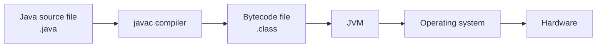

# 01 - Java Overview

## What You Should Learn

By the end of this topic, you should be able to explain:

- What Java is and why it is widely used.
- What "write once, run anywhere" really means.
- The difference between JVM, JRE, and JDK.
- How Java source code becomes bytecode and then runs on the JVM.
- What JIT compilation and Garbage Collection do.
- The difference between Java SE, Jakarta EE, and Java ME.
- Why Java 8, 11, 17, and 21 are commonly mentioned.

## Study Order

1. [What Java Is](theory/01-what-is-java.md)
2. [JVM, JRE, And JDK](theory/02-jvm-jre-jdk.md)
3. [Compile And Runtime Flow](theory/03-compile-runtime-flow.md)
4. [Java Editions And Versions](theory/04-editions-and-versions.md)

## Term Notes

- [Runtime Terms](terms/01-runtime-terms.md)

## Big Picture

Java source code is not executed directly by the operating system. The source code is compiled into bytecode, and the JVM executes that bytecode on a specific platform.

## Key Terms

- Java
- JVM
- JRE
- JDK
- Bytecode
- JIT Compiler
- Garbage Collection
- Java SE
- Jakarta EE
- Java ME
- LTS

## Self-Check

- What problem does the JVM solve?
- What is the difference between source code and bytecode?
- Why does Java need a compiler and a virtual machine?
- Why is the JDK required for development but the JRE is enough for running many applications?
- What does Garbage Collection collect?
- Why do many backend projects use Java 17 or Java 21?

## Anki Cards

- [Basic cards](anki/basic.tsv)
- [Basic Extra cards](anki/basic-extra.tsv)
- [Cloze cards](anki/cloze.tsv)
- [Code Question cards](anki/code-question.tsv)

## My Notes

-

## Reference Links

- https://docs.oracle.com/javase/tutorial/getStarted/intro/definition.html
- https://dev.java/learn/
