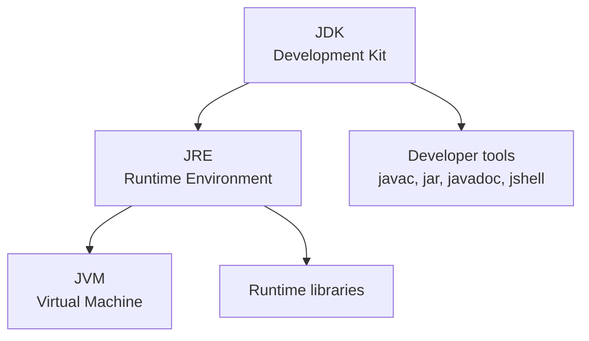

# JVM, JRE, And JDK

JVM, JRE, and JDK are three of the most important terms in Java. Many beginners memorize the names but do not understand the relationship. The simplest way to understand them is to ask:

```text
Who runs Java?
Who provides the runtime environment?
Who provides the developer tools?
```

## JVM

JVM means Java Virtual Machine.

The JVM is responsible for executing Java bytecode. It reads `.class` files and runs the instructions inside them.

The JVM also handles:

- Class loading.
- Bytecode verification.
- Runtime memory areas.
- Garbage Collection.
- JIT compilation.
- Thread management.

## JRE

JRE means Java Runtime Environment.

The JRE contains what is needed to run Java programs:

- A JVM.
- Runtime libraries.
- Supporting files.

If you only want to run a Java application, a JRE-like runtime may be enough.

## JDK

JDK means Java Development Kit.

The JDK contains what is needed to develop Java programs:

- The JRE/runtime components.
- The Java compiler `javac`.
- Tools such as `jar`, `javadoc`, and `jshell`.

If you want to write and compile Java code, you need a JDK.

## Relationship



Short memory rule:

```text
JVM runs bytecode.
JRE runs Java applications.
JDK builds Java applications.
```

## Example Commands

Check the installed Java runtime:

```bash
java -version
```

Check the compiler:

```bash
javac -version
```

Compile Java source:

```bash
javac HelloWorld.java
```

Run the compiled class:

```bash
java HelloWorld
```

## Interview-Style Explanation

If asked to explain JVM, JRE, and JDK:

> The JVM executes Java bytecode. The JRE provides the JVM and runtime libraries needed to run Java applications. The JDK includes the JRE plus development tools such as the Java compiler, so it is used to build Java applications.

## Common Mistakes

- Saying the JDK and JVM are the same thing.
- Thinking `javac` runs Java programs. It compiles source code.
- Thinking `java` compiles source code. It runs compiled classes.
- Installing only a runtime and then wondering why `javac` is missing.
