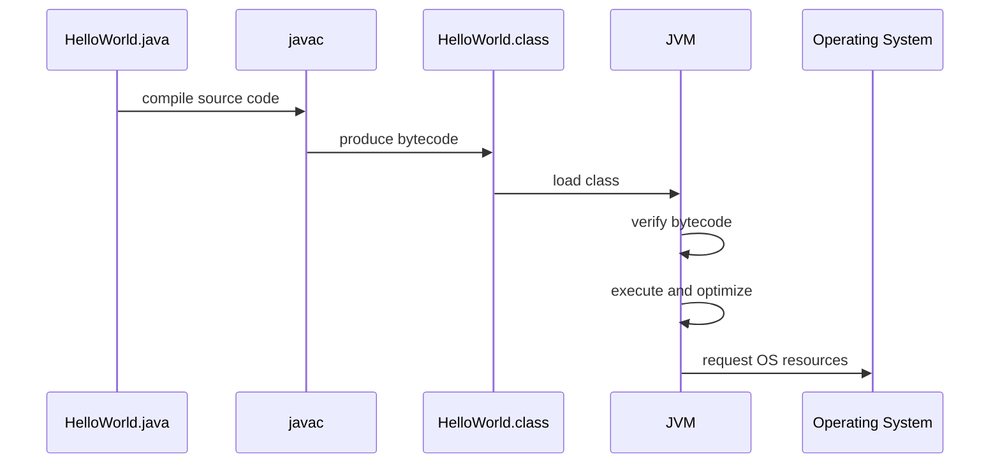

# Compile And Runtime Flow

Java has two major phases:

- Compile time.
- Runtime.

Understanding the difference helps you understand compiler errors, runtime exceptions, bytecode, and the role of the JVM.

## Compile Time

Compile time is when source code is checked and translated by the compiler.

Source file:

```java
public class HelloWorld {
    public static void main(String[] args) {
        System.out.println("Hello Java");
    }
}
```

Compile command:

```bash
javac HelloWorld.java
```

Output:

```text
HelloWorld.class
```

The `.class` file contains bytecode, not human-friendly Java source code.

## Runtime

Runtime is when the compiled program actually runs.

Run command:

```bash
java HelloWorld
```

At runtime, the JVM loads the class, verifies bytecode, executes instructions, manages memory, and may optimize code using JIT compilation.

## Detailed Flow



## Bytecode

Bytecode is an intermediate representation of Java code. It is lower-level than source code but not the same as native machine code.

Why bytecode matters:

- It makes cross-platform execution possible.
- It allows the JVM to verify code before running it.
- It allows the JVM to optimize code at runtime.

## JIT Compilation

JIT means Just-In-Time.

The JVM can observe which parts of the program are executed often. These frequently used sections can be compiled into native machine code while the program is running.

This is why Java performance can improve after warm-up in long-running applications.

## Garbage Collection

Java creates many objects on the heap. When objects are no longer reachable, Garbage Collection can reclaim their memory.

Example:

```java
String text = new String("Java");
text = null;
```

After `text = null`, the original `String` object may become unreachable if no other reference points to it. Eventually, the Garbage Collector may reclaim it.

## Compile-Time Error vs Runtime Error

Compile-time error:

```java
int age = "eighteen";
```

The compiler rejects this because a `String` cannot be assigned to an `int`.

Runtime error:

```java
int result = 10 / 0;
```

This compiles, but it fails when the program runs.

## Common Mistakes

- Thinking `.class` files are source code.
- Thinking bytecode is the same as native machine code.
- Thinking all errors are compile-time errors.
- Forgetting that runtime behavior can depend on input.
