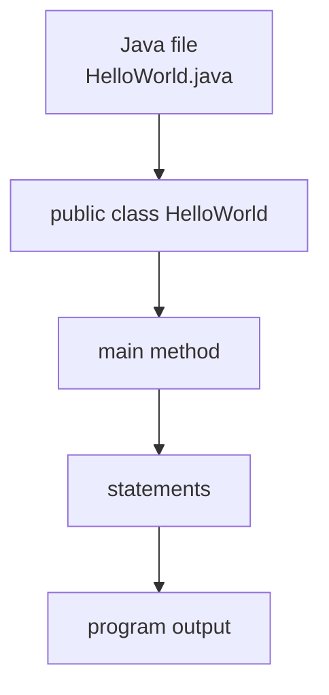

# 02 - Basic Syntax

## What You Should Learn

By the end of this topic, you should be able to:

- Read the structure of a minimal Java program.
- Explain what `public static void main(String[] args)` means.
- Use comments correctly.
- Understand the purpose of `package` and `import`.
- Follow Java naming conventions.
- Understand blocks, statements, and variable scope.

## Study Order

1. [Program Anatomy](theory/01-program-anatomy.md)
2. [The `main` Method](theory/02-main-method.md)
3. [Comments, Packages, And Imports](theory/03-comments-packages-imports.md)
4. [Naming, Keywords, Blocks, And Scope](theory/04-naming-keywords-blocks-scope.md)

## Minimal Program

```java
public class HelloWorld {
    public static void main(String[] args) {
        System.out.println("Hello Java");
    }
}
```

## Structure Overview



## Key Terms

- Class
- Method
- `main`
- Statement
- Block
- Comment
- Package
- Import
- Keyword
- Scope

## Self-Check

- Why must a Java program usually have a class?
- What does the `main` method do?
- Why is Java called case-sensitive?
- What is the difference between a statement and a block?
- Why should naming conventions matter?
- What problem do packages solve?

## Anki Cards

- [Basic cards](anki/basic.tsv)
- [Basic Extra cards](anki/basic-extra.tsv)
- [Cloze cards](anki/cloze.tsv)

## My Notes

-
