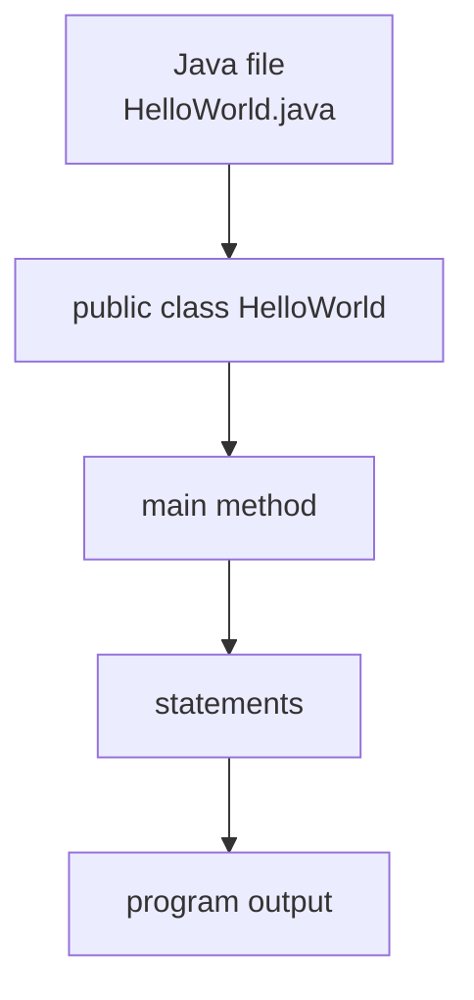

# 02 - Basic Syntax

## What You Should Learn

By the end of this topic, you should be able to:

- Read the structure of a minimal Java program.
- Explain what `public static void main(String[] args)` means.
- Use comments correctly.
- Understand the purpose of `package` and `import`.
- Follow Java naming conventions.
- Understand blocks, statements, and variable scope.

## Study Order

1. [Program Anatomy](theory/01-program-anatomy.md)
2. [The `main` Method](theory/02-main-method.md)
3. [Comments, Packages, And Imports](theory/03-comments-packages-imports.md)
4. [Naming, Keywords, Blocks, And Scope](theory/04-naming-keywords-blocks-scope.md)

## Minimal Program

```java
public class HelloWorld {
    public static void main(String[] args) {
        System.out.println("Hello Java");
    }
}
```

## Structure Overview



## Key Terms

- Class
- Method
- `main`
- Statement
- Block
- Comment
- Package
- Import
- Keyword
- Scope
- Stack Memory
- Symbol Table
- Case Sensitivity
- Lexical Analysis
- Reverse DNS

## Self-Check

- Why must a Java program start execution from a class?
- Why must the main method signature be exactly `public static void main(String[] args)`? (Detail JVM access, execution without object instantiation, return type, and runtime arguments).
- How are comments processed during compilation and Javadoc generation? (Detail what is preserved in the compiled bytecode vs. what is stripped).
- Why do we need packages and imports in Java, and why does naming packages reversely (reverse DNS) prevent name collisions?
- Why is local variable scope restricted to its declaring block, and how does this restriction help memory management and safety (preventing shadowing errors)?
- Why does Java enforce case sensitivity at both compile-time and runtime?


## Anki Cards

- [Basic cards](anki/basic.tsv)
- [Basic Extra cards](anki/basic-extra.tsv)
- [Cloze cards](anki/cloze.tsv)
- [Code Question cards](anki/code-question.tsv)

## My Notes

-

## Reference Links

- https://docs.oracle.com/javase/tutorial/getStarted/application/
- https://docs.oracle.com/javase/tutorial/java/nutsandbolts/
