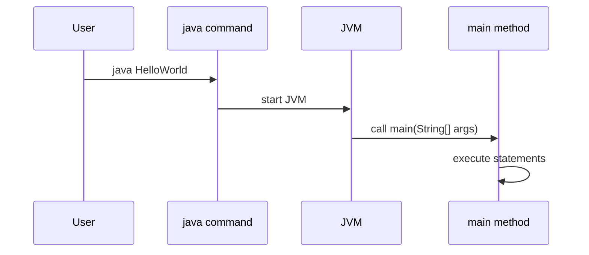

# The `main` Method

The `main` method is the entry point for a standard Java console program.

```java
public static void main(String[] args) {
    System.out.println("Hello Java");
}
```

When you run:

```bash
java HelloWorld
```

the JVM looks for a compatible `main` method and starts execution there.

## Breaking Down The Signature

```java
public static void main(String[] args)
```

### `public`

`public` means the method can be accessed from outside the class.

The JVM needs to be able to call the method when launching the program.

### `static`

`static` means the method belongs to the class, not to a specific object.

The JVM can call `main` without creating an instance of the class first.

### `void`

`void` means the method does not return a value.

The program can still print output, modify state, or call other methods, but `main` itself does not return a result to the caller.

### `main`

`main` is the method name recognized by the JVM as the program entry point.

### `String[] args`

`String[] args` receives command-line arguments.

Example:

```java
public class ArgsDemo {
    public static void main(String[] args) {
        System.out.println(args[0]);
    }
}
```

Run:

```bash
javac ArgsDemo.java
java ArgsDemo Java
```

Output:

```text
Java
```

## Main Method Flow



## Valid Variation

This is also accepted:

```java
public static void main(String... args) {
    System.out.println("Hello");
}
```

`String... args` is varargs syntax and is compatible with `String[] args`.

## Common Mistakes

- Writing `Main` instead of `main`.
- Removing `static`.
- Returning `int` instead of `void`.
- Forgetting the `String[] args` parameter.
- Trying to run a class that has no valid `main` method.

### Common Mistake: Wrong Method Name

```java
// Compiles but JVM cannot find entry point — runtime error:
// "Main method not found in class HelloWorld"
public class HelloWorld {
    public static void Main(String[] args) {  // 'M' should be 'm'
        System.out.println("Hello");
    }
}
```

### Common Mistake: Missing `static`

```java
// Compiles but runtime error:
// "Main method is not static in class HelloWorld"
public class HelloWorld {
    public void main(String[] args) {  // missing 'static'
        System.out.println("Hello");
    }
}
```

### Common Mistake: Wrong Return Type

```java
// Compiles but runtime error:
// "Main method must return a value of type void in class HelloWorld"
public class HelloWorld {
    public static int main(String[] args) {  // 'void' required, not 'int'
        System.out.println("Hello");
        return 0;
    }
}
```

### Common Mistake: Accessing `args[0]` Without Checking Length

```java
// Throws ArrayIndexOutOfBoundsException when run without arguments
public class RiskyArgs {
    public static void main(String[] args) {
        System.out.println(args[0]);  // danger if args is empty
    }
}
```

Safe version:

```java
public class SafeArgs {
    public static void main(String[] args) {
        if (args.length > 0) {
            System.out.println(args[0]);
        } else {
            System.out.println("No argument provided.");
        }
    }
}
```

## Case Study: Verifying a Valid Entry Point

```java
// All four requirements met: public, static, void, String[] args
public class EntryPointDemo {
    public static void main(String[] args) {
        System.out.println("Number of arguments: " + args.length);
        for (int i = 0; i < args.length; i++) {
            System.out.println("args[" + i + "] = " + args[i]);
        }
    }
}
```

Run as:

```bash
java EntryPointDemo Alice Bob
# Output:
# Number of arguments: 2
# args[0] = Alice
# args[1] = Bob
```
