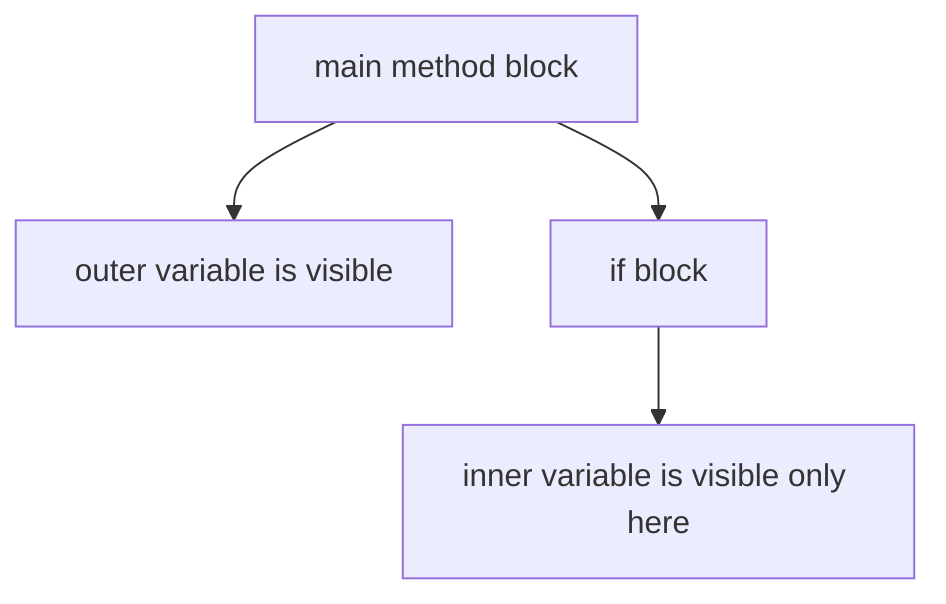

# Naming, Keywords, Blocks, And Scope

Readable Java code depends heavily on consistent names and clear scope.

## Naming Conventions

Java naming conventions are not just style. They help other developers understand what a name represents.

| Item | Convention | Example |
| --- | --- | --- |
| Class | PascalCase | `StudentService` |
| Interface | PascalCase | `Runnable` |
| Method | camelCase | `calculateTotal` |
| Variable | camelCase | `studentName` |
| Constant | UPPER_SNAKE_CASE | `MAX_RETRY_COUNT` |
| Package | lowercase | `com.example.learning` |

## Good Names

Good names describe meaning, not only type.

Weak:

```java
int x = 18;
```

Better:

```java
int age = 18;
```

Weak:

```java
String s = "Alice";
```

Better:

```java
String studentName = "Alice";
```

Short names are acceptable in tiny scopes, such as loop counters:

```java
for (int i = 0; i < 10; i++) {
    System.out.println(i);
}
```

## Keywords

Keywords are reserved words in Java. You cannot use them as variable, method, or class names.

Examples:

```text
class, public, static, void, if, else, for, while, return, new, package, import
```

Invalid:

```java
int class = 10;
```

## Scope

Scope means where a variable or name can be accessed.

Example:

```java
public class ScopeDemo {
    public static void main(String[] args) {
        int outer = 10;

        if (outer > 5) {
            int inner = 20;
            System.out.println(inner);
        }

        System.out.println(outer);
        // System.out.println(inner); // does not compile
    }
}
```

`inner` exists only inside the `if` block.

## Scope Diagram



## Common Mistakes

- Reusing vague names such as `data`, `temp`, or `value` everywhere.
- Declaring a variable inside a block and trying to use it outside.
- Using Java keywords as names.
- Using constant naming style for normal variables.

### Common Mistake: Vague Variable Names

```java
// Hard to understand at a glance
int data = getUserInput();
String temp = formatForDisplay(data);
System.out.println(temp);
```

```java
// Self-documenting
int userAge = getUserInput();
String formattedAge = formatForDisplay(userAge);
System.out.println(formattedAge);
```

### Common Mistake: Variable Used Outside Its Block

```java
public class ScopeError {
    public static void main(String[] args) {
        if (true) {
            int result = 42;
        }
        System.out.println(result);  // compile error: cannot find symbol 'result'
    }
}
```

Fix: declare `result` before the `if` block:

```java
public class ScopeFixed {
    public static void main(String[] args) {
        int result = 0;
        if (true) {
            result = 42;
        }
        System.out.println(result);  // 42
    }
}
```

### Common Mistake: Using Constant Style for Normal Variables

```java
// Wrong: constant naming for a regular variable
int CURRENT_AGE = 18;    // implies it should never change

// Correct: use camelCase for mutable variables
int currentAge = 18;

// Correct: UPPER_SNAKE_CASE only for actual constants
static final int MAX_AGE = 120;
```

### Common Mistake: Three Convention Violations in One Class

```java
// Compiles but violates all conventions:
public class order_service {                   // should be OrderService
    public static final int maxretrycount = 3; // should be MAX_RETRY_COUNT
    public void Calculate_Total() {}           // should be calculateTotal
}
```

## Case Study: Well-Named Class

```java
package com.example.shop;

/**
 * Service that manages product orders.
 */
public class OrderService {  // PascalCase class

    public static final int MAX_RETRY_COUNT = 3;  // UPPER_SNAKE_CASE constant

    private String ownerName;  // camelCase instance variable

    public double calculateTotal(double price, int quantity) {  // camelCase method
        int retryAttempts = 0;  // camelCase local variable
        // retry logic would go here
        return price * quantity;
    }
}
```

Every identifier here signals its type at a glance: class, constant, variable, method.
