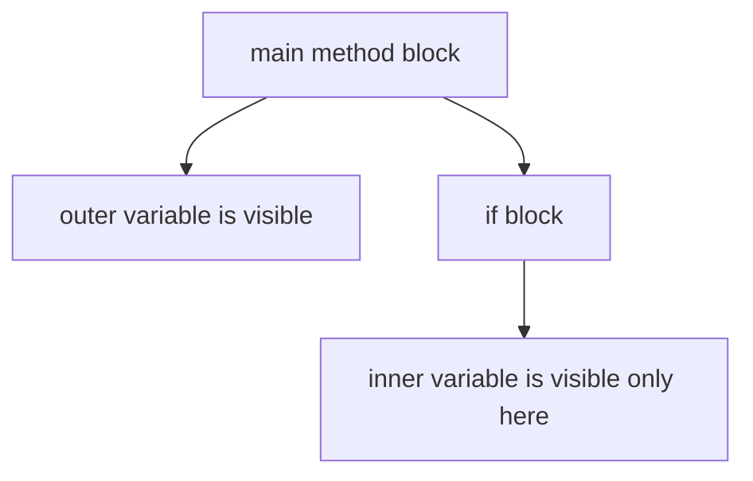

# Naming, Keywords, Blocks, And Scope

Readable Java code depends heavily on consistent names and clear scope.

## Naming Conventions

Java naming conventions are not just style. They help other developers understand what a name represents.

| Item | Convention | Example |
| --- | --- | --- |
| Class | PascalCase | `StudentService` |
| Interface | PascalCase | `Runnable` |
| Method | camelCase | `calculateTotal` |
| Variable | camelCase | `studentName` |
| Constant | UPPER_SNAKE_CASE | `MAX_RETRY_COUNT` |
| Package | lowercase | `com.example.learning` |

## Good Names

Good names describe meaning, not only type.

Weak:

```java
int x = 18;
```

Better:

```java
int age = 18;
```

Weak:

```java
String s = "Alice";
```

Better:

```java
String studentName = "Alice";
```

Short names are acceptable in tiny scopes, such as loop counters:

```java
for (int i = 0; i < 10; i++) {
    System.out.println(i);
}
```

## Keywords

Keywords are reserved words in Java. You cannot use them as variable, method, or class names.

Examples:

```text
class, public, static, void, if, else, for, while, return, new, package, import
```

Invalid:

```java
int class = 10;
```

## Scope

Scope means where a variable or name can be accessed.

Example:

```java
public class ScopeDemo {
    public static void main(String[] args) {
        int outer = 10;

        if (outer > 5) {
            int inner = 20;
            System.out.println(inner);
        }

        System.out.println(outer);
        // System.out.println(inner); // does not compile
    }
}
```

`inner` exists only inside the `if` block.

## Scope Diagram



## Common Mistakes

- Reusing vague names such as `data`, `temp`, or `value` everywhere.
- Declaring a variable inside a block and trying to use it outside.
- Using Java keywords as names.
- Using constant naming style for normal variables.
