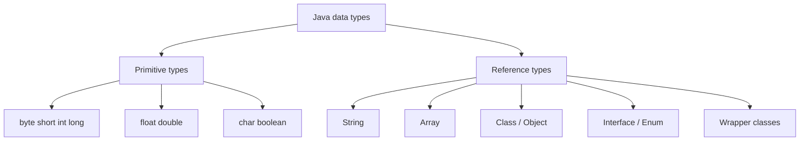

# 03 - Data Types

## What You Should Learn

By the end of this topic, you should be able to:

- List Java's 8 primitive types.
- Explain primitive types vs reference types.
- Understand literals and default values at a beginner level.
- Explain widening casting and narrowing casting.
- Understand wrapper classes, autoboxing, and unboxing.
- Explain `null` and `NullPointerException`.
- Use `==` and `.equals()` correctly.

## Study Order

1. [Primitive Types](theory/01-primitive-types.md)
2. [Reference Types And Memory Model](theory/02-reference-types.md)
3. [Literals, Casting, And Numeric Behavior](theory/03-literals-casting-numeric-behavior.md)
4. [Wrapper Classes, Boxing, Null, And Equality](theory/04-wrappers-null-equality.md)

## Big Picture

## Key Terms

- Primitive type
- Reference type
- Literal
- Casting
- Widening
- Narrowing
- Wrapper class
- Autoboxing
- Unboxing
- `null`
- `==`
- `.equals()`

## Self-Check

- Why is `String` not a primitive type?
- Why can `int` be stored directly but `String` is accessed through a reference?
- What is the difference between `int` and `Integer`?
- Why can narrowing conversion lose data?
- Why should String content usually be compared with `.equals()`?
- Why can unboxing a null wrapper cause an exception?

## Anki Cards

- [Basic cards](anki/basic.tsv)
- [Basic Extra cards](anki/basic-extra.tsv)
- [Cloze cards](anki/cloze.tsv)
- [Code Question cards](anki/code-question.tsv)

## My Notes

-
