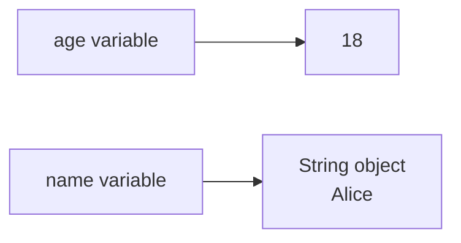
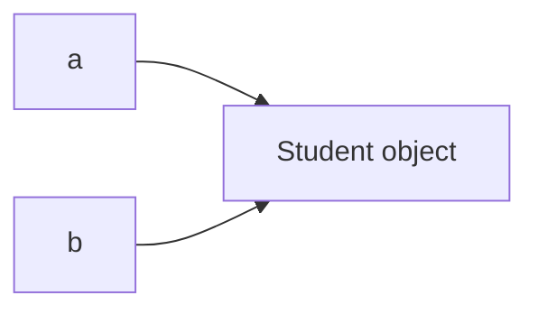

# Reference Types And Memory Model

Reference types do not store the object value directly in the variable. Instead, the variable stores a reference to an object.

Examples of reference types:

- Class types.
- Object types.
- Arrays.
- `String`.
- Interfaces.
- Enums.
- Wrapper classes such as `Integer`.

## Basic Example

```java
String name = "Alice";
int[] scores = {8, 9, 10};
Student student = new Student();
```

`name`, `scores`, and `student` are reference variables. They point to objects.

## Primitive vs Reference

```java
int age = 18;
String name = "Alice";
```

Conceptually:



`age` stores a primitive value directly. `name` stores a reference to a `String` object.

## Object Identity

Two reference variables can point to the same object.

```java
Student a = new Student();
Student b = a;
```

Conceptually:



If the object is mutable and you change it through `a`, the change can be observed through `b` because both references point to the same object.

## Arrays Are Reference Types

Arrays are objects in Java.

```java
int[] numbers = {1, 2, 3};
```

`numbers` is a reference to an array object.

This is why arrays have properties such as:

```java
numbers.length
```

## String Is A Reference Type

`String` is not a primitive type.

```java
String text = "Java";
```

`text` is a reference variable. It refers to a `String` object.

However, `String` is special because Java has string literals and a string pool. That topic is explained more deeply in the String chapter.

## null

A reference variable can contain `null`.

```java
String name = null;
```

This means the variable does not currently refer to any object.

Calling a method on `null` causes `NullPointerException`.

```java
String name = null;
System.out.println(name.length()); // runtime error
```

## Common Mistakes

- Thinking `String` is primitive because it is common and easy to write.
- Forgetting that arrays are objects.
- Assuming two references always mean two different objects.
- Calling methods on variables that may be `null`.
