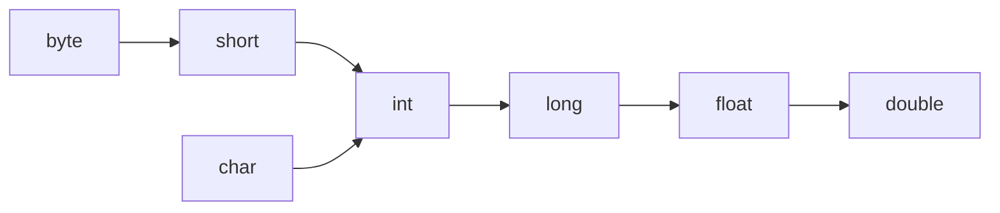
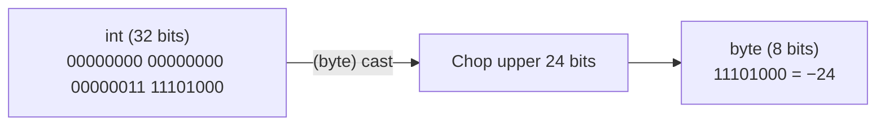

# Literals, Casting, And Numeric Behavior

A literal is a value written directly in source code.

Examples:

```java
10
10L
3.14
3.14F
'A'
"Java"
true
null
```

## Integer Literals

`int` is the default integer literal type.

```java
int a = 10;
long b = 10L;
```

Underscores can improve readability:

```java
int million = 1_000_000;
```

## Floating-Point Literals

`double` is the default decimal literal type.

```java
double price = 9.99;
float ratio = 0.5F;
```

Without `F`, `0.5` is treated as `double`.

## String And char Literals

`char` uses single quotes:

```java
char grade = 'A';
```

`String` uses double quotes:

```java
String name = "Alice";
```

## Widening Casting

Widening means converting a smaller type to a larger compatible type.

Example:

```java
int number = 10;
long bigger = number;
double decimal = bigger;
```

This is usually safe and can happen automatically.



Note: this diagram is a simplified learning model. Numeric conversions have details that become important later.

## Narrowing Casting

Narrowing means converting a larger type to a smaller type.

Example:

```java
double price = 9.8;
int rounded = (int) price;
System.out.println(rounded); // 9
```

Narrowing needs explicit casting and may lose information.

Another example:

```java
int value = 130;
byte small = (byte) value;
System.out.println(small); // -126
```

This produces −126 instead of 130 because `byte` can only hold values −128 to 127.

## Why Narrowing Can Lose Data

### Analogy: Big Bucket → Small Bucket

Think of an `int` as a large 32-bit bucket and a `byte` as a small 8-bit bucket. If the large bucket holds only a little water (value `10`), pouring it into the small bucket works fine — nothing spills. But if the large bucket is full (value `1000`), the small bucket overflows and you lose most of the water. The "water" here is **bits**, and the overflow is **data loss**.

### Binary Mechanics: Keep the Lowest Bits, Chop the Rest

When Java narrows a value, it does **not** scale or round the number. Instead it performs a simple operation: **keep only the lowest N bits** of the original binary representation and **discard all higher bits**.

For `int` → `byte`, Java keeps the lowest **8 bits** and throws away the upper **24 bits**.

### Concrete Example 1: `(byte) 1000`

`int value = 1000;` in binary (32 bits):

```
00000000 00000000 00000011 11101000
|________ discarded _______||_kept_|
         24 bits              8 bits
```

Java keeps only the last 8 bits: `11101000`.

In two's complement, the leading bit `1` means **negative**. The value of `11101000` is:

```
11101000  →  invert bits  →  00010111  →  add 1  →  00011000  =  24
→  result = −24
```

So `(byte) 1000` produces **−24**, not 1000!

### Concrete Example 2: `(byte) 130`

`int value = 130;` in binary (32 bits):

```
00000000 00000000 00000000 10000010
|________ discarded _______||_kept_|
         24 bits              8 bits
```

Kept bits: `10000010`. Leading bit is `1` → negative.

```
10000010  →  invert  →  01111101  →  add 1  →  01111110  =  126
→  result = −126
```

### Code With Output

```java
int v1 = 1000;
byte b1 = (byte) v1;
System.out.println(b1); // -24

int v2 = 130;
byte b2 = (byte) v2;
System.out.println(b2); // -126

int v3 = 10;
byte b3 = (byte) v3;
System.out.println(b3); // 10 — fits perfectly, no data loss
```

### Cause-Effect Chain

Large type has more bits → cast to smaller type → **excess high bits are chopped off** → remaining bits may form a completely different value (including a sign flip) → **DATA CORRUPTED**.

### How It Looks Visually



> **Warning:** Narrowing from `double` to `int` has an **additional** behavior — Java **truncates** the decimal part (rounds toward zero), not rounds to nearest.
> `(int) 9.8` → `9`, and `(int) -2.7` → `-2`.

> See also: [Narrowing Casting](#narrowing-casting) above for the basic syntax.

## Integer Division

When both operands are integers, Java performs integer division.

```java
System.out.println(5 / 2); // 2
```

If at least one operand is a floating-point type, the result can include decimals.

```java
System.out.println(5 / 2.0); // 2.5
```

## Numeric Promotion

Java may promote smaller numeric types during operations.

Example:

```java
byte a = 1;
byte b = 2;
// byte c = a + b; // does not compile
int c = a + b;
```

`a + b` is promoted to `int`, so storing it directly in `byte` is not allowed without a cast.

## Common Mistakes

- Expecting `5 / 2` to produce `2.5`.
- Forgetting `L` for large long literals.
- Forgetting `F` for float literals.
- Assuming narrowing conversion is always safe.
- Ignoring numeric promotion in arithmetic expressions.
