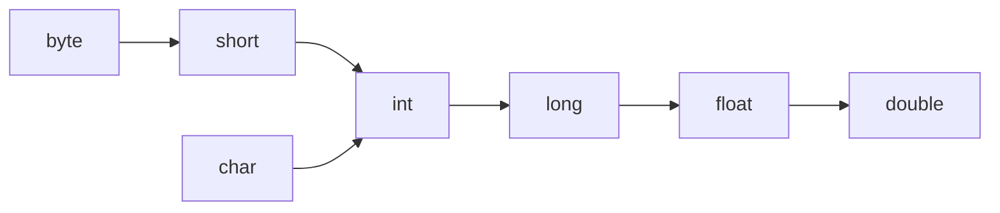

# Literals, Casting, And Numeric Behavior

A literal is a value written directly in source code.

Examples:

```java
10
10L
3.14
3.14F
'A'
"Java"
true
null
```

## Integer Literals

`int` is the default integer literal type.

```java
int a = 10;
long b = 10L;
```

Underscores can improve readability:

```java
int million = 1_000_000;
```

## Floating-Point Literals

`double` is the default decimal literal type.

```java
double price = 9.99;
float ratio = 0.5F;
```

Without `F`, `0.5` is treated as `double`.

## String And char Literals

`char` uses single quotes:

```java
char grade = 'A';
```

`String` uses double quotes:

```java
String name = "Alice";
```

## Widening Casting

Widening means converting a smaller type to a larger compatible type.

Example:

```java
int number = 10;
long bigger = number;
double decimal = bigger;
```

This is usually safe and can happen automatically.



Note: this diagram is a simplified learning model. Numeric conversions have details that become important later.

## Narrowing Casting

Narrowing means converting a larger type to a smaller type.

Example:

```java
double price = 9.8;
int rounded = (int) price;
System.out.println(rounded); // 9
```

Narrowing needs explicit casting and may lose information.

Another example:

```java
int value = 130;
byte small = (byte) value;
System.out.println(small);
```

This may produce an unexpected result because `byte` cannot represent all `int` values.

## Integer Division

When both operands are integers, Java performs integer division.

```java
System.out.println(5 / 2); // 2
```

If at least one operand is a floating-point type, the result can include decimals.

```java
System.out.println(5 / 2.0); // 2.5
```

## Numeric Promotion

Java may promote smaller numeric types during operations.

Example:

```java
byte a = 1;
byte b = 2;
// byte c = a + b; // does not compile
int c = a + b;
```

`a + b` is promoted to `int`, so storing it directly in `byte` is not allowed without a cast.

## Common Mistakes

- Expecting `5 / 2` to produce `2.5`.
- Forgetting `L` for large long literals.
- Forgetting `F` for float literals.
- Assuming narrowing conversion is always safe.
- Ignoring numeric promotion in arithmetic expressions.
