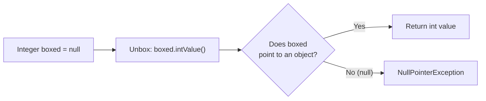
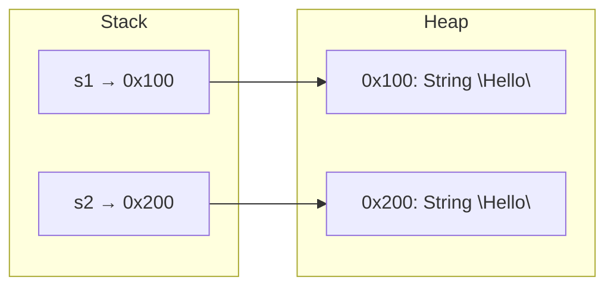
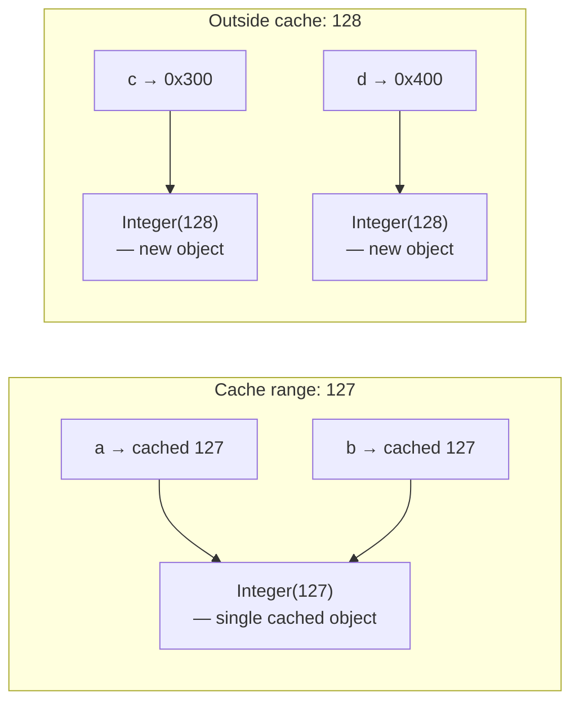

# Wrapper Classes, Boxing, Null, And Equality

Wrapper classes are object versions of primitive types.

| Primitive | Wrapper |
| --- | --- |
| `byte` | `Byte` |
| `short` | `Short` |
| `int` | `Integer` |
| `long` | `Long` |
| `float` | `Float` |
| `double` | `Double` |
| `char` | `Character` |
| `boolean` | `Boolean` |

## Why Wrappers Exist

Many Java APIs work with objects, not primitives.

For example, collections cannot store primitive types directly:

```java
// List<int> numbers; // invalid
List<Integer> numbers;
```

`Integer` is used instead of `int`.

## int vs Integer: Full Comparison

`int` and `Integer` look similar but behave very differently under the hood. The core difference is that `int` is a **primitive** — a raw value stored directly on the Stack — while `Integer` is an **object** that lives on the Heap and is accessed through a reference. This distinction affects memory usage, performance, available operations, and where each type can be used.

Java Collections (such as `ArrayList`, `HashMap`, `HashSet`) use **generics**, and generics in Java only work with reference types. The type parameter `<T>` must be an `Object` subclass, and primitives like `int` are not objects. That is why `Integer` exists — it wraps the primitive `int` inside an object so it can participate in generic APIs. Without wrapper classes, you could not store numbers in a `List` or use them as `Map` keys.

| Feature | `int` (Primitive) | `Integer` (Wrapper) |
| --- | --- | --- |
| Memory location | Stack (typically) | Heap (object) |
| Speed | Fast — direct CPU operation | Slower — object creation + GC overhead |
| Utility methods | None | `parseInt()`, `valueOf()`, `compareTo()`, etc. |
| Nullable | No — always has a value | Yes — can be `null` |
| Collections | Cannot be used in `List<>`, `Map<>` | Can be used in `List<Integer>`, etc. |
| Default value | `0` | `null` |

**Performance implication:** Arithmetic on `int` is a direct CPU operation — add, subtract, compare happen in a single machine instruction. `Integer` arithmetic requires the JVM to allocate an object on the Heap, and later the garbage collector must reclaim that memory. In tight loops processing millions of values, the difference can be significant.

```java
// int — fast, direct value
int primitiveSum = 0;
for (int i = 0; i < 1_000_000; i++) {
    primitiveSum += i; // direct CPU addition
}

// Integer — slower, creates objects
Integer wrapperSum = 0;
for (int i = 0; i < 1_000_000; i++) {
    wrapperSum += i; // unbox → add → box new Integer object each iteration
}
```

**When to use each:**

- Use `int` for local calculations, loop counters, and performance-critical code.
- Use `Integer` when you need nullability (e.g., a database column that can be `NULL`), when storing values in Collections, or when calling APIs that require `Object`.

> See also: [Primitive vs Reference](02-reference-types.md#primitive-vs-reference) for the Stack vs Heap memory model.

## Autoboxing

Autoboxing is automatic conversion from primitive to wrapper.

```java
Integer number = 10;
```

Java treats this roughly like:

```java
Integer number = Integer.valueOf(10);
```

## Unboxing

Unboxing is automatic conversion from wrapper to primitive.

```java
Integer boxed = 10;
int value = boxed;
```

Java extracts the primitive `int` value from the `Integer` object.

## Null And Unboxing

Wrappers can be `null`. Primitives cannot.

```java
Integer boxed = null;
int value = boxed; // NullPointerException at runtime
```

This fails because Java tries to unbox `null`.

## Why Unboxing null Throws NullPointerException

When Java unboxes an `Integer` to an `int`, it does not simply "extract" the value. Behind the scenes, the compiler inserts a method call: `boxed.intValue()`. This means the statement `int value = boxed;` is compiled into the equivalent of `int value = boxed.intValue();`. Understanding this hidden method call is the key to understanding why `null` causes a crash.

If `boxed` is `null`, there is no `Integer` object in memory — the reference points to nothing. Calling `.intValue()` on `null` is the same as calling any method on `null`: Java cannot dispatch a method on an object that does not exist. This triggers a `NullPointerException`.

**Cause-effect chain:**

`Integer boxed = null` → compiler inserts `boxed.intValue()` → `boxed` is `null` → no object exists to call `.intValue()` on → **NullPointerException**

```java
// What you write:
Integer boxed = null;
int value = boxed; // NullPointerException!

// What the compiler actually generates (equivalent):
Integer boxed = null;
int value = boxed.intValue(); // calling method on null → NPE
```



**Common trap — method parameters:**

```java
void process(int x) {
    System.out.println(x * 2);
}

Integer input = null;
process(input); // NPE happens HERE, at the call site, during unboxing
// output: NullPointerException (not inside process(), but before it even runs)
```

The NPE occurs **at the call site**, not inside `process()`. Java tries to unbox `input` to pass it as `int x`, and the unboxing fails before the method body ever executes. This makes the error confusing because the stack trace points to the line calling `process()`, not to any code inside it.

**How to prevent:**

```java
// Option 1: Null check before unboxing
Integer boxed = getValueFromDatabase();
if (boxed != null) {
    int value = boxed;
    process(value);
}

// Option 2: Provide a default value
int value = (boxed != null) ? boxed : 0;
```

> This relates to how `null` works with reference types, covered in [null](02-reference-types.md#null).

## `==` With Primitives

With primitives, `==` compares values.

```java
int a = 5;
int b = 5;
System.out.println(a == b); // true
```

## `==` With References

With reference types, `==` compares whether two references point to the same object.

```java
String a = new String("Java");
String b = new String("Java");

System.out.println(a == b); // false
```

The contents are the same, but the objects are different.

## `.equals()`

`.equals()` is usually used to compare object content.

```java
String a = new String("Java");
String b = new String("Java");

System.out.println(a.equals(b)); // true
```

For `String`, `.equals()` compares the character content.

## Why Use .equals() For String Content

The `==` operator only checks the **Stack** — it compares the memory addresses stored in two reference variables. It asks: "Do these two variables point to the **exact same object** in memory?" It does not look at what is inside the objects. In contrast, `.equals()` goes into the **Heap** — it opens both objects and compares their actual content character by character.

This distinction matters because two `String` objects can contain identical text (`"Hello"`) but exist at different memory addresses on the Heap. When you use `==`, Java compares the addresses and concludes they are "not equal" — even though a human reading the text would say they are the same.



In this diagram, `s1` and `s2` hold different addresses (`0x100` vs `0x200`). Even though both objects contain `"Hello"`, `s1 == s2` returns `false` because the addresses differ. But `s1.equals(s2)` returns `true` because `.equals()` compares the character sequences inside both objects.

**Why `==` sometimes works (String Pool):**

Java maintains a **String Pool** — a cache of string literals. When you write `String s = "Hello"`, Java checks the pool first. If `"Hello"` already exists there, Java reuses the same object. This means two literal strings with the same content can share the same address, making `==` return `true` by coincidence:

```java
String a = "Hello";
String b = "Hello";
System.out.println(a == b);      // true — same pooled object (coincidence!)
System.out.println(a.equals(b)); // true — same content (reliable)
```

But `new String(...)` **always** creates a new object on the Heap, bypassing the pool:

```java
String a = new String("Hello");
String b = new String("Hello");
System.out.println(a == b);      // false — different Heap objects
System.out.println(a.equals(b)); // true  — same content
```

**Cause-effect:** `new String("Hello")` creates a new Heap object → new memory address → `==` compares addresses → different addresses → `false` — even though the content is identical.

**Rule:** ALWAYS use `.equals()` for content comparison of Strings (and other objects). The `==` operator is only reliable for primitives and for intentional reference identity checks.

## Null-Safe String Comparison

This can throw `NullPointerException` if `text` is null:

```java
text.equals("Java")
```

This is safer:

```java
"Java".equals(text)
```

If `text` is null, the result is `false`, not an exception.

## Wrapper Equality Warning

Avoid comparing wrapper objects with `==` unless you specifically want reference comparison.

```java
Integer a = 1000;
Integer b = 1000;
System.out.println(a == b); // often false
System.out.println(a.equals(b)); // true
```

Use `.equals()` for value comparison.

## Integer Cache

Java caches `Integer` objects for values in the range **-128 to 127**. When you use autoboxing or `Integer.valueOf()`, Java checks if the value falls within this range. If it does, Java returns the **same cached object** every time instead of creating a new one. If the value is outside this range, Java creates a **new object** on the Heap each time.

This caching exists for performance — small integer values are used extremely frequently (loop counters, array indices, status codes), so reusing the same objects avoids creating millions of short-lived objects that would burden the garbage collector.

The consequence is that `==` behaves **unpredictably** with `Integer` objects:

```java
// Values within cache range (-128 to 127): SAME cached object
Integer a = 127;
Integer b = 127;
System.out.println(a == b);      // true  — same cached object
System.out.println(a.equals(b)); // true  — same value

// Values outside cache range: DIFFERENT objects
Integer c = 128;
Integer d = 128;
System.out.println(c == d);      // false — different Heap objects!
System.out.println(c.equals(d)); // true  — same value
```



**Cause-effect chain:**

- `Integer a = 127` → `Integer.valueOf(127)` → 127 is in [-128, 127] → return cached object → `a` points to cached object
- `Integer b = 127` → `Integer.valueOf(127)` → same cached object → `b` points to **same** object → `a == b` is `true`
- `Integer c = 128` → `Integer.valueOf(128)` → 128 is outside cache → create **new** object → `c` points to new object
- `Integer d = 128` → `Integer.valueOf(128)` → create **another new** object → `d` points to **different** object → `c == d` is `false`

This makes `==` with `Integer` (and other wrappers) **unpredictable** — it works for small values and silently breaks for larger values. This is yet another reason to **always use `.equals()`** for comparing wrapper object values.

## Common Mistakes

- Comparing String content with `==`.
- Forgetting wrappers can be `null`.
- Unboxing a null wrapper.
- Using `List<int>` instead of `List<Integer>`.
- Assuming `.equals()` is always null-safe when called on a possibly null variable.
