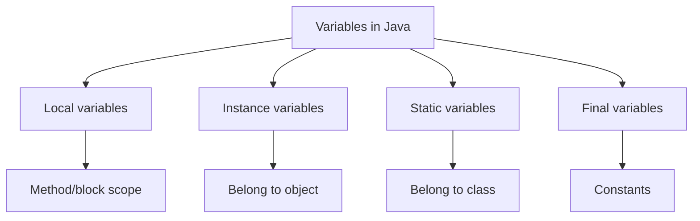

# 04 - Variables And Constants

## What You Should Learn

By the end of this topic, you should be able to:

- Explain what a variable is.
- Distinguish local, instance, and static variables.
- Explain what `final` means for variables.
- Understand constants and naming conventions.
- Understand default values for fields vs local variables.
- Use `var` correctly.
- Explain variable scope and lifetime at a beginner level.
- Connect variables to the stack/heap mental model.

## Study Order

1. [Variable Categories](theory/01-variable-categories.md)
2. [Final Variables And Constants](theory/02-final-and-constants.md)
3. [Default Values, Scope, And Lifetime](theory/03-default-scope-lifetime.md)
4. [`var` And Type Inference](theory/04-var-type-inference.md)

## Term Notes

- [Variable Terms](terms/01-variable-terms.md)

## Big Picture

## Self-Check

- Why must a local variable be assigned before use?
- How is an instance variable different from a static variable?
- What does `final` prevent?
- Why are constants often `static final`?
- When should `var` not be used?
- How does scope limit variable visibility?

## Anki Cards

- [Basic cards](anki/basic.tsv)
- [Basic Extra cards](anki/basic-extra.tsv)
- [Cloze cards](anki/cloze.tsv)
- [Code Question cards](anki/code-question.tsv)

## My Notes

-

## Reference Links

- https://docs.oracle.com/javase/tutorial/java/nutsandbolts/variables.html
