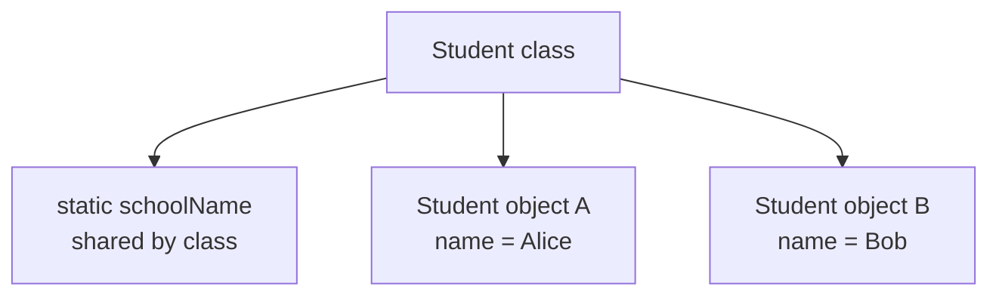

# Variable Categories

A variable is a named storage location for a value. In Java, every variable has a type.

```java
int age = 18;
String name = "Alice";
```

The variable name lets you reuse the value later. The type tells Java what kind of value the variable can hold.

## Local Variables

A local variable is declared inside a method, constructor, or block.

```java
public void printAge() {
    int age = 18;
    System.out.println(age);
}
```

`age` is local to the method. It exists only while the method is executing, and it can only be used in the scope where it is declared.

Local variables do not receive automatic default values. You must assign them before use.

```java
public void demo() {
    int x;
    // System.out.println(x); // does not compile
}
```

## Instance Variables

An instance variable is a field that belongs to an object.

```java
class Student {
    String name;
    int age;
}
```

Each `Student` object has its own `name` and `age`.

```java
Student a = new Student();
Student b = new Student();

a.name = "Alice";
b.name = "Bob";
```

`a.name` and `b.name` are separate values because they belong to different objects.

## Static Variables

A static variable belongs to the class, not to an individual object.

```java
class Counter {
    static int count;
}
```

There is one `count` value associated with the `Counter` class.

Static variables are shared by all instances of the class.

```java
Counter.count++;
```

## Instance vs Static



Use instance variables for state that differs per object.

Use static variables for state that belongs to the class as a whole.

## Common Mistakes

- Using static variables for data that should belong to individual objects.
- Trying to use a local variable before assigning it.
- Confusing field default values with local variable behavior.
- Thinking every variable lives for the whole program.
