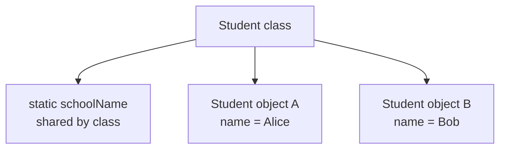
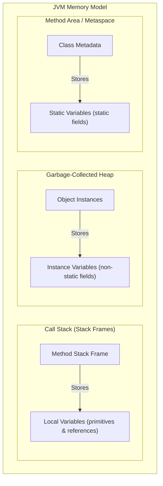

# Variable Categories

A variable is a named storage location for a value. In Java, every variable has a type.

```java
int age = 18;
String name = "Alice";
```

The variable name lets you reuse the value later. The type tells Java what kind of value the variable can hold.

## Local Variables

A local variable is declared inside a method, constructor, or block.

```java
public void printAge() {
    int age = 18;
    System.out.println(age);
}
```

`age` is local to the method. It exists only while the method is executing, and it can only be used in the scope where it is declared.

Local variables do not receive automatic default values. You must assign them before use.

```java
public void demo() {
    int x;
    // System.out.println(x); // does not compile
}
```

## Instance Variables

An instance variable is a field that belongs to an object.

```java
class Student {
    String name;
    int age;
}
```

Each `Student` object has its own `name` and `age`.

```java
Student a = new Student();
Student b = new Student();

a.name = "Alice";
b.name = "Bob";
```

`a.name` and `b.name` are separate values because they belong to different objects.

## Static Variables

A static variable belongs to the class, not to an individual object.

```java
class Counter {
    static int count;
}
```

There is one `count` value associated with the `Counter` class.

Static variables are shared by all instances of the class.

```java
Counter.count++;
```

## Instance vs Static



Use instance variables for state that differs per object.

Use static variables for state that belongs to the class as a whole.

## Instance vs Static — Side-by-Side

```java
class Student {
    String name;              // instance variable — each object gets its own copy
    static String school;     // static variable — one copy shared by ALL Student objects
}

public class Demo {
    public static void main(String[] args) {
        Student a = new Student();
        Student b = new Student();

        a.name = "Alice";
        b.name = "Bob";
        Student.school = "JavaHigh";

        System.out.println(a.name);    // Alice
        System.out.println(b.name);    // Bob
        System.out.println(a.school);  // JavaHigh  (same as b.school)
        System.out.println(b.school);  // JavaHigh  (same as a.school)

        // Changing school via one reference changes it for everyone
        a.school = "OpenU";
        System.out.println(b.school);  // OpenU  ← because school is static
    }
}
```

Accessing a static variable through an instance (`a.school`) compiles but is misleading — prefer `Student.school`.

## Local vs Instance vs Static: Memory Model and Lifetimes

In Java, variables are stored in different areas of JVM memory depending on their category, which determines their lifetime and allocation cost. Local variables are stored inside stack frames on the call stack, which are created when a method is invoked and destroyed as soon as the method exits. Instance variables (fields) belong to objects and are allocated on the Heap, living as long as the object is reachable and not garbage collected. Static variables belong to the class template and are stored in the Method Area (specifically Metaspace), remaining alive for as long as the class remains loaded in the JVM.

### JVM Memory Organization



### Memory and Lifetime Demo

```java
public class MemoryDemo {
    // Stored in Metaspace (Method Area)
    // Lifetime: From class loading to class unloading (usually program lifetime)
    static int classVar = 10; 

    // Stored on the Heap (inside MemoryDemo instance)
    // Lifetime: As long as the enclosing object is reachable
    int instanceVar = 20;     

    public void runDemo() {
        // Stored on the Stack (inside runDemo's stack frame)
        // Lifetime: While runDemo() is executing
        int localVar = 30;    

        System.out.println(classVar);    // 10
        System.out.println(instanceVar); // 20
        System.out.println(localVar);    // 30
    } // localVar is popped from stack and destroyed here
}
```

### Allocation and Destruction Cause-Effect Chains

* **Local Variable Life Cycle:**
  Method is invoked $\rightarrow$ JVM allocates a new Stack frame $\rightarrow$ Local variables are pushed onto the Stack frame $\rightarrow$ Method execution finishes $\rightarrow$ Stack frame is popped $\rightarrow$ Local variable memory is immediately reclaimed.
* **Instance Variable Life Cycle:**
  `new` operator executes $\rightarrow$ JVM allocates memory block on the Heap for the object and fields $\rightarrow$ Constructor initializes fields $\rightarrow$ Object reference is lost (goes out of scope) $\rightarrow$ Garbage Collector detects unreachable object $\rightarrow$ GC reclaims heap space.
* **Static Variable Life Cycle:**
  JVM loads the class bytecode $\rightarrow$ Class representation is initialized in Metaspace $\rightarrow$ Static fields are allocated and initialized $\rightarrow$ Program terminates or ClassLoader is unloaded $\rightarrow$ Metaspace memory is released.

## Case Study: Using a Local Variable Before Assigning It

**Scenario**: A developer writes a method to return a greeting. They forget to always assign `message` before using it.

```java
// Does NOT compile
public String greet(boolean formal) {
    String message;                         // declared but NOT assigned
    if (formal) {
        message = "Good morning.";
    }
    return message; // compile error: variable message might not have been initialized
}
```

The compiler performs **definite assignment analysis**: it checks all possible paths through the code. Here the `else` path never assigns `message`, so the compiler rejects it.

**Fix — always cover all paths:**

```java
// Compiles correctly
public String greet(boolean formal) {
    String message;
    if (formal) {
        message = "Good morning.";
    } else {
        message = "Hey!";
    }
    return message; // safe — both branches assign message
}
```

Or use a default:

```java
public String greet(boolean formal) {
    String message = "Hey!";   // default value covers the non-formal branch
    if (formal) {
        message = "Good morning.";
    }
    return message;
}
```

> **Key rule**: Java's compiler enforces that a local variable is *definitely assigned* on every code path that leads to its use. This is a **compile-time** check, not a runtime check.

## Common Mistakes

- Using static variables for data that should belong to individual objects.
- Trying to use a local variable before assigning it — this is a **compile error**, not a runtime `NullPointerException`.
- Confusing field default values with local variable behavior.
- Thinking every variable lives for the whole program.
- Accessing static variables through instance references (`a.school`) — it compiles but misleads readers.

## Reference Links

- [Java Language Specification: Kinds of Variables](https://docs.oracle.com/javase/specs/jls/se21/html/jls-4.html#jls-4.12.3)
- [Oracle Java Tutorials: Variables](https://docs.oracle.com/javase/tutorial/java/nutsandbolts/variables.html)

