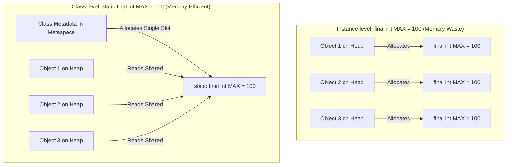

# Final Variables And Constants

`final` means a variable can be assigned only once.

```java
final int maxScore = 100;
```

After assignment, you cannot assign a new value:

```java
maxScore = 90; // does not compile
```

## final With Primitives

For primitive variables, `final` prevents changing the stored primitive value.

```java
final int age = 18;
// age = 19; // invalid
```

## final With References

For reference variables, `final` prevents changing the reference, not necessarily the object.

```java
final StringBuilder builder = new StringBuilder("Java");
builder.append(" Core"); // allowed
// builder = new StringBuilder("Other"); // not allowed
```

The variable `builder` must keep pointing to the same object, but the object may still be mutable.

## Constants

A constant is a value intended not to change.

Java constants are often declared as `static final`.

```java
public static final int MAX_RETRY_COUNT = 3;
```

`static` means the value belongs to the class.

`final` means the variable cannot be reassigned.

Constants usually use UPPER_SNAKE_CASE.

## Why Constants Are Declared static final

In Java, a constant value meant to remain unchanged across the entire application should be declared as both `static` and `final`. Declaring a constant as instance-level `final` (without `static`) means every single object instantiated from that class allocates its own separate memory slot for that exact same value, causing unnecessary memory overhead. By marking it `static`, the constant is loaded once at the class level and stored in Metaspace (Method Area) rather than inside individual object structures on the garbage-collected Heap. This ensures optimal memory utilization while enforcing read-only behavior through the `final` keyword.

### Memory Overhead: Instance final vs. static final



### Static vs. Instance Constants Code Demo

```java
class AppConfig {
    // Memory Efficient: only 1 copy exists in Metaspace, shared by all instances
    public static final String API_URL = "https://api.example.com";

    // Memory Wasteful: every AppConfig instance duplicates this exact string reference on the Heap
    public final String localApiUrl = "https://api.example.com"; 
}
```

### Memory Optimization Cause-Effect Chain

Class has non-static `final` fields $\rightarrow$ Every `new` invocation allocates Heap space for those fields $\rightarrow$ Redundant copies of identical values occupy heap space $\rightarrow$ Class is modified to use `static final` $\rightarrow$ JVM loads class bytecode $\rightarrow$ Constant is stored once in Metaspace $\rightarrow$ All instances read from the single Metaspace slot $\rightarrow$ Garbage collector overhead is reduced, and Heap space is preserved.


## Why Constants Matter

Constants remove magic numbers and magic strings.

Weak:

```java
if (retryCount > 3) {
    // ...
}
```

Better:

```java
if (retryCount > MAX_RETRY_COUNT) {
    // ...
}
```

The second version explains the meaning of `3`.

## Compile-Time Constants

Some `static final` primitives and Strings initialized with constant expressions are compile-time constants.

```java
public static final int MAX_SIZE = 100;
public static final String APP_NAME = "Learning Java";
```

You do not need to master compile-time constants immediately, but you should recognize that constants are commonly used for shared fixed values.

## How final Enables Compiler Optimizations

Declaring a variable or field as `final` guarantees that its value will not change after it has been definitely assigned. Because this guarantee is checked and enforced at compile-time, the Java compiler (`javac`) and the Just-In-Time (JIT) compiler can perform optimizations that are otherwise impossible. Specifically, the compiler can perform **constant folding** (evaluating expressions containing constants at compile time) and **constant inlining** (replacing variable references directly with their literal values in the compiled bytecode). This removes the runtime overhead of variable lookups and method call overheads.

### Constant Folding and Inlining Mechanism

```text
[Source Code]
public static final int LIMIT = 10;
int result = LIMIT * 5;

        │
        ▼ (Compiler realizes LIMIT cannot change and pre-calculates 10 * 5)
        
[Inlined & Folded Bytecode equivalent]
int result = 50; 
```

### Compiler Optimization Code Demo

```java
public class OptimizationDemo {
    public static final int BASE = 100; // Compile-time constant

    public static void main(String[] args) {
        // The compiler evaluates BASE + 50 to 150 at compile time
        int val1 = BASE + 50; // Compiled directly as: int val1 = 150;
        
        System.out.println(val1); // 150
    }
}
```

### Optimization Cause-Effect Chain

Variable declared as `final` $\rightarrow$ Java compiler guarantees value is read-only $\rightarrow$ Compiler replaces variable references with the literal value directly in bytecode (Inlining) $\rightarrow$ Expressions with constants are pre-calculated at compile time (Folding) $\rightarrow$ Execution speed increases as variable resolution lookup and runtime calculations are bypassed.


## Case Study: `final` Reference vs Immutable Object

A developer wants to make a list constant but still be able to add to it:

```java
public class Config {
    public static final List<String> ALLOWED_ROLES =
            new ArrayList<>(Arrays.asList("ADMIN", "USER"));

    public static void main(String[] args) {
        ALLOWED_ROLES.add("MODERATOR"); // Allowed — the list object is mutable
        System.out.println(ALLOWED_ROLES); // [ADMIN, USER, MODERATOR]

        // ALLOWED_ROLES = new ArrayList<>(); // compile error — cannot reassign final
    }
}
```

`final` only protects the reference. The `ArrayList` itself can still be modified.

**To truly protect the list:**

```java
public static final List<String> ALLOWED_ROLES =
        Collections.unmodifiableList(Arrays.asList("ADMIN", "USER"));

ALLOWED_ROLES.add("MODERATOR"); // throws UnsupportedOperationException at runtime
```

Or in Java 9+:

```java
public static final List<String> ALLOWED_ROLES = List.of("ADMIN", "USER"); // immutable
```

## Blank Final Variables

A `final` variable does not have to be initialized at declaration — but it must be assigned exactly once before first use.

```java
public class Circle {
    final double radius; // blank final field

    public Circle(double r) {
        radius = r; // assigned in constructor — OK
    }

    // public Circle() {} // compile error: radius might not have been initialized
}
```

This pattern is useful when the value depends on constructor arguments.

## Common Mistakes

- Thinking `final` makes a mutable object immutable — only the reference is locked.
- Naming constants with normal camelCase — use `UPPER_SNAKE_CASE`.
- Using magic numbers instead of named constants.
- Making too many values global constants before they really need to be shared.
- Forgetting that blank final fields must be assigned in **every** constructor path.

## Reference Links

- [Java Language Specification: Final Variables](https://docs.oracle.com/javase/specs/jls/se21/html/jls-4.html#jls-4.12.4)
- [Oracle Java Tutorials: Class Variables (Static Fields)](https://docs.oracle.com/javase/tutorial/java/nutsandbolts/variables.html)

