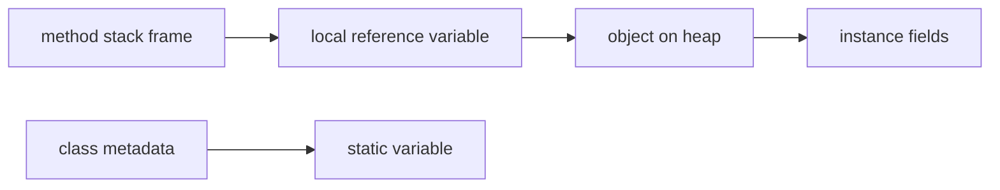

# Default Values, Scope, And Lifetime

Variables are affected by where they are declared. Location influences default values, visibility, and lifetime.

## Default Values

Fields get default values if not initialized.

```java
class Student {
    int age;        // default 0
    boolean active; // default false
    String name;    // default null
}
```

Local variables do not get usable default values.

```java
public void demo() {
    int count;
    // System.out.println(count); // does not compile
}
```

This rule prevents accidental use of uninitialized local data.

## Scope

Scope is the region of code where a variable can be accessed.

```java
public void demo() {
    int outer = 10;

    if (outer > 5) {
        int inner = 20;
        System.out.println(inner);
    }

    System.out.println(outer);
    // System.out.println(inner); // not visible here
}
```

`inner` is visible only inside the `if` block.

## Lifetime

Lifetime is how long a variable exists.

- A local variable exists while its method/block is executing.
- An instance variable exists as long as its object exists.
- A static variable exists as long as the class is loaded.

## Stack And Heap Mental Model

For beginners, use this simplified model:

- Local variables are associated with method execution and stack frames.
- Objects are stored on the heap.
- Reference variables can point to heap objects.
- Instance variables live inside objects.
- Static variables are associated with the class.



This is a learning model, not a complete JVM memory specification.

## Default Values Reference Table

| Type           | Default value |
|----------------|---------------|
| `byte`         | `0`           |
| `short`        | `0`           |
| `int`          | `0`           |
| `long`         | `0L`          |
| `float`        | `0.0f`        |
| `double`       | `0.0d`        |
| `char`         | `'\u0000'` (null char) |
| `boolean`      | `false`       |
| Any reference  | `null`        |

These defaults apply only to **fields** (instance and static), never to local variables.

```java
class Demo {
    int count;       // field → default 0
    String label;    // field → default null
    boolean active;  // field → default false

    void show() {
        System.out.println(count);   // 0
        System.out.println(label);   // null
        System.out.println(active);  // false
    }
}
```

## Case Study: Loop Variable Scope Surprise

A developer wants to read a loop counter after the loop finishes.

```java
// Does NOT compile
public void run() {
    for (int i = 0; i < 5; i++) {
        System.out.println(i);
    }
    System.out.println(i); // compile error: cannot find symbol — i is out of scope
}
```

`i` is scoped to the `for` loop block. It ceases to exist once the loop ends.

**Fix — declare outside if you need access after the loop:**

```java
public void run() {
    int i;                          // declared in method scope
    for (i = 0; i < 5; i++) {
        System.out.println(i);
    }
    System.out.println(i);          // 5 — accessible here
}
```

This also shows that scope and initialization are separate concerns: `i` is in scope after the loop, and because the loop always assigns it, Java accepts its use.

## Case Study: Scope vs Lifetime

```java
public void demo() {
    StringBuilder result = null;     // reference is in scope

    {
        StringBuilder temp = new StringBuilder("work");
        temp.append(" data");
        result = temp;               // result now points to the StringBuilder
    }
    // temp is out of scope here — but the StringBuilder object is still alive
    // because result still references it
    System.out.println(result);      // prints "work data"
}
```

`temp` (the reference) is dead after its block ends. The `StringBuilder` object on the heap survives as long as `result` is alive.

## Common Mistakes

- Assuming local variables have default values.
- Trying to use a block variable outside its scope (compile error, not runtime error).
- Confusing scope with lifetime — an object can outlive a reference variable.
- Thinking stack/heap is only about primitive vs reference types.
- Trying to read a `for` loop counter variable after the loop ends.
