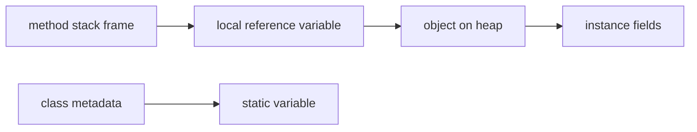

# Default Values, Scope, And Lifetime

Variables are affected by where they are declared. Location influences default values, visibility, and lifetime.

## Default Values

Fields get default values if not initialized.

```java
class Student {
    int age;        // default 0
    boolean active; // default false
    String name;    // default null
}
```

Local variables do not get usable default values.

```java
public void demo() {
    int count;
    // System.out.println(count); // does not compile
}
```

This rule prevents accidental use of uninitialized local data.

## Scope

Scope is the region of code where a variable can be accessed.

```java
public void demo() {
    int outer = 10;

    if (outer > 5) {
        int inner = 20;
        System.out.println(inner);
    }

    System.out.println(outer);
    // System.out.println(inner); // not visible here
}
```

`inner` is visible only inside the `if` block.

## Lifetime

Lifetime is how long a variable exists.

- A local variable exists while its method/block is executing.
- An instance variable exists as long as its object exists.
- A static variable exists as long as the class is loaded.

## Stack And Heap Mental Model

For beginners, use this simplified model:

- Local variables are associated with method execution and stack frames.
- Objects are stored on the heap.
- Reference variables can point to heap objects.
- Instance variables live inside objects.
- Static variables are associated with the class.



This is a learning model, not a complete JVM memory specification.

## Common Mistakes

- Assuming local variables have default values.
- Trying to use a block variable outside its scope.
- Confusing scope with lifetime.
- Thinking stack/heap is only about primitive vs reference types.
