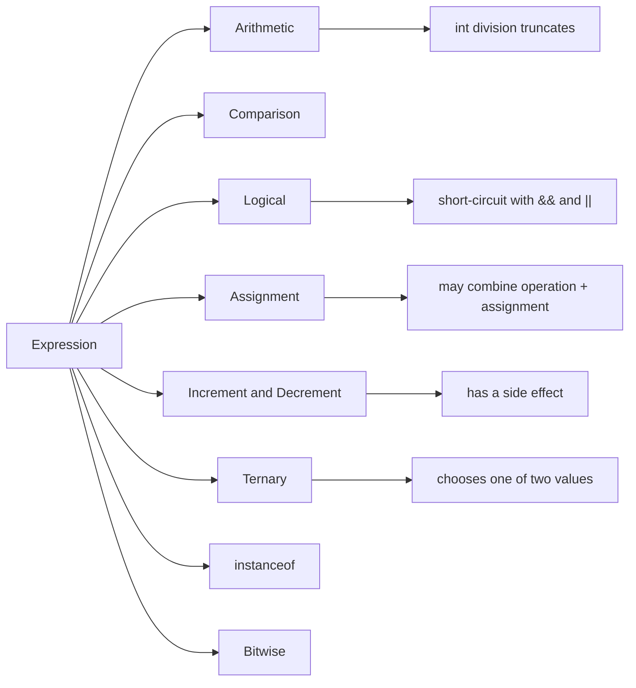

# 05 - Operators

Operators are the symbols and keywords that combine values into expressions. They are small, but they decide how Java calculates, compares, converts, assigns, and chooses values.

This topic is not only about memorizing symbols. You should learn what each operator does, what type of result it produces, whether it evaluates both sides, and whether it changes a variable as a side effect.

## Study Order

1. Read [Arithmetic and Assignment Operators](theory/01-arithmetic-assignment-operators.md).
2. Read [Comparison and Logical Operators](theory/02-comparison-logical-operators.md).
3. Read [Bitwise, Increment, Ternary, and instanceof](theory/03-bitwise-increment-ternary-instanceof.md).
4. Read [Precedence and Short-Circuit Evaluation](theory/04-precedence-short-circuit.md).
5. Review [Operator Terms](terms/01-operator-terms.md) whenever a word feels too compressed.
6. Practice with the four Anki files in [anki](anki).

## Operator Map

## What You Must Be Able To Do

- Predict integer division and modulo results.
- Explain why `==` is different from `.equals()` for objects.
- Explain the difference between `&&` and `&` in boolean expressions.
- Predict code that uses `i++`, `++i`, `i--`, and `--i`.
- Use parentheses to make a complex expression readable.
- Recognize when the ternary operator improves code and when it makes code harder to understand.
- Use `instanceof` safely, including pattern matching syntax.

## Self-Check

Before moving to the next topic, verify that you can answer these "why" questions:
1. Why do logical AND (`&&`) and OR (`||`) operators short-circuit, and how does this prevent runtime exceptions like `NullPointerException`?
2. What is the difference in execution behavior between logical operators (`&&`, `||`) and bitwise/logical operators (`&`, `|`) when applied to boolean expressions?
3. How do the bitwise shift operators (`<<`, `>>`, `>>>`) manipulate binary representations, and what is the difference between signed and unsigned right shifts?
4. Why do compound assignment operators (like `+=`, `*=`) perform implicit type casting, and what potential overflow risks can this mask?
5. What is the execution mechanism and side effect differences between prefix (`++i`) and postfix (`i++`) increment/decrement operators?
6. How does `instanceof` perform pattern matching in modern Java, and why is it preferred over traditional checking and casting?
7. Why does operator precedence and associativity matter in complex compound expressions, and how do parentheses affect readability and correctness?

## Anki Files

- [basic.tsv](anki/basic.tsv): direct concept questions.
- [basic-extra.tsv](anki/basic-extra.tsv): deeper explanation cards.
- [cloze.tsv](anki/cloze.tsv): memory-focused cards.
- [code-question.tsv](anki/code-question.tsv): code prediction and error analysis.

## Personal Notes

-

## Reference Links

- https://docs.oracle.com/javase/tutorial/java/nutsandbolts/operators.html
