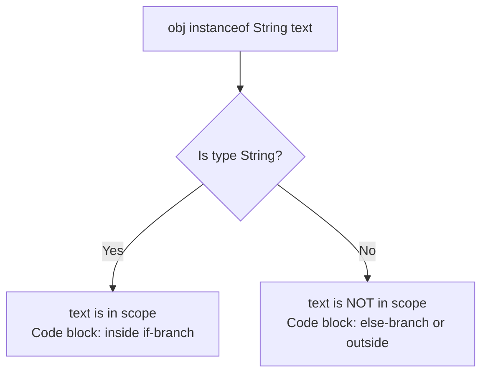

# Bitwise, Increment, Ternary, and instanceof

Some Java operators are less frequent in beginner code, but they are important for reading real programs and interview-style questions.

## Increment and Decrement

`++` increases a numeric variable by one. `--` decreases it by one.

```java
int count = 3;
count++; // count is now 4
count--; // count is now 3
```

The prefix and postfix forms differ when used inside a larger expression.

```java
int x = 5;
int a = x++; // a is 5, x becomes 6

int y = 5;
int b = ++y; // y becomes 6, b is 6
```

Postfix means "use the old value, then change the variable." Prefix means "change the variable, then use the new value."

Avoid writing dense expressions such as:

```java
int result = i++ + ++i;
```

They are legal in Java, but they force the reader to track side effects instead of understanding intent.

## How Prefix and Postfix Increments Work Under the Hood

The difference between prefix (`++i`) and postfix (`i++`) increment operators lies in the execution order of value retrieval and variable modification within the JVM's operand stack. During bytecode execution, Java uses local variable slots to store the actual values and an operand stack to evaluate expressions. In a postfix increment (`i++`), the current value of the variable is copied and pushed onto the operand stack first, after which the local variable is immediately incremented. When the expression is resolved, it uses the stale value popped from the operand stack. In a prefix increment (`++i`), the local variable is incremented first, and the newly updated value is then pushed onto the operand stack, meaning any enclosing expression immediately sees the new value.

### Stack and Local Variable Mental Model

This ASCII diagram depicts how the JVM evaluates `int a = x++` versus `int b = ++y`:

```text
POSTFIX: int a = x++ (x begins as 5)
┌────────────────────────────────────────┐
│ 1. Push x (5) to Operand Stack         │ Stack: [ 5 ]
│ 2. Increment x in Local Variable Slot  │ Local Var Slot: [ x = 6 ]
│ 3. Pop Stack value (5) to assign to a  │ Local Var Slot: [ a = 5 ]
└────────────────────────────────────────┘

PREFIX: int b = ++y (y begins as 5)
┌────────────────────────────────────────┐
│ 1. Increment y in Local Variable Slot  │ Local Var Slot: [ y = 6 ]
│ 2. Push y (6) to Operand Stack         │ Stack: [ 6 ]
│ 3. Pop Stack value (6) to assign to b  │ Local Var Slot: [ b = 6 ]
└────────────────────────────────────────┘
```

### Cause-Effect Chain
`int a = x++` (where `x = 5`) is evaluated → the JVM loads the current value `5` from the local variable slot and pushes it onto the operand stack → the JVM increments the value of `x` inside the local variable slot to `6` → the assignment operator `=` pops the value `5` off the stack and writes it to the local variable slot for `a` → variable `a` is stored as `5` while `x` is stored as `6`.

### Code Example
```java
int x = 5;
int a = x++;
System.out.println("a = " + a + ", x = " + x); // a = 5, x = 6

int y = 5;
int b = ++y;
System.out.println("b = " + b + ", y = " + y); // b = 6, y = 6
```

## Side Effects

A side effect is a change that happens while evaluating an expression. `i++` has a side effect because it changes `i`. Method calls can also have side effects if they modify state, print output, write files, or call external systems.

Side effects matter because short-circuit operators may skip them.

```java
int x = 0;
boolean result = true || x++ > 0;
System.out.println(x); // 0
```

The right side is never evaluated because `true || anything` is already true.

## Ternary Operator

The ternary operator chooses one of two expressions:

```java
String label = score >= 60 ? "pass" : "fail";
```

The structure is:

```java
condition ? valueIfTrue : valueIfFalse
```

Use it when both branches are short and produce a value. Prefer `if/else` when branches involve multiple statements or complex business rules.

## `instanceof`

The `instanceof` operator checks whether an object is compatible with a type.

```java
Object value = "Java";

if (value instanceof String) {
    System.out.println("It is a string");
}
```

Modern Java supports pattern matching for `instanceof`:

```java
if (value instanceof String text) {
    System.out.println(text.toUpperCase());
}
```

This both checks the type and declares a variable with the matched type.

`instanceof` returns false when the left-hand expression is `null`.

```java
String name = null;
System.out.println(name instanceof String); // false
```

## Why Pattern Matching for instanceof is Safer and Cleaner

Historically, performing type-specific operations on an object reference required a two-step process: first testing the type using `instanceof`, then explicitly casting the reference to the target type. This pattern is verbose and error-prone because there is no compiler-enforced link between the type check and the cast; a developer could check for one type but accidentally cast to another, throwing a `ClassCastException` at runtime. Modern Java (standardized in Java 16) solves this with pattern matching for `instanceof`, which combines the check, binding, and cast into a single atomic operation. If the check succeeds, Java automatically casts the object and assigns it to a new pattern variable whose scope is restricted to the conditional branch where the type is guaranteed.

### Compiler-Enforced Binding Scope

This Mermaid diagram shows how the binding of the pattern variable `text` is restricted to the block where the compiler can guarantee the reference is indeed a String:



### Cause-Effect Chain
`obj` reference is tested with `obj instanceof String text` → Java checks if `obj` is non-null and matches the `String` type → if true, the compiler creates a pattern variable `text` of type `String` initialized with the cast value of `obj` → the scope of `text` is flow-scoped (available only where the type is guaranteed, e.g. within the `if` block) → any attempt to use `text` outside this scope fails compile-time check, guaranteeing safety.

### Code Example
```java
Object obj = "Hello, World!";

// Safe conditional pattern matching
if (obj instanceof String text) {
    // No explicit cast String text = (String) obj; is needed
    System.out.println(text.length()); // 13
} else {
    // System.out.println(text); // Compile-time error: 'text' is not in scope here
}
```

## Bitwise Operators

Bitwise operators work on the binary representation of integer values.

| Operator | Meaning |
|---|---|
| `&` | bitwise AND |
| `|` | bitwise OR |
| `^` | bitwise XOR |
| `~` | bitwise complement |
| `<<` | left shift |
| `>>` | signed right shift |
| `>>>` | unsigned right shift |

Beginner Java code does not use bitwise operators often, but they appear in flags, permissions, low-level code, hashing, performance-sensitive code, and some library internals.

### Bitwise AND — Masking

`&` keeps a bit only when **both** operands have a 1 in that position.

```java
int a = 0b1010;  // 10 in decimal
int b = 0b1100;  // 12 in decimal
System.out.println(a & b); // 0b1000 = 8

// Common use: check whether a number is even or odd
int n = 7;
System.out.println(n & 1); // 1 → odd (least-significant bit is 1)
n = 8;
System.out.println(n & 1); // 0 → even
```

### Bitwise OR — Setting Flags

`|` sets a bit when **either** operand has a 1 in that position.

```java
int READ  = 0b001; // 1
int WRITE = 0b010; // 2
int EXEC  = 0b100; // 4

int permissions = READ | WRITE; // 0b011 = 3
System.out.println(permissions); // 3

// Check if WRITE is set:
System.out.println((permissions & WRITE) != 0); // true
```

### Bitwise XOR — Toggle

`^` produces 1 when the bits **differ**.

```java
int toggle = 0b1010;
int mask   = 0b1111;
System.out.println(toggle ^ mask); // 0b0101 = 5

// XOR with itself is always 0 — classic interview trick:
int x = 42;
System.out.println(x ^ x); // 0
```

### Shift Operators

Left shift (`<<`) multiplies by a power of 2. Right shift (`>>`) divides (signed).

```java
int n = 1;
System.out.println(n << 3);  // 8  (1 * 2^3)
System.out.println(16 >> 2); // 4  (16 / 2^2)

// Negative values: >> preserves sign bit (arithmetic shift)
System.out.println(-8 >> 1); // -4
// >>> fills with zeros regardless of sign (logical shift)
System.out.println(-8 >>> 1); // 2147483644 (very large positive)
```

### How Bitwise Shift Operators Manipulate Bits

Bitwise shift operators (`<<`, `>>`, `>>>`) manipulate the underlying binary representation of integers by moving all bits left or right by a specified number of positions. The left shift operator (`<<`) shifts bits to the left and fills the vacated rightmost positions with `0`s, which is equivalent to multiplying the value by $2^n$ (where $n$ is the shift count). The signed right shift operator (`>>`) shifts bits to the right and fills the vacated leftmost positions with a copy of the original sign bit (Most Significant Bit), preserving the sign of the number (also called an arithmetic shift). The unsigned right shift operator (`>>>`) shifts bits to the right but always fills the vacated leftmost positions with `0`s (also called a logical shift), which converts negative numbers into extremely large positive values because the sign bit becomes `0`.

#### Sign Extension vs Zero Fill Mental Model

This ASCII diagram illustrates how a signed right shift preserves a negative sign, while an unsigned right shift forces a positive value by padding with `0` (represented as 8-bit values for simplicity, though Java uses 32-bit `int`s):

```text
Original value (-8):
┌───┬───┬───┬───┬───┬───┬───┬───┐
│ 1 │ 1 │ 1 │ 1 │ 1 │ 0 │ 0 │ 0 │  (Sign bit is 1)
└───┴───┴───┴───┴───┴───┴───┴───┘

Signed Right Shift (>> 1):  --> Sign bit (1) is copied to fill the left void
┌───┐───┬───┬───┬───┬───┬───┬───┐
│ 1 │ 1 │ 1 │ 1 │ 1 │ 1 │ 0 │ 0 │  (Result is -4, sign is preserved)
└───└───┴───┴───┴───┴───┴───┴───┘

Unsigned Right Shift (>>> 1):  --> Zero (0) is forced to fill the left void
┌───┐───┬───┬───┬───┬───┬───┬───┐
│ 0 │ 1 │ 1 │ 1 │ 1 │ 1 │ 0 │ 0 │  (Result is 124, sign bit becomes 0 -> positive!)
└───└───┴───┴───┴───┴───┴───┴───┘
```

#### Cause-Effect Chain
`int x = -8` (represented in 32-bit two's complement as `11111111 11111111 11111111 11111000`) is shifted with `>>> 1` → all bits move one position to the right → the most significant bit is filled with `0` → the new bit pattern is `01111111 11111111 11111111 11111100` → since the sign bit is now `0`, the JVM interprets the result as positive, yielding the decimal value `2147483644`.

#### Code Example
```java
int positive = 16;
System.out.println(positive >> 2);  // 4  (16 / 2^2)
System.out.println(positive << 2);  // 64 (16 * 2^2)

int negative = -8;
System.out.println(negative >> 1);   // -4 (sign preserved)
System.out.println(negative >>> 1);  // 2147483644 (sign bit becomes 0)
```

For normal boolean conditions, do not use bitwise operators unless you specifically need non-short-circuit evaluation.

---

## Case Study: `i++` vs `++i` in a For Loop

A common interview question is: "Does it matter whether you write `i++` or `++i` in a for loop?"

```java
// Version A — postfix
for (int i = 0; i < 3; i++) {
    System.out.println(i);
}
// Output: 0  1  2

// Version B — prefix
for (int i = 0; i < 3; i++) {
    System.out.println(i);
}
// Output: 0  1  2   (identical!)
```

**In a for loop's update expression (`i++` or `++i`), the result of the expression is discarded.** Both forms simply increment `i` by 1 before the next iteration. The difference between prefix and postfix only matters when the **value** of the increment expression is used in a larger expression.

Where the difference IS visible:

```java
int i = 5;
System.out.println(i++); // prints 5, then i becomes 6
System.out.println(i);   // 6

int j = 5;
System.out.println(++j); // j becomes 6, then prints 6
System.out.println(j);   // 6
```

And a trickier combined example:

```java
int a = 3;
int b = a++ + ++a;
// Step 1: a++ → produces 3, side effect: a becomes 4
// Step 2: ++a → a becomes 5, produces 5
// Step 3: 3 + 5 = 8
System.out.println(b); // 8
System.out.println(a); // 5
```

**Rule of thumb**: Use `i++` or `++i` standalone. Avoid embedding them inside larger expressions — the side effects make the code hard to reason about.

---

## Common Mistakes

### Mistake 1 — Assuming `i++` and `++i` Always Differ

```java
// Both produce the same loop:
for (int i = 0; i < 5; i++) { /* ... */ }
for (int i = 0; i < 5; ++i) { /* ... */ }
// The loop body sees the same sequence: 0, 1, 2, 3, 4
```

They only differ when the expression result is used, not when the expression runs standalone.

### Mistake 2 — Misreading Postfix in Assignment

```java
int x = 10;
int y = x++;  // y = 10, x = 11  ← NOT both 11
System.out.println("x=" + x + " y=" + y); // x=11 y=10
```

### Mistake 3 — Ternary With Side Effects

```java
int count = 0;
// Which branch runs depends on the condition.
// Both increment count if you are not careful:
int result = (count > 0) ? count++ : ++count;
System.out.println(count);  // 1 either way, but result differs
System.out.println(result); // 0 if count was 0 (postfix path), would be 1 if prefix path
```

Prefer moving side effects out of the ternary expression entirely.
