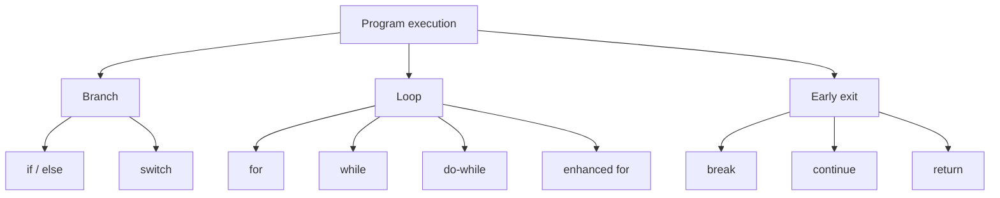

# 06 - Control Flow

Control flow is the order in which a program executes statements. Without control flow, Java code would only run from top to bottom. With control flow, a program can choose branches, repeat work, stop early, and return results.

This topic is about reading the real path a program takes.

## Study Order

1. Read [if, else, and switch](theory/01-if-else-switch.md).
2. Read [Loops](theory/02-loops.md).
3. Read [break, continue, and return](theory/03-break-continue-return.md).
4. Read [Switch Expressions and Labeled Control](theory/04-switch-expression-labeled-control.md).
5. Review [Control Flow Terms](terms/01-control-flow-terms.md).
6. Practice all four Anki card types in [anki](anki).

## Control Flow Map

## What You Must Be Able To Do

- Decide which branch runs in an `if/else if/else` chain.
- Explain why `else` binds to the nearest unmatched `if`.
- Choose between `for`, `while`, `do-while`, and enhanced `for`.
- Predict loop output and loop termination.
- Explain the difference between `break`, `continue`, and `return`.
- Use switch statements and switch expressions correctly.
- Recognize labeled `break` and labeled `continue` without overusing them.

## Anki Files

- [basic.tsv](anki/basic.tsv): direct control flow questions.
- [basic-extra.tsv](anki/basic-extra.tsv): deeper explanation cards.
- [cloze.tsv](anki/cloze.tsv): recall cards.
- [code-question.tsv](anki/code-question.tsv): output prediction and bug analysis.

## Personal Notes

-

## Reference Links

- https://docs.oracle.com/javase/tutorial/java/nutsandbolts/flow.html
