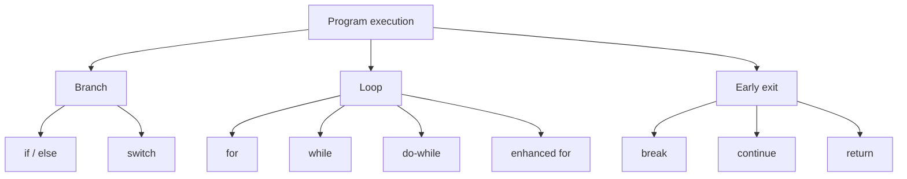

# 06 - Control Flow

Control flow is the order in which a program executes statements. Without control flow, Java code would only run from top to bottom. With control flow, a program can choose branches, repeat work, stop early, and return results.

This topic is about reading the real path a program takes.

## Study Order

1. Read [if, else, and switch](theory/01-if-else-switch.md).
2. Read [Loops](theory/02-loops.md).
3. Read [break, continue, and return](theory/03-break-continue-return.md).
4. Read [Switch Expressions and Labeled Control](theory/04-switch-expression-labeled-control.md).
5. Review [Control Flow Terms](terms/01-control-flow-terms.md).
6. Practice all four Anki card types in [anki](anki).

## Control Flow Map

## What You Must Be Able To Do

- Decide which branch runs in an `if/else if/else` chain.
- Explain why `else` binds to the nearest unmatched `if`.
- Choose between `for`, `while`, `do-while`, and enhanced `for`.
- Predict loop output and loop termination.
- Explain the difference between `break`, `continue`, and `return`.
- Use switch statements and switch expressions correctly.
- Recognize labeled `break` and labeled `continue` without overusing them.

## Self-Check

Before moving on, verify you can answer these deep conceptual "why" questions:
1. **Why does the dangling-else ambiguity occur in Java, and how does the compiler resolve it when braces are omitted?** (See [Why Dangling Else Ambiguity Occurs](theory/01-if-else-switch.md#why-dangling-else-ambiguity-occurs-and-how-java-resolves-it))
2. **Why do `while` and `do-while` loops differ under the hood, and how does this affect compilation into bytecode?** (See [How while and do-while Differ in Bytecode](theory/02-loops.md#under-the-hood-how-while-and-do-while-differ-in-bytecode))
3. **Why does the enhanced-for loop compile into different bytecode for arrays versus `Iterable` collections, and how does this relate to `ConcurrentModificationException`?** (See [Array vs. Iterable Mechanics in Enhanced for Loops](theory/02-loops.md#under-the-hood-array-vs-iterable-mechanics-in-enhanced-for-loops))
4. **Why does a labeled `break` or `continue` work to control nested loops, and how does the JVM handle labeled control transfer at the bytecode level?** (See [How the JVM Handles Labeled break and continue](theory/03-break-continue-return.md#under-the-hood-how-the-jvm-handles-labeled-break-and-continue))
5. **Why does Java enforce compile-time unreachable statement detection, and what static analysis mechanism does it use?** (See [Why Java Prohibits Unreachable Statements](theory/03-break-continue-return.md#why-java-prohibits-unreachable-statements-and-how-the-compiler-detects-them))
6. **Why are switch expressions strictly required to be exhaustive by the compiler, whereas switch statements are not?** (See [Why Switch Expressions Require Exhaustiveness](theory/04-switch-expression-labeled-control.md#why-switch-expressions-require-exhaustiveness-and-how-it-is-enforced))

## Anki Files

- [basic.tsv](anki/basic.tsv): direct control flow questions.
- [basic-extra.tsv](anki/basic-extra.tsv): deeper explanation cards.
- [cloze.tsv](anki/cloze.tsv): recall cards.
- [code-question.tsv](anki/code-question.tsv): output prediction and bug analysis.

## Personal Notes

-

## Reference Links

- https://docs.oracle.com/javase/tutorial/java/nutsandbolts/flow.html
