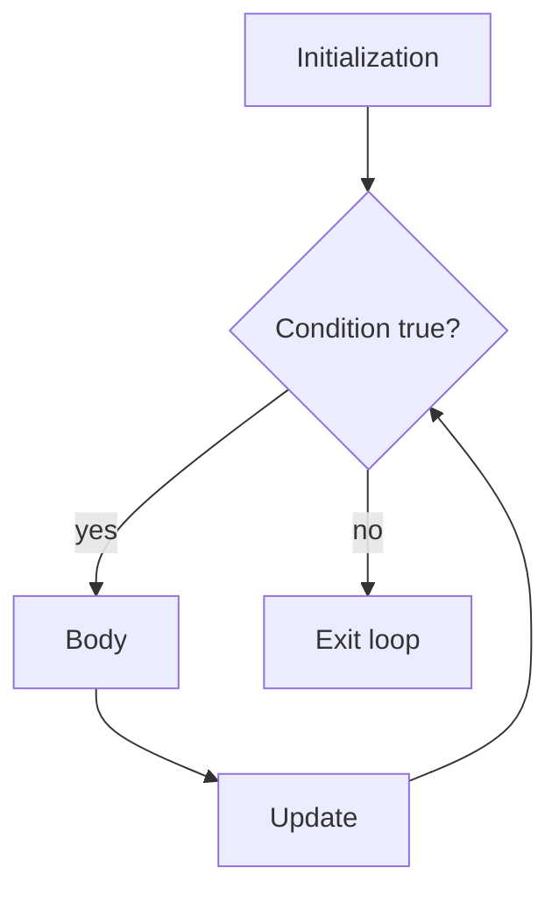

# Loops

Loops repeat code. The key to understanding any loop is knowing its initialization, condition, body, update, and stopping point.

## `while`

A `while` loop checks the condition before each iteration.

```java
int count = 0;

while (count < 3) {
    System.out.println(count);
    count++;
}
```

If the condition is false at the beginning, the loop body never runs.

## `do-while`

A `do-while` loop checks the condition after each iteration.

```java
int count = 0;

do {
    System.out.println(count);
    count++;
} while (count < 3);
```

The body always runs at least once.

## `for`

A classic `for` loop puts initialization, condition, and update in one header.

```java
for (int i = 0; i < 3; i++) {
    System.out.println(i);
}
```

It is usually best when you know the loop counter pattern.

The structure is:

```java
for (initialization; condition; update) {
    body
}
```

Execution order:



## Enhanced `for`

The enhanced `for` loop reads each element from an array or iterable.

```java
for (String name : names) {
    System.out.println(name);
}
```

It is good when you need each element but do not need the index.

If you need to modify elements by index, remove elements safely, or compare neighboring elements, a classic `for` loop may be better.

## Infinite Loops

An infinite loop never reaches a false condition or exit statement.

```java
while (true) {
    readNextCommand();
}
```

Some infinite loops are intentional, especially in servers, games, and command processors. They still need a controlled exit such as `break`, `return`, or external shutdown logic.

Accidental infinite loops often happen when the loop update is missing.

```java
int i = 0;
while (i < 3) {
    System.out.println(i);
    // missing i++
}
```

## Choosing A Loop

Use a classic `for` loop when:

- You need an index.
- You know the counter range.
- You need to update by a predictable step.

Use enhanced `for` when:

- You only need each element.
- You do not need the index.

Use `while` when:

- The number of iterations is not known in advance.
- The loop depends on an external condition.

Use `do-while` when:

- The body must run at least once before checking the condition.
