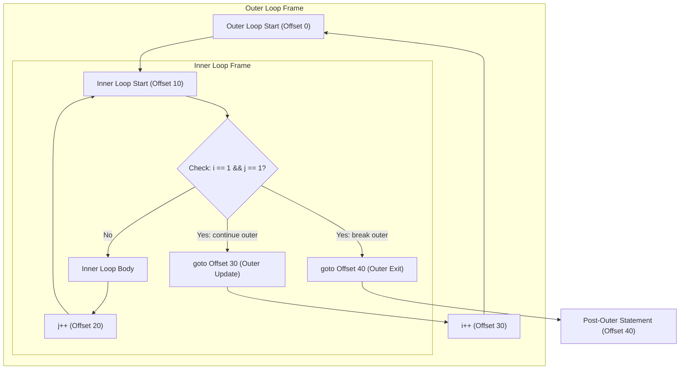
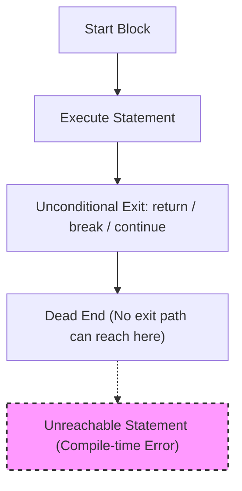

# break, continue, and return

`break`, `continue`, and `return` change the normal flow of execution. They are early-exit tools, but they exit different things.

## `break`

`break` exits the nearest loop or `switch`.

```java
for (int i = 0; i < 10; i++) {
    if (i == 3) {
        break;
    }
    System.out.println(i);
}
```

This prints `0`, `1`, and `2`, then exits the loop.

In a traditional `switch`, `break` prevents fall-through.

## `continue`

`continue` skips the rest of the current loop iteration and moves to the next iteration.

```java
for (int i = 0; i < 5; i++) {
    if (i == 2) {
        continue;
    }
    System.out.println(i);
}
```

This prints `0`, `1`, `3`, and `4`.

In a `for` loop, `continue` still goes to the update step before checking the condition again.

## `return`

`return` exits the current method.

```java
int max(int a, int b) {
    if (a >= b) {
        return a;
    }

    return b;
}
```

In a non-void method, `return` must provide a value compatible with the method return type. In a `void` method, `return;` exits without a value.

## Comparing The Three

| Statement | Exits what? | Common use |
|---|---|---|
| `break` | nearest loop or switch | stop searching, prevent switch fall-through |
| `continue` | current loop iteration | skip one item and keep looping |
| `return` | current method | finish a method early or return a result |

## Early Exit And Readability

Early exits can make code clearer when they remove unnecessary nesting.

```java
void process(User user) {
    if (user == null) {
        return;
    }

    if (!user.isActive()) {
        return;
    }

    sendMessage(user);
}
```

This uses guard clauses. The main action appears after invalid cases are handled.

Early exits can also hurt readability if scattered unpredictably through a long method. Use them to clarify the flow, not to hide it.

## Nested Loops

Inside nested loops, plain `break` exits only the nearest loop.

```java
for (int row = 0; row < 3; row++) {
    for (int col = 0; col < 3; col++) {
        if (row == col) {
            break;
        }
    }
}
```

If you need to exit an outer loop, you can use a flag, extract a method and `return`, or use a labeled `break`.

## Under the Hood: How the JVM Handles Labeled break and continue

Standard `break` and `continue` statements in Java operate implicitly on the innermost loop or switch structure. When managing complex nested loops, developers use labeled statements (e.g., `labelName:`) to specify which outer loop should be targeted. In Java bytecode, labels do not exist as named symbols; they are compiled away entirely. The Java compiler (`javac`) processes the label by calculating the bytecode offsets for the target loop's update instructions (for `continue`) or the statement immediately following the loop (for `break`). The compiler then replaces the labeled statement with a direct `goto` instruction targeting that specific bytecode offset, bypassing the default nesting rules.



### Bytecode Compilation Analysis

Consider this nested loop structure with a labeled break:

```java
public void search() {
    outer:
    for (int i = 0; i < 3; i++) {
        for (int j = 0; j < 3; j++) {
            if (i == 1 && j == 1) {
                break outer; // Jumps completely out of outer loop
            }
        }
    }
}
// Under the hood, javac translates this to the following bytecode offsets:
// 0: iconst_0
// 1: istore_1          // i = 0
// 2: iload_1
// 3: iconst_3
// 4: if_icmpge 28      // If i >= 3, jump to 28 (end of outer loop)
// 7: iconst_0
// 8: istore_2          // j = 0
// 9: iload_2
// 10: iconst_3
// 11: if_icmpge 22     // If j >= 3, jump to 22 (end of inner loop)
// 14: iload_1
// 15: iconst_1
// 16: if_icmpne 19     // Check i == 1 and j == 1
// 19: goto 28          // break outer: Direct jump to outer loop exit (offset 28)
// 22: iinc 1, 1        // i++ (outer loop update)
// 25: goto 2           // Loop back to outer check
// 28: return           // Exit method
```

### Cause-Effect Chain
Compiler parses labeled control command (`break outer`) $\rightarrow$ Compiler maps symbolic label to target loop's exit bytecode offset (offset 28) $\rightarrow$ Compiler emits direct `goto 28` instruction $\rightarrow$ JVM jumps directly to the target location at runtime $\rightarrow$ All intermediate loops are exited cleanly without requiring flag variables or conditional logic checks.

---


## Common Mistakes

### Mistake 1 — Unreachable statements
Writing code immediately after a `break`, `continue`, or `return` statement in the same block causes a compile-time error.

```java
for (int i = 0; i < 5; i++) {
    if (i == 2) {
        continue;
        // BUG: Compile-time error: unreachable statement
        System.out.println("Skipping 2"); 
    }
}
```

**Fix**: Ensure no statements follow early-exit keywords in the same block.

## Why Java Prohibits Unreachable Statements and How the Compiler Detects Them

Java does not permit statements to exist if they cannot be executed under any runtime condition. To enforce this, the Java compiler performing static analysis builds a Control Flow Graph (CFG) of the code and applies "definite completion" rules (detailed in JLS 14.21). If an instruction block terminates with an unconditional jump (such as `return`, `break`, `continue`, or a thrown exception), the compiler evaluates subsequent statements in that block as having no incoming control edges. Rather than warning the developer or compiling dead bytecode, the compiler throws a compile-time error to prevent latent logical errors, minimize bytecode footprints, and enforce clear flow design.



### Code Example: Unreachable Code compilation Error

In the code below, once `return` is processed, the subsequent statement is statically unreachable.

```java
public int processScore(int score) {
    if (score < 0) {
        return 0;
        // The following line causes a compilation error!
        // System.out.println("Invalid score reset"); // Compile-time error: unreachable statement
    }
    return score;
}
```

### Cause-Effect Chain
Developer writes statement immediately after a block-terminating control transfer statement $\rightarrow$ Compiler constructs Control Flow Graph (CFG) $\rightarrow$ Statically verifies that no execution paths can branch to the statement $\rightarrow$ Definite completion check for the statement fails $\rightarrow$ Compiler emits an "unreachable statement" compilation error and halts compilation.

### Mistake 2 — Confusing loop `break` with switch `break`
A `break` statement inside a `switch` block nested within a loop only exits the `switch`, NOT the loop itself.

```java
// BUG: Intended to exit the loop on status 200, but only exits the switch
while (true) {
    int status = getResponseCode();
    switch (status) {
        case 200:
            break; // Exits switch block, loop continues infinitely!
        case 500:
            System.out.println("Error");
            break;
    }
}

// FIX: Use a label, flag, or return to exit the loop
outerLoop:
while (true) {
    int status = getResponseCode();
    switch (status) {
        case 200:
            break outerLoop; // Exits the while loop labeled 'outerLoop'
        case 500:
            System.out.println("Error");
            break;
    }
}
```

### Mistake 3 — `continue` causing infinite loops in `while` loops
In a `for` loop, `continue` jumps to the update expression (e.g., `i++`). In a `while` or `do-while` loop, `continue` jumps directly to the condition check, skipping any update statements placed below it.

```java
int i = 0;
// BUG: Infinite loop because i++ is skipped when i == 1
while (i < 5) {
    if (i == 1) {
        continue; 
    }
    System.out.println(i);
    i++;
}

// FIX: Perform the update before continue or use a for loop
int i = 0;
while (i < 5) {
    if (i == 1) {
        i++;
        continue; 
    }
    System.out.println(i);
    i++;
}
```

---

## Case Study — Labeled Control Flow with Nested Loop Tracing

Labeled statements allow fine-grained control when managing nested loops. The label precedes the target loop (e.g., `labelName:`).

### Labeled `continue` Tracing Case Study

```java
outer:
for (int i = 1; i <= 3; i++) {
    for (int j = 1; j <= 3; j++) {
        if (i == 2 && j == 2) {
            continue outer;
        }
        System.out.println("i=" + i + ", j=" + j);
    }
}
```

**Step-by-Step Execution Trace:**
1. **`i = 1`**: Outer loop begins.
   - **`j = 1`**: Condition `i==2 && j==2` is false. Prints `i=1, j=1`.
   - **`j = 2`**: Condition is false. Prints `i=1, j=2`.
   - **`j = 3`**: Condition is false. Prints `i=1, j=3`.
2. **`i = 2`**: Outer loop updates to 2.
   - **`j = 1`**: Condition `i==2 && j==1` is false. Prints `i=2, j=1`.
   - **`j = 2`**: Condition `i==2 && j==2` is **true**.
     - `continue outer` runs.
     - Execution jumps immediately to the update step of the `outer` loop (`i++`).
     - The inner loop iteration for `j=3` is completely skipped.
3. **`i = 3`**: Outer loop updates to 3.
   - **`j = 1`**: Condition is false. Prints `i=3, j=1`.
   - **`j = 2`**: Condition is false. Prints `i=3, j=2`.
   - **`j = 3`**: Condition is false. Prints `i=3, j=3`.

**Output:**
```text
i=1, j=1
i=1, j=2
i=1, j=3
i=2, j=1
i=3, j=1
i=3, j=2
i=3, j=3
```

---

### Labeled `break` Tracing Case Study

```java
outer:
for (int i = 1; i <= 3; i++) {
    for (int j = 1; j <= 3; j++) {
        if (i == 2 && j == 2) {
            break outer;
        }
        System.out.println("i=" + i + ", j=" + j);
    }
}
```

**Step-by-Step Execution Trace:**
1. **`i = 1`**: Outer loop begins.
   - **`j = 1`**: Prints `i=1, j=1`.
   - **`j = 2`**: Prints `i=1, j=2`.
   - **`j = 3`**: Prints `i=1, j=3`.
2. **`i = 2`**: Outer loop updates to 2.
   - **`j = 1`**: Prints `i=2, j=1`.
   - **`j = 2`**: Condition `i==2 && j==2` is **true**.
     - `break outer` runs.
     - Execution breaks completely out of the loop labeled `outer`.
     - The program resumes at the statement immediately following the outer loop block.

**Output:**
```text
i=1, j=1
i=1, j=2
i=1, j=3
i=2, j=1
```

## Reference Links

- https://docs.oracle.com/javase/specs/jls/se21/html/jls-14.html#jls-14.7 (Labeled Statements in the Java Language Specification)
- https://docs.oracle.com/javase/specs/jls/se21/html/jls-14.html#jls-14.15 (The break Statement in the Java Language Specification)
- https://docs.oracle.com/javase/specs/jls/se21/html/jls-14.html#jls-14.16 (The continue Statement in the Java Language Specification)
- https://docs.oracle.com/javase/specs/jls/se21/html/jls-14.html#jls-14.21 (Unreachable Statements in the Java Language Specification)
- https://docs.oracle.com/javase/tutorial/java/nutsandbolts/branch.html (Oracle Java Branching Statements Tutorial)

