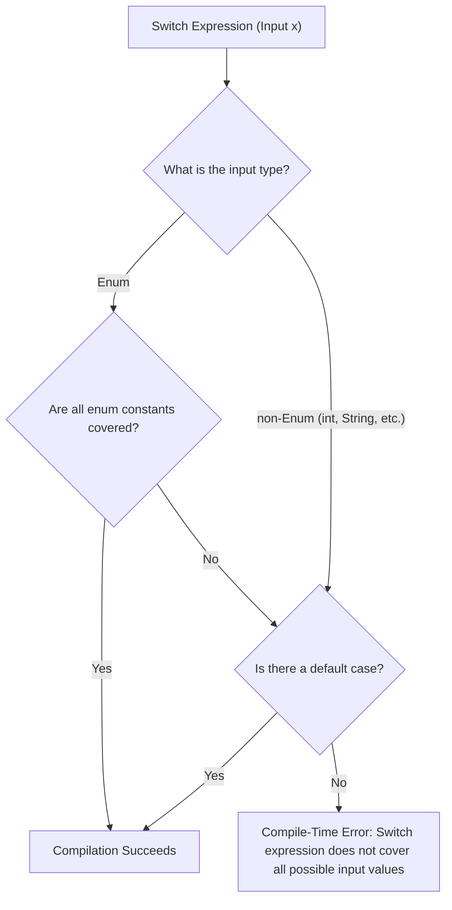

# Switch Expressions and Labeled Control

Modern Java has switch expressions, which make `switch` usable as a value-producing expression. Java also has labeled `break` and `continue`, mostly for nested loops.

## Switch Statement vs Switch Expression

A switch statement performs actions.

```java
switch (status) {
    case "NEW":
        System.out.println("Create record");
        break;
    case "DONE":
        System.out.println("Archive record");
        break;
    default:
        System.out.println("Unknown");
}
```

A switch expression produces a value.

```java
String label = switch (status) {
    case "NEW" -> "Create record";
    case "DONE" -> "Archive record";
    default -> "Unknown";
};
```

The expression form is useful when every branch should produce a result.

## Arrow Cases

Arrow cases use `->` and do not fall through.

```java
switch (day) {
    case 1 -> System.out.println("Monday");
    case 2 -> System.out.println("Tuesday");
    default -> System.out.println("Unknown");
}
```

This reduces accidental fall-through.

## `yield` In Switch Expressions

When a switch expression branch needs a block, use `yield` to provide the value.

```java
String message = switch (code) {
    case 200 -> "OK";
    case 500 -> {
        logError();
        yield "Server error";
    }
    default -> "Unknown";
};
```

`yield` is not the same as `return`. `yield` provides a value for the switch expression. `return` exits the method.

## Exhaustiveness

A switch expression must be exhaustive: it must cover every possible input value or have a `default`.

```java
String label = switch (day) {
    case 1 -> "Monday";
    case 2 -> "Tuesday";
    default -> "Other";
};
```

This rule exists because an expression must produce a value.

## Why Switch Expressions Require Exhaustiveness and How It Is Enforced

A key distinction between a traditional switch statement and a switch expression is that an expression is defined to produce a single resolved value of a specific type. If a switch expression is evaluated at runtime and the input value does not match any of the defined `case` branches, the expression would be unable to return a value, leaving the variable assignment or method parameter unassigned. To maintain Java's strict type-safety and initialize variables reliably, the compiler mandates that switch expressions be mathematically exhaustive. The compiler verifies this at compile time by checking if the input is an enum and all enum values are explicitly handled. For non-enum types (like `int`, `String`, or `char`), the compiler requires a `default` case to handle the infinite domain of possible values.



### Code Example: Exhaustive vs. Non-Exhaustive Expressions

```java
enum TaskState { PENDING, ACTIVE, COMPLETE }

public String getTaskStatusMessage(TaskState state) {
    // Exhaustive switch expression: covers all enum cases without requiring a 'default' branch.
    return switch (state) {
        case PENDING  -> "Task is waiting to start.";
        case ACTIVE   -> "Task is currently running.";
        case COMPLETE -> "Task has finished execution.";
    };
}
```

If we omit a case, the compiler immediately catches it and fails the build.

```java
public String getFailedStatusMessage(TaskState state) {
    // BUG: Compile-time error: the switch expression does not cover all possible input values
    // String msg = switch (state) {
    //     case PENDING -> "Pending";
    //     case ACTIVE  -> "Active";
    // }; // Omitted COMPLETE!
    return "Error";
}
```

### Cause-Effect Chain
Switch expression produces a value at runtime $\rightarrow$ All possible execution paths must return a value of the declared type $\rightarrow$ Compiler analyzes input domain coverage during compilation $\rightarrow$ Missing branches or missing default case on open domains are flag-matched $\rightarrow$ Compiler rejects the code with an exhaustiveness compile-time error.

## Labeled `break`

A label can name a loop. A labeled `break` exits the named loop.

```java
outer:
for (int row = 0; row < 3; row++) {
    for (int col = 0; col < 3; col++) {
        if (row == 1 && col == 1) {
            break outer;
        }
    }
}
```

This exits both loops.

## Labeled `continue`

A labeled `continue` jumps to the next iteration of the named loop.

```java
outer:
for (int row = 0; row < 3; row++) {
    for (int col = 0; col < 3; col++) {
        if (col == 1) {
            continue outer;
        }
    }
}
```

This skips the rest of the inner loop and moves to the next outer-loop iteration.

## Use Labels Carefully

Labels are legal, but they can make code harder to read if overused. Often, extracting nested logic into a method and using `return` is clearer.

Use labels mainly when:

- You are inside nested loops.
- The exit target would otherwise require awkward flags.
- The labeled control flow remains easy to see.

---

## Old vs. New Switch Comparison

Java 14 introduced standard support for **Switch Expressions**, which significantly modernizes control flow. The table below details the key differences:

| Feature | Old-Style Switch (Statement) | Modern Switch (Expression or Statement) |
| :--- | :--- | :--- |
| **Syntax** | Uses colons (`case Value:`) | Uses arrows (`case Value ->`) or colons |
| **Fall-through** | Yes (default behavior; requires `break` to stop) | No (for arrow syntax; only one branch executes) |
| **Returns Value** | No (must assign to a variable outside the switch) | Yes (can yield values directly as an expression) |
| **Exhaustiveness** | Not required (unhandled values are ignored) | Strictly required for expressions (must cover all values or have `default`) |
| **Multiple Constants**| Requires separate case lines: `case A: case B:` | Comma-separated on one line: `case A, B ->` |
| **Block Return** | N/A | Uses `yield` inside brace blocks to return a value |
| **Semicolon** | Not required after the closing brace `}` | Required after the closing brace `};` when used as an expression |

### Side-by-Side Code Comparison

**Traditional Switch Statement (Verbose, Error-prone fall-through):**
```java
int score;
switch (grade) {
    case 'A':
        score = 90;
        break;
    case 'B':
        score = 80;
        break;
    case 'C':
    case 'D':
        score = 70; // Shares logic
        break;
    default:
        score = 0;
}
```

**Modern Switch Expression (Concise, Exhaustive, Safe):**
```java
int score = switch (grade) {
    case 'A'      -> 90;
    case 'B'      -> 80;
    case 'C', 'D' -> 70; // Comma-separated multiple constants
    default       -> 0;   // Compiler enforces exhaustiveness
}; // Note the semicolon at the end of the assignment!
```

---

## Common Mistakes

### Mistake 1 — Mixing Case Formats
You cannot mix traditional colon syntax (`case L:`) and modern arrow syntax (`case L ->`) within the same `switch`. Doing so will cause a compile-time error.

```java
// BUG: Compile-time error: mixed switch case formats
int val = switch (code) {
    case 1  -> 10;
    case 2: yield 20; 
    default -> 0;
};
```

**Fix**: Use only one style consistently throughout the `switch` block.

### Mistake 2 — Missing Semicolon on Assignment
Because a switch expression can produce a value, it is often assigned to a variable. The entire assignment statement must end with a semicolon after the closing brace `}`.

```java
// BUG: Compile-time error: ';' expected
String result = switch (option) {
    case 1  -> "One"
    default -> "Other"
} // Missing semicolon here!
```

**Fix**: Append a semicolon after the closing brace: `};`.

### Mistake 3 — Using `return` instead of `yield` in a Switch Expression Block
To return a value from a multi-line arrow case block in a switch expression, you must use `yield`. Using `return` will attempt to return from the enclosing method, causing compilation or logic errors.

```java
public String getStatusDescription(int code) {
    return switch (code) {
        case 200 -> "Success";
        case 500 -> {
            logError();
            // BUG: Compile-time error: return outside of method context
            return "Internal Server Error"; 
        }
        default -> "Unknown";
    };
}

// FIX: Use yield to provide a value to the switch expression
public String getStatusDescription(int code) {
    return switch (code) {
        case 200 -> "Success";
        case 500 -> {
            logError();
            yield "Internal Server Error"; 
        }
        default -> "Unknown";
    };
}
```

### Mistake 4 — Non-Exhaustive Switch Expressions
A switch statement does not require a `default` case, but a switch **expression** must be exhaustive. If the compiler cannot prove that all possible values of the input type are handled, it throws a compile-time error.

```java
enum Direction { NORTH, SOUTH, EAST, WEST }

// BUG: Compile-time error: switch expression does not cover all possible input values
Direction dir = Direction.NORTH;
String movement = switch (dir) {
    case NORTH -> "Moving North";
    case SOUTH -> "Moving South";
}; // EAST and WEST are not handled!
```

**Fix**: Handle all cases, or add a `default` branch:
```java
String movement = switch (dir) {
    case NORTH -> "Moving North";
    case SOUTH -> "Moving South";
    default    -> "Moving East or West";
};
```

## Reference Links

- https://docs.oracle.com/javase/specs/jls/se21/html/jls-14.html#jls-14.11 (The switch Statement in the Java Language Specification)
- https://docs.oracle.com/javase/specs/jls/se21/html/jls-15.html#jls-15.28 (Switch Expressions in the Java Language Specification)
- https://docs.oracle.com/en/java/javase/21/language/switch-expressions.html (Java Language Updates: Switch Expressions)

