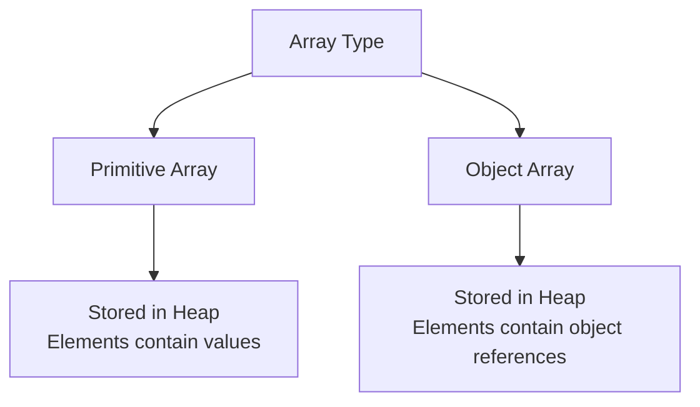

# 07 - Arrays

## What You Should Learn

- How to declare and initialize one-dimensional, two-dimensional, and multidimensional arrays.
- How to access array elements and use the `length` property.
- How memory is allocated for arrays and arrays of objects.
- How to traverse, copy, sort, search, and compare arrays using loops and the `java.util.Arrays` utility class.

## Study Order

1. [Array Basics](theory/01-array-basics.md)
2. [Array Operations](theory/02-array-operations.md)

## Term Notes

- [Array Terms](terms/01-array-terms.md)

## Mermaid Overview

## Self-Check

- Why does the JVM allocate arrays as contiguous blocks of memory on the Heap, and how does this enable O(1) constant-time direct access?
- Why are array elements automatically zero-initialized upon allocation, unlike local variables which trigger compilation errors if read before initialization?
- Why does a multidimensional array in Java behave as an "array of arrays" rather than a single contiguous block, and what is its physical memory layout?
- Why is `System.arraycopy()` faster than a manual loop, and why does it perform a shallow copy instead of a deep copy for object reference arrays?
- Why does `Arrays.equals()` fail to compare the contents of multidimensional arrays correctly, requiring `Arrays.deepEquals()`?
- Why must an array be sorted in ascending order before calling `Arrays.binarySearch()`, and what does the returned negative value represent mathematically if the key is not found?

## Anki Cards

- [Basic](anki/basic.tsv)
- [Basic Extra](anki/basic-extra.tsv)
- [Cloze](anki/cloze.tsv)
- [Code Question](anki/code-question.tsv)

## Reference Links

- https://docs.oracle.com/javase/tutorial/java/nutsandbolts/arrays.html
