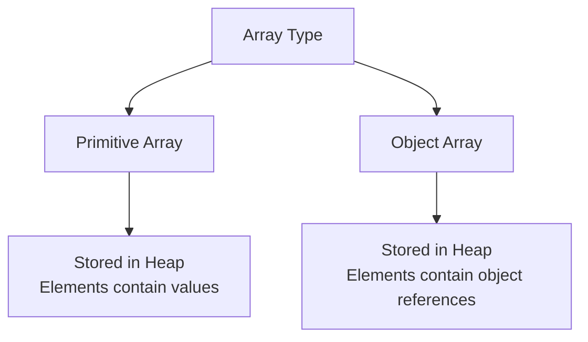

# 07 - Arrays

## What You Should Learn

- How to declare and initialize one-dimensional, two-dimensional, and multidimensional arrays.
- How to access array elements and use the `length` property.
- How memory is allocated for arrays and arrays of objects.
- How to traverse, copy, sort, search, and compare arrays using loops and the `java.util.Arrays` utility class.

## Study Order

1. [Array Basics](theory/01-array-basics.md)
2. [Array Operations](theory/02-array-operations.md)

## Term Notes

- [Array Terms](terms/01-array-terms.md)

## Mermaid Overview

## Self-Check

- Why do arrays have a fixed size in Java?
- What is the default value of elements in an uninitialized numeric array?
- What is the difference between `array.length` and `String.length()`?
- How does `Arrays.equals()` differ from `Arrays.deepEquals()`?
- Why does `System.arraycopy()` perform better than a manual loop for copying?

## Anki Cards

- [Basic](anki/basic.tsv)
- [Basic Extra](anki/basic-extra.tsv)
- [Cloze](anki/cloze.tsv)
- [Code Question](anki/code-question.tsv)

## Reference Links

- https://docs.oracle.com/javase/tutorial/java/nutsandbolts/arrays.html
