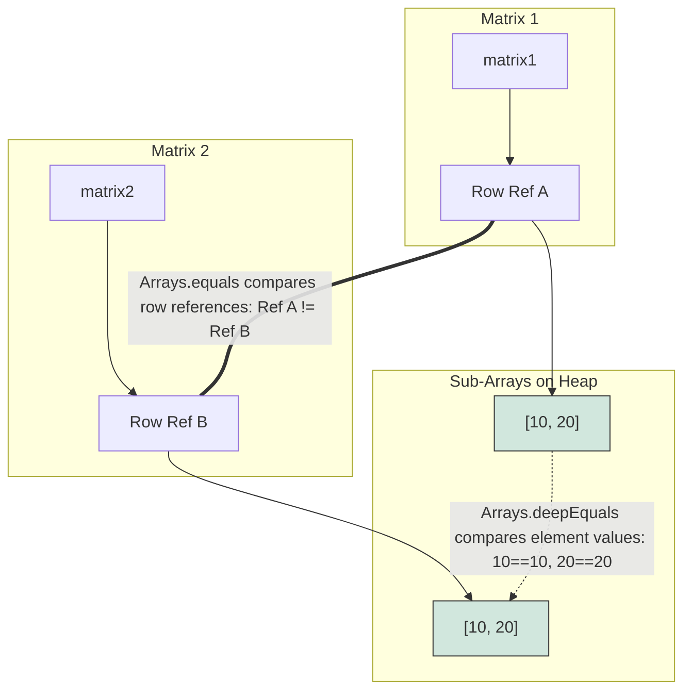

# Array Operations

The `java.util.Arrays` class and system native methods provide high-performance operations for copying, sorting, searching, and comparing arrays.

---

## Detailed Mechanics of Copying Arrays

Java provides multiple ways to copy arrays, each with different performance characteristics and syntax.

### 1. `System.arraycopy()`
This is a low-level, native static method of the `System` class. It is highly optimized because it copies memory blocks directly at the OS/hardware level.

**Syntax:**
```java
System.arraycopy(Object src, int srcPos, Object dest, int destPos, int length);
```
- `src`: Source array.
- `srcPos`: Starting position index in the source array.
- `dest`: Destination array.
- `destPos`: Starting position index in the destination array.
- `length`: Number of elements to copy.

**Key characteristics:**
- You must pre-allocate the destination array with sufficient size.
- Throws `NullPointerException` if source or destination is `null`.
- Throws `IndexOutOfBoundsException` if indices exceed array sizes.
- Throws `ArrayStoreException` if the runtime types of source and destination arrays are incompatible.

### Why System.arraycopy is Performant and Shallow

The `System.arraycopy()` method is highly performant because it bypasses the Java virtual machine's element-by-element loop overhead and executes a direct memory block transfer (equivalent to `memmove` in C) at the operating system or hardware level. When copying large arrays, a standard Java loop requires fetching, type-checking, and writing each individual element, which incurs significant CPU instruction overhead. In contrast, `System.arraycopy()` utilizes native CPU instructions to copy the entire raw memory block in a single unified operation, maximizing bus utilization. However, because it copies the raw bits of the array elements directly, it performs a shallow copy when applied to arrays of object references. It copies the reference addresses (pointers) stored in the array rather than duplicating the underlying objects themselves, meaning both arrays will reference the same instances on the heap.

```mermaid
flowchart TD
    subgraph Source Array [Source String[]]
        S0["Index 0: Ref A"]
        S1["Index 1: Ref B"]
    end
    subgraph Dest Array [Dest String[]]
        D0["Index 0: Ref A"]
        D1["Index 1: Ref B"]
    end
    subgraph Heap Objects
        ObjA["String Object A: 'Hello'"]
        ObjB["String Object B: 'World'"]
    end
    S0 --> ObjA
    D0 --> ObjA
    S1 --> ObjB
    D1 --> ObjB
    Source Array -.->|Direct memory copy of references| Dest Array
    style Source Array fill:#fff3cd,stroke:#333
    style Dest Array fill:#d1e7dd,stroke:#333
```

**Runnable Code Example:**
```java
public class ArrayCopyPerformanceDemo {
    public static void main(String[] args) {
        String[] src = {new String("Hello"), new String("World")};
        String[] dest = new String[2];
        System.arraycopy(src, 0, dest, 0, 2);
        System.out.println("Same object reference: " + (src[0] == dest[0])); // Output: true
    }
}
```

**Cause-Effect Chain:**
`System.arraycopy called` &rarr; `Native system call bypasses JVM loop` &rarr; `Contiguous memory block copied directly at OS/hardware level` &rarr; `Raw reference addresses copied verbatim` &rarr; `Shallow copy where both arrays point to the same heap objects`

### 2. `Arrays.copyOf()`
Creates a new array copy from index `0` up to `newLength`.

```java
int[] copy = Arrays.copyOf(original, newLength);
```
- If `newLength` is larger than `original.length`, the remaining slots are filled with default values (`0`, `false`, or `null`).
- If `newLength` is smaller, the array is truncated.
- Under the hood, this method calls `System.arraycopy` after allocating the new array.

##### Runnable Example: Using `Arrays.copyOf()` and `copyOfRange()`
```java
import java.util.Arrays;

public class ArrayCopyExample {
    public static void main(String[] args) {
        int[] original = {10, 20, 30, 40, 50};

        // 1. Truncating copy (length = 3)
        int[] truncated = Arrays.copyOf(original, 3);
        System.out.println("Truncated (length 3): " + Arrays.toString(truncated));
        // Output: [10, 20, 30]

        // 2. Padding copy (length = 7)
        int[] padded = Arrays.copyOf(original, 7);
        System.out.println("Padded (length 7): " + Arrays.toString(padded));
        // Output: [10, 20, 30, 40, 50, 0, 0]

        // 3. Sub-range copy (indices 1 to 4 exclusive, i.e., 20, 30, 40)
        int[] range = Arrays.copyOfRange(original, 1, 4);
        System.out.println("Range (indices 1 to 4): " + Arrays.toString(range));
        // Output: [20, 30, 40]
    }
}
```

### 3. `Arrays.copyOfRange()`
Copies a specific range of the array.

```java
int[] rangeCopy = Arrays.copyOfRange(original, fromIndex, toIndex);
```
- `fromIndex`: Inclusive start index.
- `toIndex`: Exclusive end index.
- If `toIndex` is greater than the array length, the new array is padded with default values.
- Throws `IllegalArgumentException` if `fromIndex > toIndex`.
- Throws `ArrayIndexOutOfBoundsException` if `fromIndex < 0` or `fromIndex > original.length`.

---

## Sorting Arrays: Algorithms and Stability

The `Arrays.sort()` method is overloaded to sort primitive types and object types.

### 1. Primitive Array Sorting (Dual-Pivot Quicksort)
For primitive arrays (`int[]`, `double[]`, etc.), `Arrays.sort()` uses a **Dual-Pivot Quicksort** algorithm.
- **Time Complexity:** Average $O(n \log n)$, Worst-case $O(n^2)$ (though highly optimized to avoid worst-case scenarios).
- **Stability:** **Unstable** (may reorder equal elements). Since primitives do not have identity, stability does not matter.

### 2. Object Array Sorting (Timsort)
For object arrays (`String[]`, custom classes), `Arrays.sort()` uses **Timsort** (a hybrid of Merge Sort and Insertion Sort).
- **Time Complexity:** Average and Worst-case $O(n \log n)$, Best-case $O(n)$ when the array is already sorted.
- **Stability:** **Stable** (preserves the relative order of equal elements).
- **Prerequisite:** The objects inside the array must implement the `Comparable` interface, or you must pass a custom `Comparator` to specify the ordering logic.

### 3. Sorting Ranges
You can sort a specific sub-array using:
```java
Arrays.sort(arr, fromIndex, toIndex); // toIndex is exclusive
```

##### Runnable Example: Sorting Primitives vs. Objects
```java
import java.util.Arrays;
import java.util.Comparator;

public class ArraySortExample {
    static class Person implements Comparable<Person> {
        String name;
        int age;

        Person(String name, int age) {
            this.name = name;
            this.age = age;
        }

        @Override
        public int compareTo(Person other) {
            return Integer.compare(this.age, other.age); // Sort by age ascending
        }

        @Override
        public String toString() {
            return name + " (" + age + ")";
        }
    }

    public static void main(String[] args) {
        // 1. Primitive sorting (Dual-Pivot Quicksort)
        int[] numbers = {5, 2, 8, 1, 9};
        Arrays.sort(numbers);
        System.out.println("Sorted primitives: " + Arrays.toString(numbers));
        // Output: [1, 2, 5, 8, 9]

        // 2. Object sorting using Comparable (Timsort)
        Person[] people = {
            new Person("Alice", 30),
            new Person("Bob", 25),
            new Person("Charlie", 35)
        };
        Arrays.sort(people);
        System.out.println("Sorted by Comparable (age): " + Arrays.toString(people));
        // Output: [Bob (25), Alice (30), Charlie (35)]

        // 3. Object sorting using a custom Comparator (by name descending)
        Arrays.sort(people, new Comparator<Person>() {
            @Override
            public int compare(Person p1, Person p2) {
                return p2.name.compareTo(p1.name);
            }
        });
        System.out.println("Sorted by custom Comparator (name desc): " + Arrays.toString(people));
        // Output: [Charlie (35), Bob (25), Alice (30)]
    }
}
```

---

## Why Binary Search Requires Sorted Arrays and How Its Return Code Math Works

The `Arrays.binarySearch()` method relies on the binary search algorithm, which repeatedly halves the search space by comparing the target key to the middle element of the current range. This halving mechanism assumes a strict sorting contract: if the target key is less than the middle element, it must reside in the left half, and if greater, it must reside in the right half. If the array is not sorted, this directional assumption is broken, causing the algorithm to prune the correct path and return an incorrect or unpredictable result. When the key is not found, `binarySearch()` returns a negative value calculated as `-(insertionPoint) - 1` to communicate both the absence of the key and its correct sorted insertion location. By offsetting the negative insertion point by 1, the algorithm avoids the collision at index `0`, ensuring that a negative return value always unambiguously indicates 'not found' while preserving the index value.

```mermaid
flowchart TD
    subgraph Sorted Array: [10, 20, 30, 40, 50]
        A["[0]=10"]
        B["[1]=20"]
        C["[2]=30"]
        D["[3]=40"]
        E["[4]=50"]
    end
    Target["Search for 25"]
    Target -->|Compare to Mid [2]=30| C
    C -->|25 < 30: Go Left| B
    B -->|25 > 20: Go Right| NotFound["Not Found. Insertion point is index 2"]
    NotFound -->|Formula: -insertionPoint - 1| Return["Return: -2 - 1 = -3"]
    style Sorted Array fill:#f8f9fa,stroke:#333
    style Return fill:#f8d7da,stroke:#333
```

**Runnable Code Example:**
```java
import java.util.Arrays;

public class BinarySearchDemo {
    public static void main(String[] args) {
        int[] sorted = {10, 20, 30, 40, 50};
        
        // Element found
        int indexFound = Arrays.binarySearch(sorted, 30);
        System.out.println("Index of 30: " + indexFound); // Output: 2
        
        // Element not found (should be at index 2)
        int indexNotFound = Arrays.binarySearch(sorted, 25);
        System.out.println("Index of 25: " + indexNotFound); // Output: -3
    }
}
```

**Cause-Effect Chain:**
`Binary search assumes sorted order` &rarr; `Middle element compared to key` &rarr; `Range halved based on order assumption` &rarr; `Key not found` &rarr; `Insertion point determined` &rarr; `Return value calculated as -(insertionPoint) - 1 to prevent 0 index collision`

---

## Comparing Arrays (Shallow vs. Deep)

Using `==` on array variables only compares their references (addresses on the stack).

### 1. `Arrays.equals()`
Compares two 1D arrays for content equality:
- Returns `true` if both arrays contain the same number of elements, and all corresponding pairs of elements are equal (using `==` for primitives, and `.equals()` for objects).
- It is null-safe (handles comparisons where one or both arrays are `null`).

### 2. `Arrays.deepEquals()`
Compares two multidimensional arrays.
- `Arrays.equals()` on a 2D array compares the references of the inner row arrays. If the rows reside at different heap addresses, it returns `false` even if the values are identical.
- `Arrays.deepEquals()` recursively traverses the nested arrays, comparing values at the lowest levels.

```java
int[][] matrix1 = {{1, 2}};
int[][] matrix2 = {{1, 2}};

System.out.println(Arrays.equals(matrix1, matrix2));     // false (inner row addresses differ)
System.out.println(Arrays.deepEquals(matrix1, matrix2)); // true (contents compared recursively)
```

### Why Arrays.equals Fails on Multidimensional Arrays

The `Arrays.equals()` method is designed to perform a single-level equality check, meaning it iterates through the elements of the arrays and compares them using `==` for primitives or the `.equals()` method for objects. When `Arrays.equals()` is called on multidimensional arrays (which are arrays of sub-array references), it compares the inner row references rather than the actual values inside those sub-arrays. Because sub-arrays are independent objects on the heap, two structurally identical multidimensional arrays will have different row references and thus fail the single-level reference check. To solve this, `Arrays.deepEquals()` must be used because it detects when elements are nested arrays and recursively traverses down into them to compare their low-level values. This recursion ensures that multidimensional structures are evaluated by value rather than by the memory addresses of their component rows.



**Runnable Code Example:**
```java
import java.util.Arrays;

public class ArrayEqualityDemo {
    public static void main(String[] args) {
        int[][] m1 = {{10, 20}};
        int[][] m2 = {{10, 20}};
        System.out.println("Arrays.equals: " + Arrays.equals(m1, m2));         // Output: false
        System.out.println("Arrays.deepEquals: " + Arrays.deepEquals(m1, m2)); // Output: true
    }
}
```

**Cause-Effect Chain:**
`Arrays.equals called on 2D array` &rarr; `Nested arrays treated as Object elements` &rarr; `Single-level .equals() compares sub-array references using identity check` &rarr; `References differ` &rarr; `Returns false despite identical numeric values`

---

## Common Mistakes

### 1. Searching an Unsorted Array with `Arrays.binarySearch()`
`Arrays.binarySearch()` relies on the array being sorted in ascending order. If it is not sorted, the result is undefined.
```java
int[] unsorted = {3, 1, 4, 1, 5};
int index = Arrays.binarySearch(unsorted, 4); // Undefined result! Could be negative or incorrect.
```

### 2. Using `==` or `.equals()` to Compare Array Contents
Arrays do not override `.equals()` from `Object`. Therefore, `arr1.equals(arr2)` is equivalent to `arr1 == arr2` (it compares stack references, not heap array contents). Use `Arrays.equals()` or `Arrays.deepEquals()` instead.
```java
int[] a = {1, 2};
int[] b = {1, 2};
System.out.println(a == b);       // false
System.out.println(a.equals(b));  // false
System.out.println(Arrays.equals(a, b)); // true
```

### 3. Using `Arrays.equals()` on Multidimensional Arrays
`Arrays.equals()` only compares top-level references when run on multi-dimensional arrays. If those references are different, it returns `false`, even if the underlying values are identical. Use `Arrays.deepEquals()` instead.
```java
int[][] m1 = {{1, 2}};
int[][] m2 = {{1, 2}};
System.out.println(Arrays.equals(m1, m2));     // false
System.out.println(Arrays.deepEquals(m1, m2)); // true
```

### 4. Direct Casting in `System.arraycopy()` with Incompatible Types
`System.arraycopy()` throws an `ArrayStoreException` at runtime if the element types are incompatible, even though the code compiles fine (since both arguments are typed as `Object`).
```java
Object[] src = { "Hello", "World" };
Integer[] dest = new Integer[2];
// System.arraycopy(src, 0, dest, 0, 2); // Throws ArrayStoreException at runtime!
```

---

## Reference Links

- https://docs.oracle.com/javase/specs/jls/se21/html/jls-10.html (Arrays in Java Language Specification)
- https://docs.oracle.com/javase/8/docs/api/java/lang/System.html#arraycopy-java.lang.Object-int-java.lang.Object-int-int- (Java SE 8 System.arraycopy Javadoc)
- https://docs.oracle.com/javase/8/docs/api/java/util/Arrays.html (Java SE 8 java.util.Arrays Javadoc)
