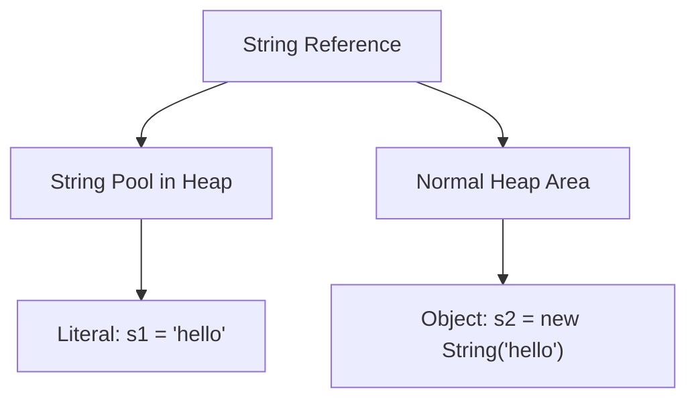

# 08 - String

## What You Should Learn

- The nature of the `java.lang.String` class and how immutability works.
- The concept of the String Literal and the JVM String Pool.
- The differences between comparing strings with `==` and `.equals()`.
- Common `String` methods for manipulation, searching, splitting, formatting, and Text Blocks.
- The differences between `String`, `StringBuilder`, and `StringBuffer` (including performance and thread safety).

## Study Order

1. [String Basics](theory/01-string-basics.md)
2. [String Methods and Formatting](theory/02-string-methods.md)
3. [StringBuilder and StringBuffer](theory/03-stringbuilder-stringbuffer.md)

## Term Notes

- [String Terms](terms/01-string-terms.md)

## Mermaid Overview

## Self-Check

- Why is String immutable in Java?
- What is the difference between `s1 = "hello"` and `s2 = new String("hello")`?
- How does the String Pool save memory?
- What is the difference between `trim()` and `strip()`?
- When should you use `StringBuilder` instead of `String`?
- Are `StringBuilder` methods thread-safe?

## Anki Cards

- [Basic](anki/basic.tsv)
- [Basic Extra](anki/basic-extra.tsv)
- [Cloze](anki/cloze.tsv)
- [Code Question](anki/code-question.tsv)

## Reference Links

- https://docs.oracle.com/en/java/javase/21/docs/api/java.base/java/lang/String.html
- https://docs.oracle.com/en/java/javase/21/docs/api/java.base/java/lang/StringBuilder.html
