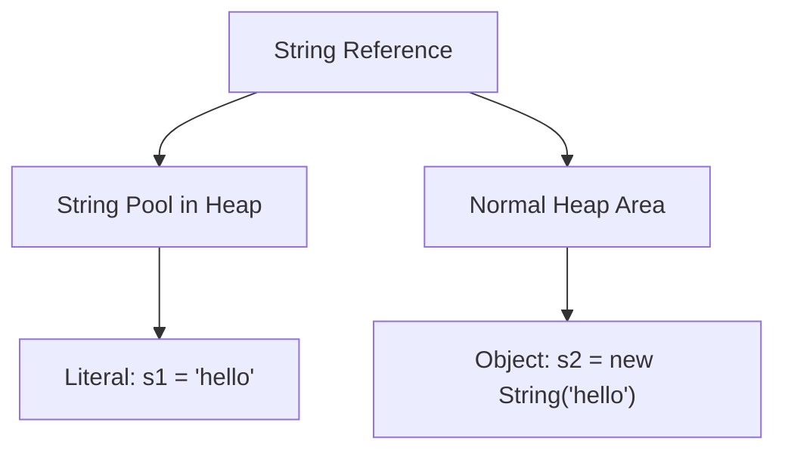

# 08 - String

## What You Should Learn

- The nature of the `java.lang.String` class and how immutability works.
- The concept of the String Literal and the JVM String Pool.
- The differences between comparing strings with `==` and `.equals()`.
- Common `String` methods for manipulation, searching, splitting, formatting, and Text Blocks.
- The differences between `String`, `StringBuilder`, and `StringBuffer` (including performance and thread safety).

## Study Order

1. [String Basics](theory/01-string-basics.md)
2. [String Methods and Formatting](theory/02-string-methods.md)
3. [StringBuilder and StringBuffer](theory/03-stringbuilder-stringbuffer.md)

## Term Notes

- [String Terms](terms/01-string-terms.md)

## Mermaid Overview

## Self-Check

- Why is `String` immutable in Java, and how does this design decision impact security, thread-safety, and caching (String Pool)?
- How does the JVM String Pool optimize memory usage, and what are the exact heap mechanics of `s1 = "hello"` versus `s2 = new String("hello")`?
- Why does reference comparison (`==`) produce different results for pool-allocated versus heap-allocated strings, and why is `.equals()` required for content comparison?
- What are the mechanical differences between `trim()` and `strip()` regarding Unicode whitespace and codepoint processing?
- Why does `StringBuilder` outperform `StringBuffer`, and how does synchronization impact their performance and thread-safety?

## Anki Cards

- [Basic](anki/basic.tsv)
- [Basic Extra](anki/basic-extra.tsv)
- [Cloze](anki/cloze.tsv)
- [Code Question](anki/code-question.tsv)

## Reference Links

- https://docs.oracle.com/en/java/javase/21/docs/api/java.base/java/lang/String.html
- https://docs.oracle.com/en/java/javase/21/docs/api/java.base/java/lang/StringBuilder.html
