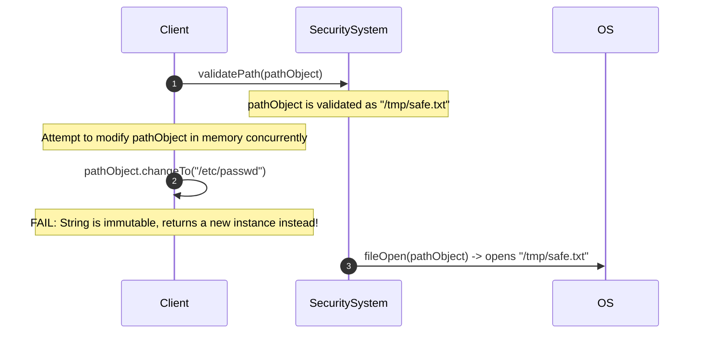
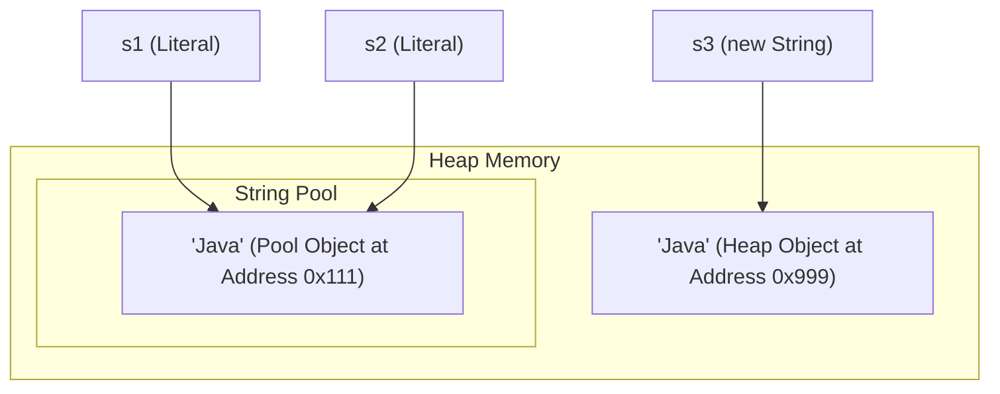
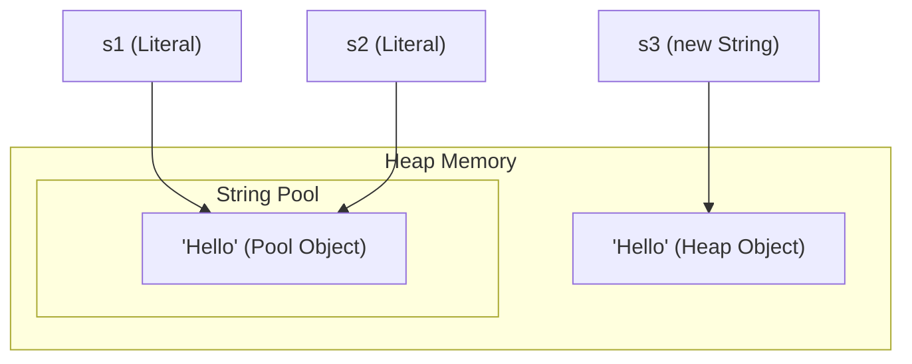
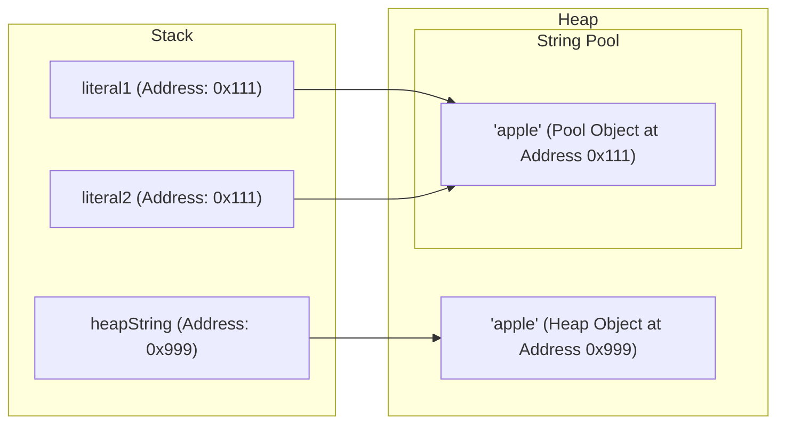

# String Basics

The `java.lang.String` class represents sequences of characters. In Java, strings are treated as reference objects, but they have special compiler support and memory optimizations.

---

## Internal Representation (Compact Strings)

Historically, in Java 8 and earlier, strings were stored internally as a character array (`char[]`), which allocated 2 bytes of memory per character using UTF-16 encoding.

Starting from Java 9, the JVM implements **Compact Strings**:
- Strings are stored internally as a byte array (`byte[]`).
- A single byte `coder` field is added to track the encoding used:
  - `LATIN1` (coder value `0`): Used for characters that can be represented in 1 byte (ISO-8859-1). Saves up to 50% memory.
  - `UTF16` (coder value `1`): Used for characters requiring 2 bytes (such as Chinese, Japanese, Korean, or emojis).
- This transition is entirely automatic and does not affect public API behavior.

---

## Immutability of String

In Java, `String` objects are **immutable**. Once a string object is instantiated on the heap, its internal character byte sequence cannot be modified. Any operations that appear to change a string actually instantiate a new string.

### Immutability Code Example

Here is a concrete example demonstrating that operations on a `String` do not modify the original object:

```java
String original = "Java";
String result = original.concat(" Core");

System.out.println("Original String: " + original); // Output: Java (remains unchanged)
System.out.println("Result String:   " + result);   // Output: Java Core (new String object)

// Modifying the reference itself is just changing where the pointer points,
// not mutating the underlying object in memory.
String s = "Hello";
s = s + " World"; // s now points to a new String object "Hello World"
```

### Why is String Immutable?

1. **Security & Class Loading:**
   - Strings are used to store class names loaded by ClassLoaders, database credentials, socket addresses, and file paths. If strings were mutable, a hacker could pass a path validation check (e.g. `"/tmp/file.txt"`) and then modify the string content to `"/etc/passwd"` during execution.
   - ClassLoading security relies on strings remaining unchanged to ensure the correct classes are loaded.
2. **String Constant Pool:**
   - Because strings are immutable, the JVM can cache multiple variables pointing to the same string literal, saving substantial memory.
3. **Thread Safety:**
   - Immutable objects are thread-safe by default. They can be shared among threads without synchronization, preventing data corruption or race conditions.
4. **Caching Hashcode:**
   - The hash value of a String is calculated once and cached inside its `hash` private field. This makes it extremely fast to use as keys in hash-based collections like `HashMap` and `HashSet`.

### Deep-Dive: The Mechanics and Security of Immutability

String immutability is not just a language feature but a core security and performance guarantee in Java. Security-sensitive operations, such as database connections, network socket configurations, and file system operations, rely heavily on `String` references remaining unchanged after validation checks. If strings were mutable, a malicious background thread could alter a validated path string between validation and actual file access (a Time-of-Check to Time-of-Use vulnerability). Furthermore, because strings are immutable, they are inherently thread-safe and can be shared freely across multiple threads without synchronizing access, removing lock overhead. Finally, immutability allows the JVM to safely implement the String Pool, caching string literals to prevent redundant heap allocations and cache their hash codes for fast hash-map operations.

#### Immutability Security Sequence Model



#### Immutability and HashCode Caching Code Example

```java
// Caching Hashcode example
String s1 = "HelloJava";
int initialHash = s1.hashCode(); // Calculated once and cached in private field 'hash'
System.out.println(initialHash); // Output: 1411516244

// Modifying the string returns a new object with a different hash
String s2 = s1.concat("!"); 
System.out.println(s2);          // Output: HelloJava!
System.out.println(s2.hashCode()); // Output: 887467645 (new calculation for new object)
```

#### Cause-Effect Chain of HashCode Caching
String is declared immutable $\rightarrow$ Internal data `byte[]` is marked `final` and cannot be modified $\rightarrow$ JVM calculates and caches the hash value upon first call to `hashCode()` $\rightarrow$ Subsequent key lookups in collections like `HashMap` retrieve the cached hash immediately $\rightarrow$ Avoids $O(n)$ character comparison, yielding $O(1)$ performance.

---

## The String Constant Pool

The **String Constant Pool** (String Pool) is a special memory region inside the Java Heap. It is implemented as a fixed-size internal hashtable (with buckets containing references to String objects).

### Deep-Dive: Memory Optimization and Heap Mechanics of the String Pool

The JVM String Pool is a dedicated memory structure within the Heap that acts as a cache for string literals. When a string literal is defined in the source code, the JVM performs a lookup in the String Pool to check if an identical character sequence already exists. If the sequence is found, the JVM returns the existing reference, pointing both variables to the same memory location to avoid duplicate allocations. However, using the `new String("hello")` constructor explicitly bypasses this optimization, forcing the JVM to allocate a new `String` object in the general heap space, even if the literal already exists in the pool. This results in two separate objects representing the same value, leading to unnecessary memory usage and increased garbage collection overhead.

#### String Pool Reference Sharing Model



#### Cause-Effect Chain of String Literal Allocation
JVM encounters literal `"Java"` $\rightarrow$ Searches String Pool $\rightarrow$ Literal not found $\rightarrow$ Allocates new `String` object in String Pool $\rightarrow$ Returns pool reference $\rightarrow$ Subsequent assignments to same literal reuse reference directly $\rightarrow$ Prevents redundant heap allocations.

#### Cause-Effect Chain of `new String("Java")` Allocation
JVM encounters `new String("Java")` constructor $\rightarrow$ Allocates distinct memory block in general Heap $\rightarrow$ Creates new `String` object pointing to the underlying char/byte array $\rightarrow$ Returns heap address (different from Pool) $\rightarrow$ Bypasses pool deduplication $\rightarrow$ Increases GC pressure.

### String Pool Code Example

This code demonstrates how literals share references in the pool while the `new` keyword bypasses it:

```java
// Literals are looked up in the pool. "Java" is created in the pool.
String s1 = "Java"; 
// "Java" already exists in the pool, so s2 points to the same object.
String s2 = "Java"; 

// Using 'new' forces creation of a new object on the heap.
String s3 = new String("Java"); 

System.out.println(s1 == s2); // true (same reference in the pool)
System.out.println(s1 == s3); // false (s3 points to a heap object outside the pool)

// Interning s3 returns the reference from the pool
String s4 = s3.intern();
System.out.println(s1 == s4); // true (both point to the pool reference)
```

1. **String Literal (`String s = "Hello";`):**
   - The compiler searches the String Pool for `"Hello"`.
   - If found, it returns the reference to the existing pool object.
   - If not found, a new String object is created *inside* the String Pool, and its reference is returned.

2. **Explicit Instantiation (`String s = new String("Hello");`):**
   - This expression creates **two** objects if the literal is not already in the pool:
     1. One literal `"Hello"` inside the String Pool (if it didn't exist).
     2. One normal String object in the main Heap area.
   - The reference `s` points to the object in the main Heap, not the String Pool.



### Manual Interning with `.intern()`
Calling `.intern()` on a string returns its canonical representation from the String Pool:
- If the pool already contains a string equal to this `String` object, the pool reference is returned.
- If not, this string object is added to the pool, and its reference is returned.

```java
String s1 = new String("Hello");
String s2 = s1.intern(); // s2 points to the pool object
String s3 = "Hello";

System.out.println(s1 == s3); // false (Heap vs Pool)
System.out.println(s2 == s3); // true (Both point to Pool)
```
*Note:* The size of the String Pool hashtable can be adjusted using the JVM parameter `-XX:StringTableSize=N`.

---

## String Comparisons

Because strings can exist in the pool or general heap, you must select the correct comparison operator/method.

### Deep-Dive: Reference Comparison (==) vs. Content Equality (.equals())

In Java, the `==` operator performs reference comparison, meaning it checks if two reference variables point to the exact same memory address. Since the JVM optimizes string literal allocation via the String Pool, two identical literals will share a single memory address, making `==` evaluate to `true` by coincidence. However, strings constructed dynamically (such as through user input, database queries, or the `new String()` constructor) are allocated at new, distinct addresses in the general heap. To compare the actual sequence of characters rather than memory locations, the `String` class overrides the `Object.equals(Object)` method to inspect the internal character arrays character-by-character. Consequently, content comparison should always use `.equals()` to ensure correctness regardless of whether the strings reside in the pool or the heap.

#### Memory Reference Comparison Model



#### Reference vs. Content Comparison Code Example

```java
String literal1 = "apple";
String literal2 = "apple";
String heapString = new String("apple");

System.out.println(literal1 == literal2);      // Output: true (same pool address 0x111)
System.out.println(literal1 == heapString);     // Output: false (pool address 0x111 vs heap address 0x999)
System.out.println(literal1.equals(heapString)); // Output: true (content comparison matches)
```

#### Cause-Effect Chain of Comparison Operators
Comparing heap-allocated string with `==` $\rightarrow$ JVM compares references (0x111 vs 0x999) $\rightarrow$ Reference addresses differ $\rightarrow$ Evaluates to `false` (incorrect content verdict) $\rightarrow$ Comparing with `.equals()` $\rightarrow$ Checks reference equality (fails) $\rightarrow$ Inspects character-by-character sequence $\rightarrow$ Finds identical contents $\rightarrow$ Evaluates to `true`.

### 1. Reference Comparison (`==`)
Compares heap memory addresses. Only returns `true` if both variables point to the exact same memory location.
```java
String a = "test";
String b = new String("test");
System.out.println(a == b); // false (Pool address vs Heap address)
```

### 2. Content Comparison (`.equals()`)
Compares the actual sequence of characters. Overridden in the `String` class to perform an element-by-element character check.
```java
System.out.println(a.equals(b)); // true
```

### 3. Case-Insensitive Comparison (`.equalsIgnoreCase()`)
Compares character sequences while ignoring case differences.
```java
System.out.println("TEST".equalsIgnoreCase("test")); // true
```

### 4. Lexicographical Comparison (`.compareTo()`)
Compares strings alphabetically based on Unicode character values. Returns:
- `0` if strings are equal.
- A **negative integer** if the current string is alphabetically before the argument string.
- A **positive integer** if the current string is alphabetically after the argument string.

```java
System.out.println("apple".compareTo("banana")); // Returns negative (apple < banana)
System.out.println("banana".compareTo("apple")); // Returns positive (banana > apple)
```
Use `.compareToIgnoreCase()` to perform a lexicographical comparison ignoring case differences.

---

## Common Mistakes

### 1. Comparing String Content with `==`
Using `==` compares object references (memory addresses), not content. This often works by chance when comparing literals because of the String Pool, but fails for strings constructed at runtime or via the `new` keyword.

```java
String s1 = "hello";
String s2 = new String("hello");
System.out.println(s1 == s2);      // false (Incorrect way to compare content)
System.out.println(s1.equals(s2)); // true  (Correct way to compare content)
```

### 2. Ignoring String Immutability
Assuming a string modification method changes the string in place.
```java
String s = "  Java  ";
s.trim(); // The trimmed result is discarded!
System.out.println("[" + s + "]"); // Output: [  Java  ]

// Correct approach:
s = s.trim();
System.out.println("[" + s + "]"); // Output: [Java]
```

### 3. Unnecessary Use of `new String()`
Writing `String s = new String("abc");` instead of `String s = "abc";`. The former creates an extra, redundant object on the heap. Unless explicitly required, always use string literals.

---

## Reference Links

- https://docs.oracle.com/javase/specs/jls/se21/html/jls-3.html#jls-3.10.5 (Java Language Specification: String Literals)
- https://docs.oracle.com/en/java/javase/21/docs/api/java.base/java/lang/String.html#intern() (Oracle Java API: String.intern())
- https://docs.oracle.com/en/java/javase/21/docs/api/java.base/java/lang/String.html (Oracle Java API: String Class Reference)
```,StartLine:120,TargetContent:
