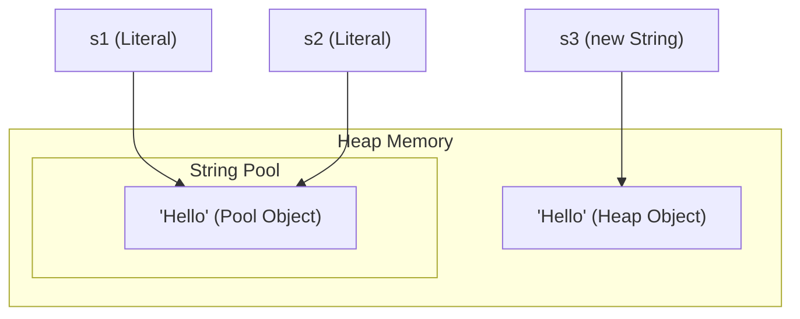

# String Basics

The `java.lang.String` class represents sequences of characters. In Java, strings are treated as reference objects, but they have special compiler support and memory optimizations.

---

## Internal Representation (Compact Strings)

Historically, in Java 8 and earlier, strings were stored internally as a character array (`char[]`), which allocated 2 bytes of memory per character using UTF-16 encoding.

Starting from Java 9, the JVM implements **Compact Strings**:
- Strings are stored internally as a byte array (`byte[]`).
- A single byte `coder` field is added to track the encoding used:
  - `LATIN1` (coder value `0`): Used for characters that can be represented in 1 byte (ISO-8859-1). Saves up to 50% memory.
  - `UTF16` (coder value `1`): Used for characters requiring 2 bytes (such as Chinese, Japanese, Korean, or emojis).
- This transition is entirely automatic and does not affect public API behavior.

---

## Immutability of String

In Java, `String` objects are **immutable**. Once a string object is instantiated on the heap, its internal character byte sequence cannot be modified. Any operations that appear to change a string actually instantiate a new string.

### Why is String Immutable?

1. **Security & Class Loading:**
   - Strings are used to store class names loaded by ClassLoaders, database credentials, socket addresses, and file paths. If strings were mutable, a hacker could pass a path validation check (e.g. `"/tmp/file.txt"`) and then modify the string content to `"/etc/passwd"` during execution.
   - ClassLoading security relies on strings remaining unchanged to ensure the correct classes are loaded.
2. **String Constant Pool:**
   - Because strings are immutable, the JVM can cache multiple variables pointing to the same string literal, saving substantial memory.
3. **Thread Safety:**
   - Immutable objects are thread-safe by default. They can be shared among threads without synchronization, preventing data corruption or race conditions.
4. **Caching Hashcode:**
   - The hash value of a String is calculated once and cached inside its `hash` private field. This makes it extremely fast to use as keys in hash-based collections like `HashMap` and `HashSet`.

---

## The String Constant Pool

The **String Constant Pool** (String Pool) is a special memory region inside the Java Heap. It is implemented as a fixed-size internal hashtable (with buckets containing references to String objects).

### Literal Creation vs. `new` Keyword

1. **String Literal (`String s = "Hello";`):**
   - The compiler searches the String Pool for `"Hello"`.
   - If found, it returns the reference to the existing pool object.
   - If not found, a new String object is created *inside* the String Pool, and its reference is returned.

2. **Explicit Instantiation (`String s = new String("Hello");`):**
   - This expression creates **two** objects if the literal is not already in the pool:
     1. One literal `"Hello"` inside the String Pool (if it didn't exist).
     2. One normal String object in the main Heap area.
   - The reference `s` points to the object in the main Heap, not the String Pool.



### Manual Interning with `.intern()`
Calling `.intern()` on a string returns its canonical representation from the String Pool:
- If the pool already contains a string equal to this `String` object, the pool reference is returned.
- If not, this string object is added to the pool, and its reference is returned.

```java
String s1 = new String("Hello");
String s2 = s1.intern(); // s2 points to the pool object
String s3 = "Hello";

System.out.println(s1 == s3); // false (Heap vs Pool)
System.out.println(s2 == s3); // true (Both point to Pool)
```
*Note:* The size of the String Pool hashtable can be adjusted using the JVM parameter `-XX:StringTableSize=N`.

---

## String Comparisons

Because strings can exist in the pool or general heap, you must select the correct comparison operator/method.

### 1. Reference Comparison (`==`)
Compares heap memory addresses. Only returns `true` if both variables point to the exact same memory location.
```java
String a = "test";
String b = new String("test");
System.out.println(a == b); // false (Pool address vs Heap address)
```

### 2. Content Comparison (`.equals()`)
Compares the actual sequence of characters. Overridden in the `String` class to perform an element-by-element character check.
```java
System.out.println(a.equals(b)); // true
```

### 3. Case-Insensitive Comparison (`.equalsIgnoreCase()`)
Compares character sequences while ignoring case differences.
```java
System.out.println("TEST".equalsIgnoreCase("test")); // true
```

### 4. Lexicographical Comparison (`.compareTo()`)
Compares strings alphabetically based on Unicode character values. Returns:
- `0` if strings are equal.
- A **negative integer** if the current string is alphabetically before the argument string.
- A **positive integer** if the current string is alphabetically after the argument string.

```java
System.out.println("apple".compareTo("banana")); // Returns negative (apple < banana)
System.out.println("banana".compareTo("apple")); // Returns positive (banana > apple)
```
Use `.compareToIgnoreCase()` to perform a lexicographical comparison ignoring case differences.
