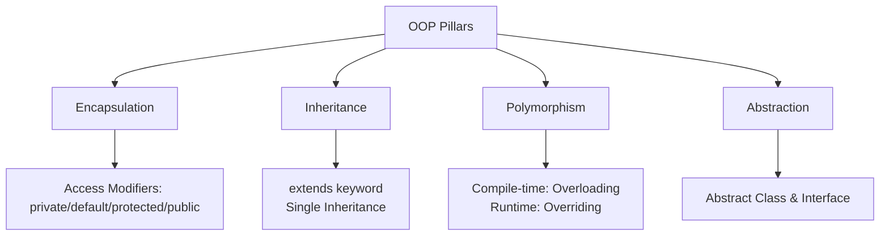

# 09 - Object-Oriented Programming (OOP)

## What You Should Learn

- The definitions and relationships of classes, objects, fields, methods, and constructors.
- The meaning and application of the `this` reference and anonymous objects.
- The four core pillars of Object-Oriented Programming (OOP):
  1. **Encapsulation:** Access modifiers, getters/setters, and data hiding.
  2. **Inheritance:** Super/subclasses, class type hierarchies, constructors under inheritance, the `super` keyword, and method overriding.
  3. **Polymorphism:** Method overloading vs. overriding, upcasting/downcasting, dynamic method dispatch, and the `instanceof` operator.
  4. **Abstraction:** Abstract classes, abstract methods, and interfaces (including default, static, and private interface methods).

## Study Order

1. [Classes and Objects](theory/01-classes-objects.md)
2. [Encapsulation](theory/02-encapsulation.md)
3. [Inheritance](theory/03-inheritance.md)
4. [Polymorphism](theory/04-polymorphism.md)
5. [Abstraction](theory/05-abstraction.md)

## Term Notes

- [OOP Terms](terms/01-oop-terms.md)

## Mermaid Overview

## Self-Check

- What is the difference between a class and an object?
- What happens if you do not define any constructor in a class?
- Why should instance variables be declared `private`?
- Why does Java not support multiple class inheritance, and how does it solve this through interfaces?
- What is the difference between method overloading and method overriding?
- When should you choose an abstract class over an interface?

## Anki Cards

- [Basic](anki/basic.tsv)
- [Basic Extra](anki/basic-extra.tsv)
- [Cloze](anki/cloze.tsv)
- [Code Question](anki/code-question.tsv)

## Reference Links

- Oracle Java Tutorials - OOP concepts: https://docs.oracle.com/javase/tutorial/java/concepts/
- Oracle Java Tutorials - Classes and Objects: https://docs.oracle.com/javase/tutorial/java/javaOO/index.html
- Oracle Java Tutorials - Inheritance: https://docs.oracle.com/javase/tutorial/java/IandI/subclasses.html
- Oracle Java Tutorials - Polymorphism: https://docs.oracle.com/javase/tutorial/java/IandI/polymorphism.html
- Oracle Java Tutorials - Interfaces: https://docs.oracle.com/javase/tutorial/java/IandI/createinterface.html
- Oracle Java Tutorials - Abstract methods and classes: https://docs.oracle.com/javase/tutorial/java/IandI/abstract.html
- Dev.java - Objects, Classes, Interfaces, Packages, and Inheritance: https://dev.java/learn/oop/
