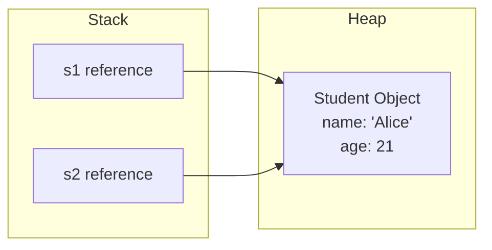

# Classes and Objects

Object-Oriented Programming (OOP) is a programming paradigm centered around "objects"—data structures containing states (fields) and behaviors (methods)—rather than actions and logic.

---

## Class vs. Object

- **Class:** A template or blueprint that defines the structure and behaviors of a type of object. It is a compile-time, logical entity. When compiled, a class definition is loaded into the **Metaspace** (part of JVM memory for class metadata).
- **Object:** An instance of a class. It is a physical, runtime entity that occupies memory in the **Heap** and has a specific state and behavior.

---

## Fields and Methods

- **Fields (Instance Variables / Attributes):** Variables declared inside a class but outside any methods. They represent the state of each individual object. Each object gets its own copy of instance variables.
- **Methods:** Code blocks that perform operations. They represent the actions or behaviors an object can execute.

---

## Constructors and the `<init>` Method

A **Constructor** is a block of code called during object instantiation using the `new` keyword. Its primary role is to initialize the object's fields.

### Constructor Rules:
1. It must match the class name exactly.
2. It must not declare a return type (not even `void`).
3. It cannot be marked `static`, `final`, `abstract`, or `synchronized`.

### Compiler Mechanics:
Under the hood, the Java compiler compiles constructors into a special bytecode method named **`<init>`** (instance initialization method).

### Types of Constructors:
1. **Default Constructor:** If you do not write any constructors, the compiler automatically inserts a public, no-argument constructor:
   ```java
   public ClassName() {
       super(); // Calls parent default constructor
   }
   ```
   If you define *any* constructor with parameters, the compiler **will not** generate the default no-argument constructor.
2. **Parameterized Constructor:** Accepts parameters to initialize instance fields with custom values.
3. **Constructor Overloading:** Defining multiple constructors with different parameter signatures (different parameter counts, types, or order) inside the same class.

```java
class Student {
    String name;
    int age;

    // No-arg constructor
    Student() {
        this("Unknown", 18); // Constructor Chaining
    }

    // Parameterized constructor
    Student(String name, int age) {
        this.name = name;
        this.age = age;
    }
}
```

---

## Constructor Chaining and the `this` Keyword

**Constructor Chaining** is the process of calling one constructor from another constructor within the same class or from a parent class.

### Rules for `this()`:
- To call another constructor in the same class, use `this(arguments)`.
- The call to `this()` (or `super()`) must be the **very first statement** in the constructor body.
- You cannot perform recursive constructor calls (Constructor A calling Constructor B, and B calling A); this causes a compile-time error.

---

## Object References in Memory (Stack vs. Heap)

When you create an object, memory is divided between the Stack and Heap:

```java
Student s1 = new Student("Alice", 20);
```

1. **Stack Memory:** Allocates a reference variable `s1`. The value stored in `s1` is the **memory address (pointer)** of the actual object in the Heap.
2. **Heap Memory:** Allocates contiguous memory space to store the actual `Student` object data (the string `"Alice"`, the integer `20`, and class metadata headers).
3. **Reassignment:**
   ```java
   Student s2 = s1; // s2 copies the reference value. Both point to the same Student in the Heap.
   s2.age = 21;     // Modifying via s2 changes the state of the object s1 points to.
   ```



---

## Passing Objects to Methods

Java uses **pass-by-value** for all arguments. When you pass an object to a method, you are passing the **copy of its reference (memory address)**:
- If the method modifies a field of the object, the caller **will see** the change because both reference variables point to the same object in the heap.
- If the method reassigns the reference parameter to a new object, the caller's reference **will not** change.

```java
void updateStudent(Student s) {
    s.age = 22; // Caller sees this change
    s = new Student("Bob", 25); // Reassignment. Caller does not see this
}
```

---

## Anonymous Objects

An anonymous object is instantiated without being assigned to a reference variable.
- Used for single-use operations.
- Immediately eligible for garbage collection after the statement completes.
```java
new Student("Charlie", 19).printDetails();
```

## Deep Review: Class Design Checklist

When you design a class, do not stop at "it has fields and methods." A useful class usually has a clear responsibility, a controlled state, and a small public API.

Ask these questions:

- What real concept or program concept does this class model?
- Which fields represent object state?
- Which methods protect or transform that state?
- Which constructors create valid objects from the beginning?
- Which invariants must never be broken after construction?
- Should the object be mutable, immutable, or only mutable through controlled methods?

### Constructor Invariants

A constructor should leave the object usable. If a `BankAccount` cannot have a negative starting balance, the constructor should reject that value immediately. This prevents invalid state from spreading through the program.

```java
class BankAccount {
    private int balance;

    BankAccount(int openingBalance) {
        if (openingBalance < 0) {
            throw new IllegalArgumentException("negative balance");
        }
        this.balance = openingBalance;
    }
}
```

### Object Identity vs Object State

Two references can point to the same object. Two objects can also have equal state but be different identities.

```java
Student a = new Student("Alice");
Student b = new Student("Alice");
Student c = a;
```

- `a == b` is false because they are different objects.
- `a == c` is true because both references point to the same object.
- `a.equals(b)` depends on whether `Student` overrides `equals`.

### Reference Links

- Oracle Java Tutorials - OOP concepts: https://docs.oracle.com/javase/tutorial/java/concepts/
- Oracle Java Tutorials - Classes and Objects: https://docs.oracle.com/javase/tutorial/java/javaOO/index.html
- Oracle Java Tutorials - Constructors: https://docs.oracle.com/javase/tutorial/java/javaOO/constructors.html
- Oracle Java Tutorials - `this`: https://docs.oracle.com/javase/tutorial/java/javaOO/thiskey.html
- Oracle Java Tutorials - Creating Objects: https://docs.oracle.com/javase/tutorial/java/javaOO/objectcreation.html
- Oracle Java Tutorials - Passing arguments: https://docs.oracle.com/javase/tutorial/java/javaOO/arguments.html
- Dev.java OOP overview: https://dev.java/learn/oop/
