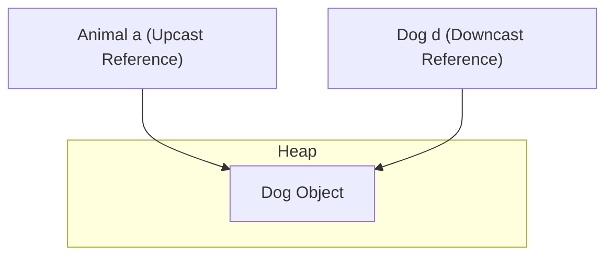

# Polymorphism

Polymorphism, derived from Greek meaning "many forms", is the ability of an object to behave differently depending on the context in which it is used. In Java, this is manifested through overloading (compile-time) and overriding (runtime).

---

## Method Overloading (Compile-Time Polymorphism)

Method Overloading occurs when a class contains multiple methods with the same name but different signatures. It is resolved by the compiler at compile-time (**early binding**).

### Rules for Overloading:
- Methods must differ in their parameters: **number**, **type**, or **order**.
- Return types, access modifiers, or throws clauses **alone** are not part of the method signature and cannot be used to overload a method.

### Automatic Type Promotion
When overloading methods, if the exact parameter types are not passed, Java matches the method using **automatic type promotion**:
- `byte` $\rightarrow$ `short` $\rightarrow$ `int` $\rightarrow$ `long` $\rightarrow$ `float` $\rightarrow$ `double`
- `char` $\rightarrow$ `int`

```java
class Demo {
    void show(int x) { System.out.println("int: " + x); }
    void show(double x) { System.out.println("double: " + x); }
}
// Calling new Demo().show('A') prints "int: 65" due to char -> int promotion.
```

---

## Method Overriding and Dynamic Method Dispatch (Runtime Polymorphism)

Runtime Polymorphism is the process where a call to an overridden method is resolved at runtime (**late binding**).

### Dynamic Method Dispatch
When an overridden method is invoked through a superclass reference, Java determines which method implementation to execute based on the **actual object type in the Heap**, not the reference type in the Stack.

### How the JVM Resolves Methods: Virtual Method Tables (Vtables)
For every class, the JVM maintains a **Vtable (Virtual Method Table)** in the Method Area / Metaspace:
- The Vtable contains pointers to the executable code for all methods of that class.
- If a subclass does not override a parent method, its Vtable entry points to the parent's implementation.
- If the subclass overrides a method, its Vtable entry is updated to point to the subclass's overridden code.
- At runtime, the JVM simply looks up the method signature in the vtable of the actual heap object.

```java
class Vehicle { void start() {} }
class Car extends Vehicle { @Override void start() {} }

Vehicle v = new Car();
v.start(); // At compile time, compiler checks if start() exists in Vehicle class.
           // At runtime, JVM checks v's heap object (Car) and runs Car's start() via Car's Vtable.
```

---

## Object Casting and the Heap

Casting converts an object reference type within an inheritance hierarchy. It **does not modify** the object in the Heap; it only changes the reference type used to access it.



### Upcasting
Casting from a subclass to a superclass.
- **Implicit and Safe:** `Animal a = new Dog();`
- You can only call methods declared in the parent class `Animal`. Subclass-specific methods are inaccessible.

### Downcasting
Casting from a superclass back to a subclass.
- **Explicit and Risky:** `Dog d = (Dog) a;`
- Re-enables access to subclass-specific methods.
- Throws a `ClassCastException` at runtime if the object in memory is not an instance of the target subclass.

---

## The `instanceof` Operator and Pattern Matching

To prevent `ClassCastException`, check the object's runtime type with `instanceof` before casting.

### 1. Traditional Syntax
Requires checking the type and then performing an explicit cast on a new line:
```java
if (obj instanceof String) {
    String s = (String) obj; // Redundant cast
    System.out.println(s.toLowerCase());
}
```

### 2. Pattern Matching for `instanceof` (Java 16+)
Combines type checking and casting in a single statement. If the check succeeds, a **pattern variable** is created and automatically cast:

```java
if (obj instanceof String s) {
    System.out.println(s.toLowerCase()); // 's' is already cast to String here
}
```

### Scope of the Pattern Variable:
The pattern variable is only in scope where the compiler can guarantee the check was `true`.
- **Valid scope using logical `&&`:**
  ```java
  if (obj instanceof String s && s.length() > 5) { // Valid because s is guaranteed to be String
      System.out.println(s);
  }
  ```
- **Invalid scope using logical `||`:**
  ```java
  // if (obj instanceof String s || s.length() > 5) // Compile error!
  ```

## Deep Review: How To Read Polymorphic Code

When reading polymorphic code, separate three things:

1. The **reference type**: what the compiler allows you to call.
2. The **object type**: what actually exists in the heap.
3. The **method kind**: instance, static, private, final, or field access.

```java
Animal animal = new Dog();
animal.speak();
```

- The compiler checks whether `speak()` exists on `Animal`.
- At runtime, Java dispatches the overridden instance method on `Dog`.
- If `speak()` were static, it would be resolved from the reference type instead.

### Good Uses Of Polymorphism

- Processing many implementations through one interface.
- Replacing `if/else` chains with subtype behavior.
- Testing code with fake implementations.
- Building extensible APIs where callers depend on abstractions.

### Bad Uses Of Polymorphism

- Creating a hierarchy only to share two helper methods.
- Downcasting frequently because the parent type lacks the behavior you need.
- Using inheritance where composition would isolate change better.

### Reference Links

- Oracle Java Tutorials - Polymorphism: https://docs.oracle.com/javase/tutorial/java/IandI/polymorphism.html
- Oracle Java Tutorials - Overriding and hiding methods: https://docs.oracle.com/javase/tutorial/java/IandI/override.html
- Oracle Java Tutorials - Method overloading: https://docs.oracle.com/javase/tutorial/java/javaOO/methods.html
