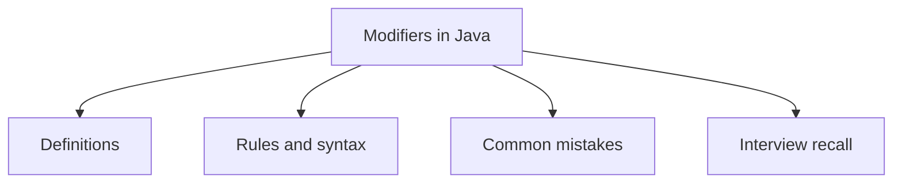

# 10 - Modifiers in Java

This topic follows the master outline in [outline.md](../outline.md). The goal is to understand each concept deeply enough to explain it, recognize it in code, and answer interview-style questions.

## Study Order

- [Access Modifier Concepts](theory/01-access-modifier-concepts.md)
- [Abstract Concepts](theory/02-abstract-concepts.md)
- [Static Block Concepts](theory/03-static-block-concepts.md)
- [Key Terms](terms/01-key-terms.md)

## Outline Checklist

- Access modifier:
- public
- protected
- default
- private
- Non-access modifier:
- static
- final
- abstract
- synchronized
- volatile
- transient
- native
- strictfp
- Static variable
- Static method
- Static block
- Static nested class
- Static import
- Final variable
- Final method
- Final class
- Final parameter
- Blank final variable

## Anki Cards

- [Basic](anki/basic.tsv)
- [Basic Extra](anki/basic-extra.tsv)
- [Cloze](anki/cloze.tsv)
- [Code Question](anki/code-question.tsv)

## Mermaid Overview

## Self-Check

Before moving on, verify that you can answer these deep conceptual "why" questions:

1. [Why does the `private` modifier prevent inheritance and external access, and how does it support encapsulation?](theory/01-access-modifier-concepts.md#why-private-restricts-access-and-supports-encapsulation)
2. [Why are `static` members allocated per class in Metaspace instead of on the Heap, and how are they shared across all instances?](theory/02-abstract-concepts.md#why-static-members-are-allocated-in-metaspace-and-shared)
3. [Why do `final` variables prevent re-assignment, and how does this enable compiler optimizations like inlining?](theory/03-static-block-concepts.md#why-final-variables-prevent-re-assignment-and-enable-inlining)
4. [Why do `synchronized` methods rely on monitor locks, and how does lock reentrancy prevent a thread from deadlocking itself?](theory/02-abstract-concepts.md#why-synchronized-methods-use-monitor-locks-and-reentrancy)
5. [Why does the `volatile` keyword guarantee memory visibility and prevent instruction reordering, yet fail to guarantee atomicity for compound operations?](theory/02-abstract-concepts.md#why-volatile-guarantees-visibility-and-ordering-but-not-atomicity)

## Reference Links

- https://docs.oracle.com/javase/tutorial/java/javaOO/accesscontrol.html
- https://docs.oracle.com/javase/tutorial/java/javaOO/classvars.html

