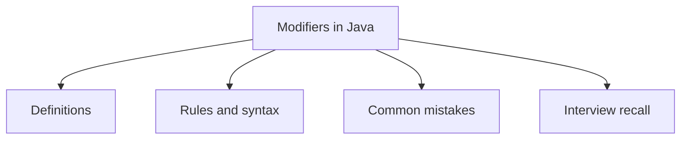

# 10 - Modifiers in Java

This topic follows the master outline in [outline.md](../outline.md). The goal is to understand each concept deeply enough to explain it, recognize it in code, and answer interview-style questions.

## Study Order

- [Access Modifier Concepts](theory/01-access-modifier-concepts.md)
- [Abstract Concepts](theory/02-abstract-concepts.md)
- [Static Block Concepts](theory/03-static-block-concepts.md)
- [Key Terms](terms/01-key-terms.md)

## Outline Checklist

- Access modifier:
- public
- protected
- default
- private
- Non-access modifier:
- static
- final
- abstract
- synchronized
- volatile
- transient
- native
- strictfp
- Static variable
- Static method
- Static block
- Static nested class
- Static import
- Final variable
- Final method
- Final class
- Final parameter
- Blank final variable

## Anki Cards

- [Basic](anki/basic.tsv)
- [Basic Extra](anki/basic-extra.tsv)
- [Cloze](anki/cloze.tsv)
- [Code Question](anki/code-question.tsv)

## Mermaid Overview

## Reference Links

- https://docs.oracle.com/javase/tutorial/java/javaOO/accesscontrol.html
- https://docs.oracle.com/javase/tutorial/java/javaOO/classvars.html
