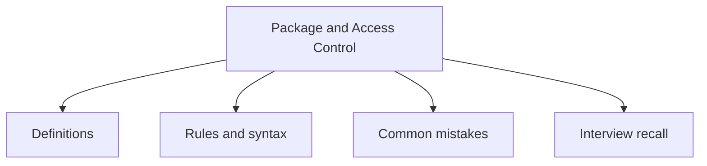

# 11 - Package and Access Control

This topic follows the master outline in [outline.md](../outline.md). The goal is to understand each concept deeply enough to explain it, recognize it in code, and answer interview-style questions.

## Study Order

- [What Is A Package Concepts](theory/01-what-is-a-package-concepts.md)
- [Key Terms](terms/01-key-terms.md)

## Outline Checklist

- What is a package?
- Create package
- Import package
- import static
- Default package
- Package naming convention
- Access between packages
- Classpath
- Basic module path

## Anki Cards

- [Basic](anki/basic.tsv)
- [Basic Extra](anki/basic-extra.tsv)
- [Cloze](anki/cloze.tsv)
- [Code Question](anki/code-question.tsv)

## Mermaid Overview

## Reference Links

- https://docs.oracle.com/javase/tutorial/java/package/packages.html
- https://docs.oracle.com/javase/tutorial/java/package/usepkgs.html
