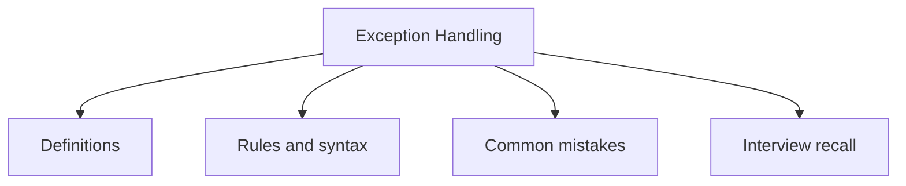

# 12 - Exception Handling

This topic follows the master outline in [outline.md](../outline.md). The goal is to understand each concept deeply enough to explain it, recognize it in code, and answer interview-style questions.

## Study Order

- [What Is An Exception Concepts](theory/01-what-is-an-exception-concepts.md)
- [Finally Concepts](theory/02-finally-concepts.md)
- [Arrayindexoutofboundsexception Concepts](theory/03-arrayindexoutofboundsexception-concepts.md)
- [Filenotfoundexception Concepts](theory/04-filenotfoundexception-concepts.md)
- [Key Terms](terms/01-key-terms.md)

## Outline Checklist

- What is an exception?
- Error vs Exception
- Checked exception
- Unchecked exception
- Runtime exception
- try
- catch
- multiple catch
- finally
- throw
- throws
- try-with-resources
- Custom exception
- Exception propagation
- Common exceptions:
- NullPointerException
- ArrayIndexOutOfBoundsException
- StringIndexOutOfBoundsException
- ClassCastException
- NumberFormatException
- ArithmeticException
- IllegalArgumentException
- IllegalStateException
- IOException
- FileNotFoundException
- SQLException
- Best practices when handling exceptions

## Anki Cards

- [Basic](anki/basic.tsv)
- [Basic Extra](anki/basic-extra.tsv)
- [Cloze](anki/cloze.tsv)
- [Code Question](anki/code-question.tsv)

## Self-Check

Before moving to the next topic, verify that you can answer these questions:
1. Why does Java have two separate categories of exceptions (checked and unchecked), and what philosophical distinction drives the compiler to enforce handling for one but not the other?
   &rarr; See [Why Java Has Checked and Unchecked Exceptions](theory/01-what-is-an-exception-concepts.md#why-java-has-checked-and-unchecked-exceptions)
2. Why does the `finally` block run even when a `return` statement is executed inside `try`, and what JVM mechanism ensures cleanup cannot be skipped?
   &rarr; See [Why Finally Executes Even When Try Returns Early](theory/02-finally-concepts.md#why-finally-executes-even-when-try-returns-early)
3. Why does `try-with-resources` replace manual `finally` for resource cleanup, and how does `AutoCloseable` enable the compiler to guarantee closing order?
   &rarr; See [Why Try-With-Resources Replaces Manual Finally for Resource Cleanup](theory/02-finally-concepts.md#why-try-with-resources-replaces-manual-finally-for-resource-cleanup)
4. Why does exception chaining (wrapping a low-level exception in a higher-level one) preserve the original cause, and what debugging problem does losing the original exception create?
   &rarr; See [Why Exception Chaining Preserves Debugging Context](theory/02-finally-concepts.md#why-exception-chaining-preserves-debugging-context)
5. Why is catching a broad exception type like `Exception` or `Throwable` dangerous, and what specific class of bugs does overly broad catching introduce?
   &rarr; See [Why Catching Broad Exception Types Is Dangerous](theory/01-what-is-an-exception-concepts.md#why-catching-broad-exception-types-is-dangerous)

## Mermaid Overview

## Reference Links

- https://docs.oracle.com/javase/tutorial/essential/exceptions/
