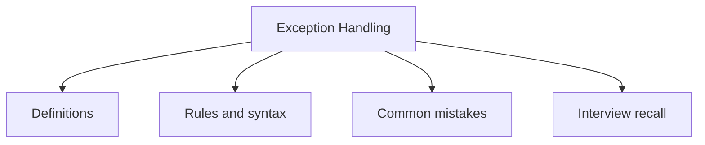

# 12 - Exception Handling

This topic follows the master outline in [outline.md](../outline.md). The goal is to understand each concept deeply enough to explain it, recognize it in code, and answer interview-style questions.

## Study Order

- [What Is An Exception Concepts](theory/01-what-is-an-exception-concepts.md)
- [Finally Concepts](theory/02-finally-concepts.md)
- [Arrayindexoutofboundsexception Concepts](theory/03-arrayindexoutofboundsexception-concepts.md)
- [Filenotfoundexception Concepts](theory/04-filenotfoundexception-concepts.md)
- [Key Terms](terms/01-key-terms.md)

## Outline Checklist

- What is an exception?
- Error vs Exception
- Checked exception
- Unchecked exception
- Runtime exception
- try
- catch
- multiple catch
- finally
- throw
- throws
- try-with-resources
- Custom exception
- Exception propagation
- Common exceptions:
- NullPointerException
- ArrayIndexOutOfBoundsException
- StringIndexOutOfBoundsException
- ClassCastException
- NumberFormatException
- ArithmeticException
- IllegalArgumentException
- IllegalStateException
- IOException
- FileNotFoundException
- SQLException
- Best practices when handling exceptions

## Anki Cards

- [Basic](anki/basic.tsv)
- [Basic Extra](anki/basic-extra.tsv)
- [Cloze](anki/cloze.tsv)
- [Code Question](anki/code-question.tsv)

## Mermaid Overview

## Reference Links

- https://docs.oracle.com/javase/tutorial/essential/exceptions/
