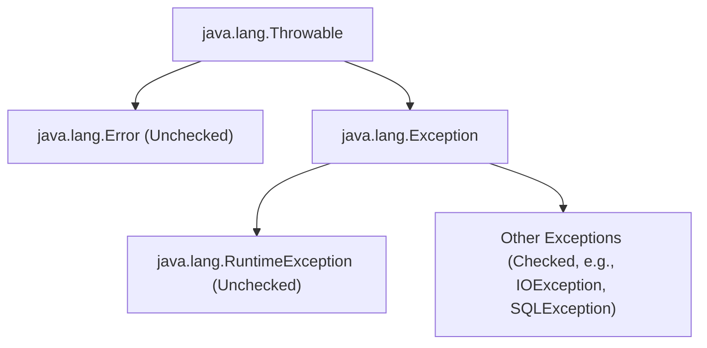

# Exception Handling - Part 1

## Learning Goal

This file covers a focused slice of **Exception Handling**. Study each concept as a practical Java rule, not as isolated vocabulary.

## Outline Coverage

| Concept | What to know |
| --- | --- |
| `What is an exception?` | An exception represents an abnormal condition that a program may catch or propagate. |
| `Error vs Exception` | An exception represents an abnormal condition that a program may catch or propagate. |
| `Checked exception` | A checked exception must be handled or declared by compiler rules. |
| `Unchecked exception` | An unchecked exception is not required to be caught or declared. |
| `Runtime exception` | An exception represents an abnormal condition that a program may catch or propagate. |
| `try` |try marks the block whose exceptions you want to handle, clean up after, or propagate. |
| `catch` |catch handles a matching exception type thrown from the try block. |
| `multiple catch` |multiple catch lets different exception types be handled by different handlers, ordered from specific to broad. |

## Detailed Notes

### What is an exception?

An exception represents an abnormal condition that a program may catch or propagate.

It matters because exception behavior decides whether failures are handled locally, propagated, or allowed to stop the program. A common confusion is treating every exception the same instead of separating recoverable conditions from programming bugs.

Practical check:

- Define `What is an exception?` in one sentence.
- Recognize `What is an exception?` in code, commands, documentation, or interview prompts.
- Explain one bug, limitation, or tradeoff related to `What is an exception?`.

Tiny example or mental model:

- When reading code, ask: what does `What is an exception?` change, allow, reject, or clarify?

#### Runnable Code Example: Throwing and Catching an Exception
Below is a basic example of throwing a standard `Exception` and catching it locally.

```java
public class ExceptionDemo {
    public static void main(String[] args) {
        try {
            System.out.println("Before exception throw");
            throw new Exception("Something went wrong");
            // System.out.println("Unreachable"); // Compile error: unreachable statement
        } catch (Exception e) {
            System.out.println("Caught exception: " + e.getMessage());
        }
        System.out.println("Execution continues normally.");
    }
}
```

### Error vs Exception

An exception represents an abnormal condition that a program may catch or propagate.

It matters because exception behavior decides whether failures are handled locally, propagated, or allowed to stop the program. A common confusion is treating every exception the same instead of separating recoverable conditions from programming bugs.

Practical check:

- Define `Error vs Exception` in one sentence.
- Recognize `Error vs Exception` in code, commands, documentation, or interview prompts.
- Explain one bug, limitation, or tradeoff related to `Error vs Exception`.

Tiny example or mental model:

- When reading code, ask: what does `Error vs Exception` change, allow, reject, or clarify?

#### Runnable Code Example: Recovering from Exception vs Crashing on Error
Errors (like `StackOverflowError` or `OutOfMemoryError`) indicate serious problems that a reasonable application should not try to catch. Exceptions (like `IOException` or `NullPointerException`) are conditions that a reasonable application might want to catch.

```java
public class ThrowableHierarchyDemo {
    // 1. Error: Stack Overflow due to infinite recursion (JVM-level disaster)
    public static void causeStackOverflow() {
        causeStackOverflow();
    }

    // 2. Exception: Division by zero (recoverable program-level issue)
    public static void causeException() {
        int result = 10 / 0;
    }

    public static void main(String[] args) {
        // Recovering from Exception
        try {
            causeException();
        } catch (ArithmeticException e) {
            System.out.println("Recovered from exception: " + e.getMessage());
        }

        // Running into Error (Avoid catching Errors in production code!)
        try {
            causeStackOverflow();
        } catch (StackOverflowError err) {
            System.err.println("Caught StackOverflowError (Highly discouraged to catch Errors): " + err);
        }
    }
}
```

#### Class Hierarchy Diagram


### Checked exception

A checked exception must be handled or declared by compiler rules.

It matters because exception behavior decides whether failures are handled locally, propagated, or allowed to stop the program. A common confusion is treating every exception the same instead of separating recoverable conditions from programming bugs.

Practical check:

- Define `Checked exception` in one sentence.
- Recognize `Checked exception` in code, commands, documentation, or interview prompts.
- Explain one bug, limitation, or tradeoff related to `Checked exception`.

Tiny example or mental model:

- When reading code, ask: what does `Checked exception` change, allow, reject, or clarify?

#### Runnable Code Example: Handling Checked Exceptions
Checked exceptions represent conditions outside the immediate control of the program (e.g., file system or network issues). The compiler enforces that you either catch them using `try-catch` or declare them in the method signature using `throws`.

```java
import java.io.FileReader;
import java.io.FileNotFoundException;

public class CheckedExceptionDemo {
    // Option 1: Declaring the checked exception using 'throws'
    public static void readFileWithThrows() throws FileNotFoundException {
        FileReader fr = new FileReader("non_existent_file.txt");
    }

    // Option 2: Handling the checked exception using 'try-catch'
    public static void readFileWithTryCatch() {
        try {
            FileReader fr = new FileReader("non_existent_file.txt");
        } catch (FileNotFoundException e) {
            System.out.println("Handled checked exception: File not found!");
        }
    }

    public static void main(String[] args) {
        readFileWithTryCatch();
    }
}
```

### Unchecked exception

An unchecked exception is not required to be caught or declared.

It matters because exception behavior decides whether failures are handled locally, propagated, or allowed to stop the program. A common confusion is treating every exception the same instead of separating recoverable conditions from programming bugs.

Practical check:

- Define `Unchecked exception` in one sentence.
- Recognize `Unchecked exception` in code, commands, documentation, or interview prompts.
- Explain one bug, limitation, or tradeoff related to `Unchecked exception`.

Tiny example or mental model:

- When reading code, ask: what does `Unchecked exception` change, allow, reject, or clarify?

#### Runnable Code Example: Unchecked Exceptions (RuntimeExceptions)
Unchecked exceptions represent programming errors (e.g., logic errors, improper use of APIs). The compiler does not force you to handle or declare them.

```java
public class UncheckedExceptionDemo {
    public static void main(String[] args) {
        String text = null;
        
        // This line throws NullPointerException at runtime.
        // It compiles successfully without any try-catch or throws declaration.
        try {
            int length = text.length();
        } catch (NullPointerException e) {
            System.out.println("Caught unchecked NullPointerException: " + e.getMessage());
        }
    }
}
```

### Runtime exception

An exception represents an abnormal condition that a program may catch or propagate.

It matters because exception behavior decides whether failures are handled locally, propagated, or allowed to stop the program. A common confusion is treating every exception the same instead of separating recoverable conditions from programming bugs.

Practical check:

- Define `Runtime exception` in one sentence.
- Recognize `Runtime exception` in code, commands, documentation, or interview prompts.
- Explain one bug, limitation, or tradeoff related to `Runtime exception`.

Tiny example or mental model:

- When reading code, ask: what does `Runtime exception` change, allow, reject, or clarify?

#### Runnable Code Example: Runtime Exceptions (Subclasses of RuntimeException)
`RuntimeException` is the superclass of those exceptions that can be thrown during the normal operation of the Java Virtual Machine.

```java
public class RuntimeExceptionDemo {
    public static void main(String[] args) {
        // ArithmeticException is a subclass of RuntimeException
        try {
            int result = 50 / 0;
        } catch (ArithmeticException e) {
            System.out.println("Caught RuntimeException subclass (ArithmeticException): " + e.getMessage());
        }
    }
}
```

### try

try marks the block whose exceptions you want to handle, clean up after, or propagate.

Use it to predict the exact Java rule, the allowed form, and the failure mode. Review it with a tiny example instead of memorizing only the label.

Practical check:

- Define `try` in one sentence.
- Recognize `try` in code, commands, documentation, or interview prompts.
- Explain one bug, limitation, or tradeoff related to `try`.

Tiny example or mental model:

- `try { ... } catch (IOException ex) { ... }` handles a specific failure path.

#### Runnable Code Example: Try Block Scope
A `try` block cannot exist by itself. It must be followed by at least one `catch` block, a `finally` block, or both. Variables declared inside the `try` block are local to that block and cannot be accessed outside of it.

```java
public class TryScopeDemo {
    public static void main(String[] args) {
        try {
            int x = 10;
            System.out.println("x in try: " + x);
        } catch (Exception e) {
            // System.out.println(x); // Compile error: x is out of scope here
        }
        // System.out.println(x); // Compile error: x is out of scope here
    }
}
```

### catch

catch handles a matching exception type thrown from the try block.

Use it to predict the exact Java rule, the allowed form, and the failure mode. Review it with a tiny example instead of memorizing only the label.

Practical check:

- Define `catch` in one sentence.
- Recognize `catch` in code, commands, documentation, or interview prompts.
- Explain one bug, limitation, or tradeoff related to `catch`.

Tiny example or mental model:

- `try { ... } catch (IOException ex) { ... }` handles a specific failure path.

#### Runnable Code Example: Catching Specific Exception
When an exception is thrown in the `try` block, Java matches the exception type to the parameter type of the `catch` block.

```java
public class CatchDemo {
    public static void main(String[] args) {
        try {
            String str = "abc";
            int num = Integer.parseInt(str); // Throws NumberFormatException
        } catch (NumberFormatException e) {
            System.out.println("Caught NumberFormatException: " + e.getMessage());
        }
    }
}
```

### multiple catch

multiple catch lets different exception types be handled by different handlers, ordered from specific to broad.

Use it to predict the exact Java rule, the allowed form, and the failure mode. Review it with a tiny example instead of memorizing only the label.

Practical check:

- Define `multiple catch` in one sentence.
- Recognize `multiple catch` in code, commands, documentation, or interview prompts.
- Explain one bug, limitation, or tradeoff related to `multiple catch`.

Tiny example or mental model:

- `try { ... } catch (IOException ex) { ... }` handles a specific failure path.

#### Runnable Code Example: Multiple Catch Blocks vs Multi-Catch (Union Catch)
Java allows you to define multiple `catch` blocks for a single `try` block, or catch multiple exception types in a single `catch` block using the pipe (`|`) operator.

```java
public class MultipleCatchDemo {
    public static void main(String[] args) {
        // Scenario 1: Multiple catch blocks (ordered from specific to general)
        try {
            int[] arr = new int[3];
            arr[5] = 10; // ArrayIndexOutOfBoundsException
        } catch (ArrayIndexOutOfBoundsException e) {
            System.out.println("Caught specific index out of bounds exception");
        } catch (RuntimeException e) {
            System.out.println("Caught general RuntimeException");
        }

        // Scenario 2: Multi-catch (Union catch block)
        try {
            String str = null;
            str.length(); // NullPointerException
        } catch (NullPointerException | ArithmeticException e) {
            // Note: 'e' is implicitly final in a multi-catch block
            // e = new NullPointerException(); // Compile error: cannot assign a value to final variable e
            System.out.println("Caught NullPointerException or ArithmeticException: " + e.getClass().getSimpleName());
        }
    }
}
```

## Common Mistakes

### 1. Catching a Superclass Exception Before a Subclass Exception
Since exception matching is resolved in order from top to bottom, catching a broader exception type (like `Exception`) before a more specific exception type (like `IOException`) results in a compile-time error.
```java
// COMPILE ERROR: exception java.io.IOException has already been caught
try {
    throw new java.io.IOException("File missing");
} catch (Exception e) {
    System.out.println("Caught Exception");
} catch (java.io.IOException e) { // Compile Error!
    System.out.println("Caught IOException");
}
```

### 2. Catching Checked Exceptions That Cannot Be Thrown in Try Block
If you write a catch block for a specific **checked** exception, but the code in the corresponding `try` block has no possibility of throwing that exception, the compiler will fail with an error. (Note: This rule does not apply to unchecked exceptions or broad exceptions like `Exception` or `Throwable`).
```java
// COMPILE ERROR: exception java.io.IOException is never thrown in body of corresponding try statement
try {
    int x = 10 / 2;
} catch (java.io.IOException e) { // Compile Error!
    System.out.println("Caught IOException");
}
```

### 3. Reassigning the Exception Variable in Multi-Catch Blocks
The exception variable `e` in a multi-catch block (e.g., `catch (ArithmeticException | NullPointerException e)`) is implicitly `final`. Any attempt to reassign it results in a compile error.
```java
try {
    int x = 10 / 0;
} catch (ArithmeticException | NullPointerException e) {
    // e = new ArithmeticException("new message"); // Compile Error!
}
```

## Common Review Prompts

- Which concepts here are compile-time rules?
- Which concepts here affect runtime behavior?
- Which concepts here are likely interview traps?

---

## Why Java Has Checked and Unchecked Exceptions

Java's designers made a deliberate philosophical distinction when categorizing exceptions. **Checked exceptions** represent failures in external resources or conditions entirely outside the program's control — file system I/O, network connections, database access. These failures are expected, possible, and recoverable: a file might not exist, a network might be unavailable. The compiler enforces handling because the designer believes callers must be explicitly informed about these failure modes and must make a decision about them.

**Unchecked exceptions** (`RuntimeException` and its subclasses) represent programming bugs — null dereferences, array index errors, division by zero, illegal arguments. These are caused by errors in the code itself, not by external conditions. Since they can theoretically occur anywhere in any code, requiring the compiler to enforce `try-catch` for every unchecked exception would make Java code unreadably verbose. The design decision is: programmers are expected to fix bugs, not catch them.

The distinction maps to the question: "Is this failure mode something the caller can reasonably be expected to handle at the call site?" For `FileNotFoundException` — yes, a caller can handle a missing file. For `NullPointerException` — no, the correct response is to fix the null dereference in the code, not to catch it.

### Mental Model: Checked vs Unchecked split
```
External Environment Failures (Checked — compiler enforces handling):
  FileNotFoundException → network: IOException → database: SQLException
  Caller MUST decide: catch it here, or declare throws to propagate it upward

Programming Bugs (Unchecked — compiler does NOT enforce handling):
  NullPointerException → ArrayIndexOutOfBoundsException → NumberFormatException
  Programmer should FIX the bug, not catch it
  Theoretically possible in any method → forcing catch everywhere = unreadable code
```

### Code Example: Checked vs Unchecked in method signatures
```java
import java.io.*;

// CHECKED — compiler enforces caller to handle or declare throws
public void readFile(String path) throws FileNotFoundException {
    FileReader fr = new FileReader(path);  // compiler mandates this is handled
}

// UNCHECKED — no compiler requirement to declare or handle
public int divide(int a, int b) {
    return a / b;  // ArithmeticException if b=0 — compiler doesn't care
}

// Caller of readFile MUST handle
try {
    readFile("config.txt");       // must catch FileNotFoundException
} catch (FileNotFoundException e) {
    System.out.println("Config missing: " + e.getMessage());
}

// Caller of divide has no compiler requirement
int result = divide(10, 0);  // throws ArithmeticException at runtime — fix the code
```

### Cause-Effect Chain
File I/O fails &rarr; `FileNotFoundException` thrown (checked) &rarr; Compiler detects uncaught checked exception &rarr; Compile error unless try-catch or throws declaration added &rarr; Caller is forced to make a conscious decision about the failure &rarr; Program handles or propagates — never silently ignores. Programming bug: null dereference &rarr; `NullPointerException` thrown (unchecked) &rarr; Compiler imposes no requirement &rarr; Exception propagates up the call stack &rarr; Program crashes with stack trace &rarr; Developer fixes the null check in code.

---

## Why Catching Broad Exception Types Is Dangerous

When you catch `Exception` or `Throwable` broadly, you catch not only the exceptions you expected, but also every other exception that could possibly be thrown — including `InterruptedException`, `OutOfMemoryError`, `StackOverflowError`, `ThreadDeath`, and future exceptions added by refactoring. This introduces three serious problems.

First, **exception masking**: an unanticipated exception is caught and treated as if it was the expected one, hiding the real failure. Code that catches `Exception` and logs "file not found" may be masking a database timeout, a null pointer bug, or a network issue — all silently misclassified as "file not found."

Second, **swallowed errors**: if `Error` subclasses are caught via `Throwable`, JVM-level catastrophes like `OutOfMemoryError` are silently absorbed, leaving the application in an undefined state.

Third, **loss of exception type information**: catch blocks often react differently depending on exception type. A broad catch with a single response forces all exceptions into one behavior, preventing the correct, type-specific response.

### Mental Model: Narrow vs Broad catch scope
```
[Narrow — correct]
try { readFile("data.csv"); }
catch (FileNotFoundException e) {
    // Handles ONLY file-not-found
    // All other exceptions propagate to their proper handlers
}

[Broad — dangerous]
try { readFile("data.csv"); }
catch (Exception e) {
    // Catches FileNotFoundException ← intended
    // Also catches NullPointerException ← bug masking!
    // Also catches OutOfMemoryError (via Throwable) ← dangerous!
    // Also catches SQLException ← unrelated, different behavior needed
    log("Error: " + e.getMessage()); // one response for all — wrong!
}
```

### Code Example: Bug masking via broad exception catch
```java
public void processFile(String path) {
    try {
        FileReader fr = new FileReader(path);    // May throw FileNotFoundException
        String content = null;
        content.length();                         // NullPointerException bug in code!
    } catch (Exception e) {
        // BUG MASKED: Both exceptions caught here as if they were the same
        System.out.println("File error: " + e.getMessage());
        // Developer thinks file is missing — actually there's a NPE in the code
    }
}

// CORRECT:
public void processFileCorrect(String path) throws FileNotFoundException {
    FileReader fr = new FileReader(path);    // Compiler enforces handling
    String content = null;
    content.length();                         // NullPointerException propagates — visible bug!
}
```

### Cause-Effect Chain
Catch `Exception` broadly &rarr; `NullPointerException` thrown inside try &rarr; Caught by broad `catch (Exception e)` &rarr; Application logs "file error" &rarr; Bug is misclassified as an expected failure &rarr; Developer investigates file path, not null dereference &rarr; Real bug hidden for days or weeks. Catch narrowly (`FileNotFoundException`) &rarr; `NullPointerException` not caught here &rarr; Propagates up call stack &rarr; Crash with clear stack trace &rarr; Developer sees the null dereference immediately.
