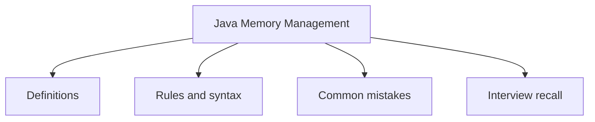

# 13 - Java Memory Management

This topic follows the master outline in [outline.md](../outline.md). The goal is to understand each concept deeply enough to explain it, recognize it in code, and answer interview-style questions.

## Study Order

- [Stack Concepts](theory/01-stack-concepts.md)
- [Weak Reference Concepts](theory/02-weak-reference-concepts.md)
- [Outofmemoryerror Concepts](theory/03-outofmemoryerror-concepts.md)
- [Key Terms](terms/01-key-terms.md)

## Outline Checklist

- Stack
- Heap
- Method Area / Metaspace
- PC Register
- Native Method Stack
- Object lifecycle
- Reference variable
- Strong reference
- Weak reference
- Soft reference
- Phantom reference
- Garbage Collection
- Conditions for an object to be GC'd
- System.gc()
- Finalization, finalize() deprecated
- Memory leak in Java
- OutOfMemoryError
- StackOverflowError

## Anki Cards

- [Basic](anki/basic.tsv)
- [Basic Extra](anki/basic-extra.tsv)
- [Cloze](anki/cloze.tsv)
- [Code Question](anki/code-question.tsv)

## Mermaid Overview

## Reference Links

- https://docs.oracle.com/en/java/javase/21/gctuning/introduction-garbage-collection-tuning.html
- https://docs.oracle.com/en/java/javase/21/docs/api/java.base/java/lang/ref/package-summary.html
