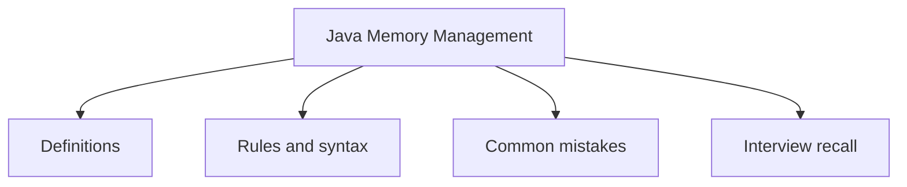

# 13 - Java Memory Management

This topic follows the master outline in [outline.md](../outline.md). The goal is to understand each concept deeply enough to explain it, recognize it in code, and answer interview-style questions.

## Study Order

- [Stack Concepts](theory/01-stack-concepts.md)
- [Weak Reference Concepts](theory/02-weak-reference-concepts.md)
- [Outofmemoryerror Concepts](theory/03-outofmemoryerror-concepts.md)
- [Key Terms](terms/01-key-terms.md)

## Outline Checklist

- Stack
- Heap
- Method Area / Metaspace
- PC Register
- Native Method Stack
- Object lifecycle
- Reference variable
- Strong reference
- Weak reference
- Soft reference
- Phantom reference
- Garbage Collection
- Conditions for an object to be GC'd
- System.gc()
- Finalization, finalize() deprecated
- Memory leak in Java
- OutOfMemoryError
- StackOverflowError

## Anki Cards

- [Basic](anki/basic.tsv)
- [Basic Extra](anki/basic-extra.tsv)
- [Cloze](anki/cloze.tsv)
- [Code Question](anki/code-question.tsv)

## Self-Check

Before moving to the next topic, verify that you can answer these questions:
1. Why does the JVM allocate primitive variables on the Stack in some situations but on the Heap in others, and how does the declaration scope determine their memory location?
   &rarr; See [Why Primitives Live on the Stack or Heap](theory/01-stack-concepts.md#why-primitives-live-on-the-stack-or-heap)
2. Why is Java strictly pass-by-value, and what occurs at the reference variable level when an object reference is passed to a method?
   &rarr; See [Why Java Is Strictly Pass-by-Value](theory/01-stack-concepts.md#why-java-is-strictly-pass-by-value)
3. Why do Weak, Soft, and Phantom references behave differently during Garbage Collection, and what memory constraints or post-mortem cleanup requirements drive the choice of each?
   &rarr; See [Why Different Reference Types Exist](theory/02-weak-reference-concepts.md#why-different-reference-types-exist)
4. Why can circular references (islands of isolation) be garbage collected in Java, and how does tracing from GC Roots solve the limitations of reference counting?
   &rarr; See [Why Islands of Isolation Can Be Garbage Collected](theory/02-weak-reference-concepts.md#why-islands-of-isolation-can-be-garbage-collected)
5. Why do OutOfMemoryError and StackOverflowError occur in different memory regions of the JVM, and why is catching these errors inside application code considered a dangerous anti-pattern?
   &rarr; See [Why Heap and Stack Errors Differ](theory/03-outofmemoryerror-concepts.md#why-heap-and-stack-errors-differ)

## Mermaid Overview

## Reference Links

- https://docs.oracle.com/en/java/javase/21/gctuning/introduction-garbage-collection-tuning.html
- https://docs.oracle.com/en/java/javase/21/docs/api/java.base/java/lang/ref/package-summary.html
