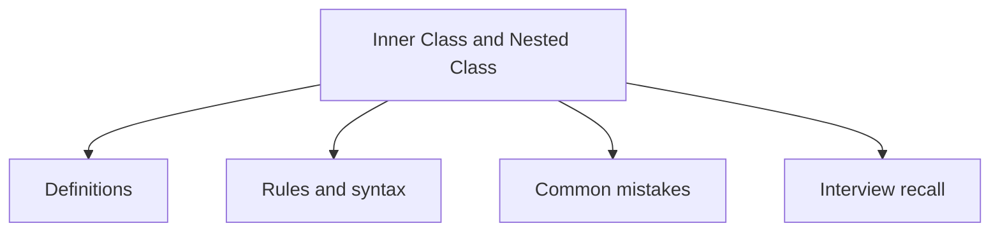

# 15 - Inner Class and Nested Class

This topic follows the master outline in [outline.md](../outline.md). The goal is to understand each concept deeply enough to explain it, recognize it in code, and answer interview-style questions.

## Study Order

- [Nested Class Concepts](theory/01-nested-class-concepts.md)
- [Key Terms](terms/01-key-terms.md)

## Outline Checklist

- Nested class
- Static nested class
- Inner class
- Local inner class
- Anonymous inner class
- Access variables outside the class
- Use case of inner class
- Anonymous class in event handler, thread, comparator

## Anki Cards

- [Basic](anki/basic.tsv)
- [Basic Extra](anki/basic-extra.tsv)
- [Cloze](anki/cloze.tsv)
- [Code Question](anki/code-question.tsv)

## Mermaid Overview

## Reference Links

- https://docs.oracle.com/javase/tutorial/java/javaOO/nested.html
