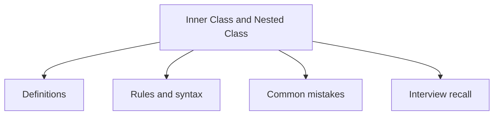

# 15 - Inner Class and Nested Class

This topic follows the master outline in [outline.md](../outline.md). The goal is to understand each concept deeply enough to explain it, recognize it in code, and answer interview-style questions.

## Study Order

- [Nested Class Concepts](theory/01-nested-class-concepts.md)
- [Key Terms](terms/01-key-terms.md)

## Outline Checklist

- Nested class
- Static nested class
- Inner class
- Local inner class
- Anonymous inner class
- Access variables outside the class
- Use case of inner class
- Anonymous class in event handler, thread, comparator

## Self-Check

- **Question 1**: Why does a non-static inner class hold an implicit reference to its outer class instance, and how can this lead to memory leaks (and how can using a static nested class prevent this)?
  - *Hint*: See [Why Non-Static Inner Classes Can Cause Memory Leaks](theory/01-nested-class-concepts.md#why-non-static-inner-classes-can-cause-memory-leaks).
- **Question 2**: How do static nested classes and non-static inner classes differ in their initialization, instantiating syntax, and memory footprint?
  - *Hint*: See [Why Static Nested and Non-Static Inner Classes Differ in Initialization and Memory](theory/01-nested-class-concepts.md#why-static-nested-and-non-static-inner-classes-differ-in-initialization-and-memory).
- **Question 3**: Why can local and anonymous inner classes only access local variables that are final or effectively final, and how does the compiler implement this under the hood via copy-by-value variable capture?
  - *Hint*: See [Why Local and Anonymous Inner Classes Only Access Final or Effectively Final Variables](theory/01-nested-class-concepts.md#why-local-and-anonymous-inner-classes-only-access-final-or-effectively-final-variables).
- **Question 4**: Why does the JVM generate synthetic accessor methods (e.g. `access$000`) for private outer/inner class member access, and what are the performance and security implications?
  - *Hint*: See [Why JVM Generates Synthetic Accessors for Private Nested Access](theory/01-nested-class-concepts.md#why-jvm-generates-synthetic-accessors-for-private-nested-access).
- **Question 5**: How does the Java compiler compile anonymous inner classes into separate `.class` bytecode files (e.g., `Outer$1.class`), and how does this contrast with how lambda expressions are compiled?
  - *Hint*: See [Why Anonymous Classes Compile to Separate Class Files vs Lambdas](theory/01-nested-class-concepts.md#why-anonymous-classes-compile-to-separate-class-files-vs-lambdas).

## Anki Cards

- [Basic](anki/basic.tsv)
- [Basic Extra](anki/basic-extra.tsv)
- [Cloze](anki/cloze.tsv)
- [Code Question](anki/code-question.tsv)

## Mermaid Overview

## Reference Links

- https://docs.oracle.com/javase/tutorial/java/javaOO/nested.html
