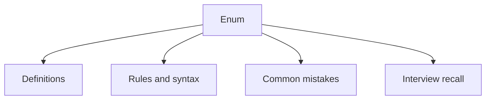

# 16 - Enum

This topic follows the master outline in [outline.md](../outline.md). The goal is to understand each concept deeply enough to explain it, recognize it in code, and answer interview-style questions.

## Study Order

- [What Is An Enum Concepts](theory/01-what-is-an-enum-concepts.md)
- [Enum Implements Interface Concepts](theory/02-enum-implements-interface-concepts.md)
- [Key Terms](terms/01-key-terms.md)

## Outline Checklist

- What is an enum?
- Declare enum
- Enum constructor
- Enum field
- Enum method
- values()
- valueOf()
- ordinal()
- name()
- Enum in switch
- Enum implements interface
- Enum Singleton pattern

## Self-Check

Try to answer these questions after studying the topic. You should be able to explain the underlying mechanisms without external resources:

1. **Why does the Java compiler compile enums into `final` classes extending `java.lang.Enum`?**
   - *Key mechanism*: Java's single inheritance constraint, compile-time type safety, and prohibiting sub-classing of enum types.
2. **Why must enum constructors be implicitly or explicitly `private`, and what happens if you try to instantiate an enum using `new` or reflection?**
   - *Key mechanism*: Strict instance control preventing external instantiation; compiler-time blocks on `new` and runtime blocks on reflection instantiations.
3. **How does the single-element Enum Singleton pattern guarantee thread safety and protect against reflection and serialization attacks?**
   - *Key mechanism*: JVM class loading guarantees thread safety, runtime reflection blocks throw `IllegalArgumentException`, and serialization restores instances using the name alone.
4. **How do compiler-generated `values()` and `valueOf(String)` methods work under the hood, and why is calling `values()` in a hot loop considered a performance anti-pattern?**
   - *Key mechanism*: Hidden static array `$VALUES` storing constants, array cloning on every invocation to prevent modification, and garbage collection overhead.
5. **Why are enums safe to compare using the `==` operator instead of `.equals()`, and how does this relate to the JVM's instance control?**
   - *Key mechanism*: Singleton nature of each enum constant, reference identity, and compile-time type safety checking.
6. **How can enum constants implement interfaces and define constant-specific class bodies to achieve behavioral polymorphism?**
   - *Key mechanism*: Anonymous inner subclasses generated by the compiler for constants that define class bodies, overriding interface or base methods.

## Anki Cards

- [Basic](anki/basic.tsv)
- [Basic Extra](anki/basic-extra.tsv)
- [Cloze](anki/cloze.tsv)
- [Code Question](anki/code-question.tsv)

## Mermaid Overview

## Reference Links

- https://docs.oracle.com/javase/tutorial/java/javaOO/enum.html
- https://docs.oracle.com/en/java/javase/21/docs/api/java.base/java/lang/Enum.html
