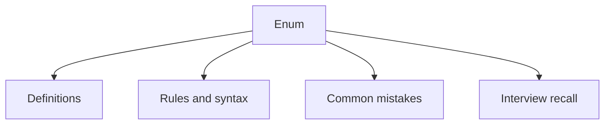

# 16 - Enum

This topic follows the master outline in [outline.md](../outline.md). The goal is to understand each concept deeply enough to explain it, recognize it in code, and answer interview-style questions.

## Study Order

- [What Is An Enum Concepts](theory/01-what-is-an-enum-concepts.md)
- [Enum Implements Interface Concepts](theory/02-enum-implements-interface-concepts.md)
- [Key Terms](terms/01-key-terms.md)

## Outline Checklist

- What is an enum?
- Declare enum
- Enum constructor
- Enum field
- Enum method
- values()
- valueOf()
- ordinal()
- name()
- Enum in switch
- Enum implements interface
- Enum Singleton pattern

## Anki Cards

- [Basic](anki/basic.tsv)
- [Basic Extra](anki/basic-extra.tsv)
- [Cloze](anki/cloze.tsv)
- [Code Question](anki/code-question.tsv)

## Mermaid Overview

## Reference Links

- https://docs.oracle.com/javase/tutorial/java/javaOO/enum.html
- https://docs.oracle.com/en/java/javase/21/docs/api/java.base/java/lang/Enum.html
