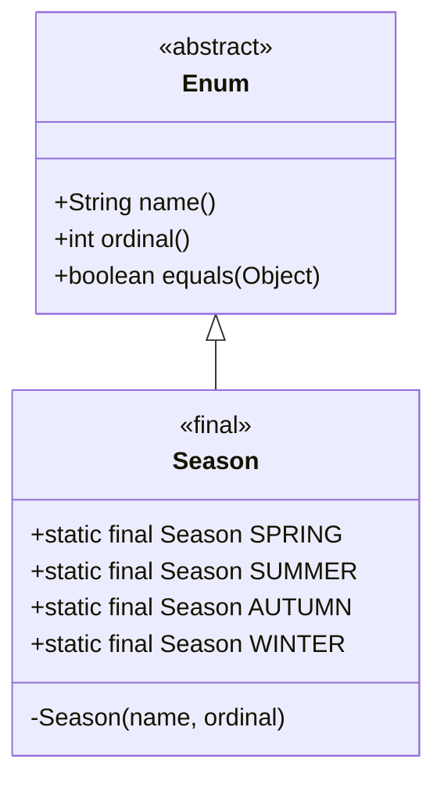

# Enum - Part 1

## Learning Goal

This file covers a focused slice of **Enum**. Study each concept as a practical Java rule, not as isolated vocabulary.

## Outline Coverage

| Concept | What to know |
| --- | --- |
| `What is an enum?` | Defines a fixed set of named constants as a type-safe class extending `java.lang.Enum`. |
| `Declare enum` | Declared using the `enum` keyword; can be top-level or nested (implicitly static). |
| `Enum constructor` | Executed at class loading, must be private, cannot be instantiated with `new`. |
| `Enum field` | Instance or static variables defined within an enum, usually final to ensure immutability. |
| `Enum method` | Can define static, instance, or abstract methods overridden by each constant. |
| `values()` | Static method returning a cloned array of all constants in declaration order. |
| `valueOf()` | Static method returning the constant matching the exact case-sensitive string or throws `IllegalArgumentException`. |
| `ordinal()` | Returns the 0-based declaration index; dangerous to use for database/business logic. |
| `name()` | Final method returning the exact declared constant string; cannot be overridden. |
| `Enum in switch` | Used as selector; case labels must use unqualified constant names. Throws NPE if enum reference is null. |
| `EnumSet` | Highly optimized bit-vector `Set` implementation for enums. |
| `EnumMap` | Ultra-fast array-backed `Map` implementation using enums as keys. |

## Detailed Notes

### What is an enum?

An enum (enumeration) defines a fixed set of named constants as a type-safe class-like construct. Under the hood, every enum is a subclass of `java.lang.Enum`. Enums cannot be instantiated using `new` and cannot extend other classes, but they provide strong type safety at compile time.

```java
public enum Season {
    SPRING, SUMMER, AUTUMN, WINTER
}
```

- **Type Safety**: Unlike integer constants, you cannot pass an arbitrary integer or different enum type where a `Season` is expected.
- **Inheritance Limitation**: Enums cannot extend any other class because they already implicitly extend `java.lang.Enum`.

### Why Enums Are Compiled to Final Classes Extending java.lang.Enum

Java enums are compiled into final classes extending `java.lang.Enum` to enforce compile-time type safety and strict inheritance limits. Because Java only supports single class inheritance, pre-empting the parent class slot with `java.lang.Enum` prevents an enum from extending any other class. Marking the class `final` ensures that no other class can subclass the enum, keeping the set of instances strictly closed. The type safety is enforced by both the compiler and the JVM, which recognize the `ENUM` class modifier and prevent any subclassing or external instantiation, ensuring that only the predefined constants can ever exist at runtime.

#### Mental Model: Enum Hierarchy and Type Boundaries
The following diagram illustrates how the compiled class structure prevents inheritance while inheriting core features from `java.lang.Enum`:



#### Code Demonstration: Inheritance Limitations

```java
// Under the hood compiled structure:
// public final class Season extends java.lang.Enum<Season> { ... }

// Attempting to subclass the enum results in a compile-time error:
// class CustomSeason extends Season {} 
// Error: Cannot inherit from final 'Season'
```

#### Cause-Effect Chain: Enforcing Type Safety
$$\text{Declaring an enum} \rightarrow \text{Compiler generates a final class extending java.lang.Enum} \rightarrow \text{Class slot occupied (no multiple inheritance) + final modifier applied} \rightarrow \text{No subclassing allowed + No external instantiation} \rightarrow \text{Strict type safety and closed set of instances}$$

### Declare enum

Enums are declared using the `enum` keyword. They can be declared as top-level classes or nested inside other classes or interfaces. Nested enums are implicitly `static`. Enums cannot be declared inside a method (local enums are allowed since Java 16, but inner enums are always static).

```java
public class Order {
    public enum Status {
        PENDING, SHIPPED, DELIVERED, CANCELLED
    }
    
    private Status currentStatus = Status.PENDING;
    
    public void setStatus(Status status) {
        this.currentStatus = status;
    }
}
```

### Enum constructor

Enums can define constructors to initialize instance fields.
- **Visibility**: Enum constructors are implicitly `private`. Specifying `public` or `protected` results in a compile-time error.
- **Execution**: They are executed when the class is loaded for each constant, in the order of constant declaration.
- **Rules**: You cannot invoke an enum constructor with `new`.

```java
public enum Coin {
    PENNY(1), NICKEL(5), DIME(10), QUARTER(25);

    private final int valueInCents;

    // Explicitly private (or default/package-private, but implicitly private)
    private Coin(int valueInCents) {
        this.valueInCents = valueInCents;
    }

    public int getValueInCents() {
        return valueInCents;
    }
}
```

### Why Enum Constructors Must Be Private

Enum constructors are required to be private to guarantee strict instance control, ensuring that only the predefined enum constants declared inside the enum body can ever be created. If an enum constructor were public or protected, external code could instantiate new instances via the `new` keyword, which would violate the fundamental contract of enums as a fixed set of constants. The Java compiler enforces this rule at compile time by rejecting any non-private access modifiers on constructors. Furthermore, the Java Virtual Machine (JVM) prevents instantiation through reflection, raising an error if a reflective call attempts to instantiate an enum class constructor.

#### Mental Model: Constructor Isolation
Only the class loader initializing the static constants can trigger the private constructor:

```text
[ External Code ] ──── ( attempts "new Coin(5)" ) ────> [ Compiler / JVM Gatekeeper ] (BLOCKED)
                                                                    │
                                                      [ Loaded Enum Class (Coin) ]
                                                       ├── PENNY   (Instance 0, 1c)
                                                       ├── NICKEL  (Instance 1, 5c)
                                                       ├── DIME    (Instance 2, 10c)
                                                       └── QUARTER (Instance 3, 25c)
                                                      (No other instances allowed!)
```

#### Code Demonstration: Constructor Violation Checks

```java
public enum Status {
    ACTIVE, INACTIVE;
    
    // Explicitly declaring public or protected constructor causes a compile error:
    // public Status() {} // Error: Modifier 'public' not allowed here
}

// Attempting to instantiate via new:
// Status s = new Status(); // Error: Status() has private access in Status
```

#### Cause-Effect Chain: Maintaining Instance Integrity
$$\text{Enum constructor is private} \rightarrow \text{Constructor cannot be invoked externally} \rightarrow \text{new instantiation fails at compile-time} \rightarrow \text{Reflection instantiation fails at runtime} \rightarrow \text{Complete instance control is maintained}$$

### Enum field

Enums can define instance fields and static fields.
- Instance fields should be marked `final` to maintain the immutability of the enum constants.
- The constants must be declared first in the enum class body, terminated by a semicolon if fields, constructors, or methods follow.

```java
public enum Plan {
    BASIC(9.99), PREMIUM(19.99);

    // Instance field
    private final double monthlyRate;
    
    // Static field
    public static final String CURRENCY = "USD";

    private Plan(double rate) {
        this.monthlyRate = rate;
    }
}
```

### Enum method

Enums can define static methods, instance methods, and abstract methods. If an enum defines an abstract method, each individual constant must override it using a constant-specific class body.

```java
public enum UserRole {
    ADMIN {
        @Override
        public boolean canAccessAdminPanel() { return true; }
    },
    USER {
        @Override
        public boolean canAccessAdminPanel() { return false; }
    };

    // Abstract method overridden by each constant
    public abstract boolean canAccessAdminPanel();
}
```

### values()

The compiler automatically generates a static `values()` method for every enum.
- **Behavior**: It returns an array containing all of the constants of the enum type in the order they are declared.
- **Gotcha**: To prevent modification of the internal array, `values()` returns a new cloned array copy on every call. Calling it repeatedly in a high-frequency loop can create unnecessary garbage collector overhead.

```java
for (Season s : Season.values()) {
    System.out.println(s);
}
```

### Why values() Can Be a Performance Bottleneck

The compiler-generated `values()` method returns an array of all enum constants by cloning a hidden internal static array named `$VALUES`. This cloning is necessary to prevent client code from modifying the original array elements, which would compromise the integrity of the enum constants. However, because a new array object is allocated on the heap every time `values()` is invoked, calling it inside high-frequency execution loops can generate massive amounts of short-lived garbage, leading to frequent Garbage Collection pauses. To avoid this performance bottleneck, developers should cache the result of `values()` in a static final array or list if it is queried repeatedly in a hot path.

#### Mental Model: Array Cloning Process

```text
Under the Hood:
[ Private Internal Array: $VALUES ] = [SPRING, SUMMER, AUTUMN, WINTER]

Client calls Season.values():
1. Allocates new array memory on heap: [ _ , _ , _ , _ ]
2. Clones references from $VALUES to the new array
3. Returns new array reference to client
(Frequent calls in hot loops = GC overhead!)
```

#### Code Demonstration: Caching Array References

```java
public enum GameState {
    START, PLAYING, END;
    
    // Optimization: Cache values to prevent cloning overhead
    private static final GameState[] CACHED_VALUES = GameState.values();
    
    public static GameState[] cachedValues() {
        return CACHED_VALUES;
    }
}
```

#### Cause-Effect Chain: GC Allocation Pressure
$$\text{Client calls values()} \rightarrow \text{JVM clones internal $VALUES array to protect elements} \rightarrow \text{New array allocated on the Heap} \rightarrow \text{Repeated calls in hot loop allocate many arrays} \rightarrow \text{Garbage Collection overhead increases}$$

### valueOf()

The compiler automatically generates a static `valueOf(String)` method for every enum.
- **Behavior**: It returns the enum constant matching the specified name exactly.
- **Gotchas**:
  - The lookup is case-sensitive. Passing `"spring"` instead of `"SPRING"` throws an `IllegalArgumentException`.
  - Passing `null` throws a `NullPointerException`.

```java
Season s = Season.valueOf("SPRING"); // Returns Season.SPRING
try {
    Season invalid = Season.valueOf("WINTER_BREAK");
} catch (IllegalArgumentException e) {
    System.out.println("No matching constant found.");
}
```

### ordinal()

Returns the ordinal (positional index) of the enum constant, starting at 0 based on its declaration order.
- **Gotcha**: Do **not** use `ordinal()` to store enum values in databases or use it in business logic. Reordering or inserting constants in the enum will change their ordinal values, causing data corruption or bugs.

```java
int index = Season.SUMMER.ordinal(); // Returns 1
```

### name()

Returns the exact name of the enum constant as a string, exactly as declared.
- **Contrast with `toString()`**:
  - `name()` is `final` and cannot be overridden.
  - `toString()` can be overridden to provide a more user-friendly representation.

```java
public enum Color {
    RED {
        @Override
        public String toString() { return "Bright Red"; }
    };
}
// Color.RED.name() -> "RED"
// Color.RED.toString() -> "Bright Red"
```

### Why Enums Are Safe to Compare Using the == Operator

Enums are safe and preferred to be compared using the identity comparison operator (`==`) instead of `.equals()` because each enum constant is a true singleton. Since there is exactly one instance of each enum constant in memory, reference equality (`==`) is equivalent to semantic equality. Using `==` provides compile-time safety because the compiler will raise an error if you attempt to compare two incompatible types, whereas `.equals()` will accept any object and simply return `false` at runtime. Additionally, `==` is immune to `NullPointerException` because comparing a null reference to an enum constant using `==` safely evaluates to `false` without throwing an exception.

#### Mental Model: Reference Identity vs Logical Equality

```text
Stack                      Heap
[ season1 (ref: 0x111) ] ──┐
                           ├─> [ Season.SUMMER (Object at 0x111) ]
[ season2 (ref: 0x111) ] ──┘

season1 == season2  => True (both point to same memory address 0x111)
```

#### Code Demonstration: Null Safety and Type Compatibility

```java
Season s1 = Season.SUMMER;
Season s2 = null;

// 1. Null-safe comparison (does not throw NullPointerException)
System.out.println(s2 == s1); // false

// 2. Compile-time type check:
// System.out.println(s1 == Color.RED); // Error: Incompatible operand types Season and Color

// 3. Using equals() can throw NPE if caller is null:
// s2.equals(s1); // Throws NullPointerException!
```

#### Cause-Effect Chain: Reference Comparison Advantages
$$\text{Strict instance control} \rightarrow \text{Exactly one instance per constant in memory} \rightarrow \text{Reference identity (==) matches logical equality} \rightarrow \text{Compile-time type check is performed + Null safety is achieved} \rightarrow \text{Safer and faster comparisons}$$

### Enum in switch

Enums are fully supported in switch statements and expressions.
- **Syntax**: Case labels must use the unqualified name of the enum constant (e.g. `case SPRING:`), not the qualified name (`case Season.SPRING:` is a compile-time error).
- **Failure Mode**: If the selector expression evaluates to `null`, a `NullPointerException` is thrown at runtime before any case is evaluated.

```java
Season season = Season.SUMMER;
switch (season) {
    case SPRING: System.out.println("Springtime!"); break;
    case SUMMER: System.out.println("Summertime!"); break;
    default: System.out.println("Other season"); break;
}
```

### EnumSet

`java.util.EnumSet` is a specialized `Set` implementation designed specifically for enums.
- **Implementation**: Under the hood, it is represented as a bit-vector (typically a single `long` if the enum has 64 or fewer constants).
- **Performance**: High performance and extremely low memory footprint. All basic operations (like `add`, `contains`) run in constant $O(1)$ time and are extremely fast.

```java
import java.util.EnumSet;

EnumSet<Season> warmSeasons = EnumSet.of(Season.SPRING, Season.SUMMER);
EnumSet<Season> allSeasons = EnumSet.allOf(Season.class);
```

### EnumMap

`java.util.EnumMap` is a specialized `Map` implementation where keys must be enums of a single enum type.
- **Implementation**: Internally represented as a flat array of values, indexed by the enum's ordinal.
- **Performance**: Much faster and more memory-efficient than a `HashMap` for enum keys.
- **Rules**: Null keys are not allowed (throws `NullPointerException`). Null values are permitted.

```java
import java.util.EnumMap;

EnumMap<Season, String> weather = new EnumMap<>(Season.class);
weather.put(Season.SUMMER, "Hot");
weather.put(Season.WINTER, "Cold");
```

---

## Case Study: Under the Hood of Java Enums

### Why Enums are Type-Safe
Before Java 5, developers used the "Int Enum Pattern" or "String Enum Pattern" to define sets of constants:
```java
public static final int SEASON_SPRING = 0;
public static final int SEASON_SUMMER = 1;
```
This approach had severe issues:
1. **No Type Safety**: Any integer (like `99`) could be passed to a method expecting a season.
2. **Brittle**: Changing the integer values broke compiled clients.
3. **No Namespace**: Constants had to be prefixed (e.g., `SEASON_`) to avoid collisions.

Java enums solve this by defining a compiler-enforced class type extending `java.lang.Enum`. You cannot pass an arbitrary integer or a different enum type where a specific enum is expected.

### How Enums are Implemented (Decompilation)
Under the hood, when you declare:
```java
public enum Size {
    SMALL, MEDIUM, LARGE
}
```
The Java compiler translates this into a class that extends `java.lang.Enum<Size>`:
```java
public final class Size extends java.lang.Enum<Size> {
    public static final Size SMALL = new Size("SMALL", 0);
    public static final Size MEDIUM = new Size("MEDIUM", 1);
    public static final Size LARGE = new Size("LARGE", 2);

    private static final Size[] $VALUES = new Size[]{SMALL, MEDIUM, LARGE};

    public static Size[] values() {
        return (Size[])$VALUES.clone(); // Returns a clone to prevent mutation
    }

    public static Size valueOf(String name) {
        return (Size)Enum.valueOf(Size.class, name);
    }

    private Size(String name, int ordinal) {
        super(name, ordinal);
    }
}
```

#### Key Compiler Transformations:
1. **`final class`**: Enums are marked `final` (unless they have constants with class bodies, in which case the base enum class is `abstract` and each constant has a generated anonymous class extending it). You cannot extend an enum.
2. **`java.lang.Enum` Inheritance**: Since Java doesn't support multiple class inheritance, enums cannot extend any other class.
3. **Private Constructor**: The compiler inserts a private constructor accepting a `String name` and `int ordinal` and calls `super(name, ordinal)`.
4. **`$VALUES` Cloning**: The generated `values()` method returns a clone of the private internal `$VALUES` array. This is why calling `values()` repeatedly in a performance-critical loop can create garbage collection pressure.
5. **Instantiation Restriction**: You cannot instantiate an enum with `new` because the constructor is private and the compiler explicitly forbids instantiation of enum types.

---

## Common Mistakes

### 1. Using `ordinal()` for persistence
**Mistake**: Storing `ordinal()` values in a database.
```java
// If you insert a new status at the beginning:
public enum Status {
    ARCHIVED, // Now ordinal 0
    PENDING,  // Ordinal becomes 1 (was 0)
    ACTIVE    // Ordinal becomes 2 (was 1)
}
```
*Consequence*: Stored database IDs no longer match the correct enum states. Always persist enums as strings (using `name()`) or map them to explicit, stable database IDs.

### 2. Passing a `null` Enum reference to a switch statement
**Mistake**:
```java
Season season = null;
switch (season) { // Throws NullPointerException!
    case SPRING: ...
}
```
*Consequence*: Java throws a `NullPointerException` when trying to dereference the switch selector. Always verify that the enum reference is not null before switching.

### 3. Declaring public constructors in Enums
**Mistake**:
```java
public enum Role {
    USER;
    public Role() {} // Compile error!
}
```
*Consequence*: Enums are instantiable only by the compiler at class loading. Constructor visibility must be private.

### 4. Overhead of calling `values()` inside hot loops
**Mistake**:
```java
// Bad practice: clones the array on every iteration
for (int i = 0; i < 1000000; i++) {
    for (Season s : Season.values()) { 
        // ...
    }
}
```
*Consequence*: Generates temporary arrays on every iteration, putting pressure on the Garbage Collector. Cache `Season.values()` in a static final array if called in high-throughput hot paths.

## Reference Links

- [Official Oracle Java Tutorials - Enum Types](https://docs.oracle.com/javase/tutorial/java/javaOO/enum.html)
- [Java Platform, Standard Edition API Specification - Enum Class](https://docs.oracle.com/en/java/javase/17/docs/api/java.base/java/lang/Enum.html)
