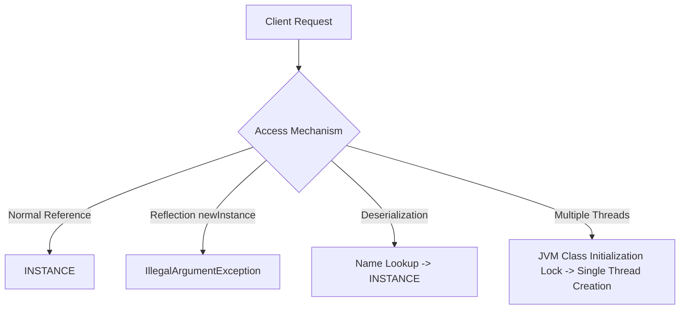

# Enum - Part 2

## Learning Goal

This file covers a focused slice of **Enum**. Study each concept as a practical Java rule, not as isolated vocabulary.

## Outline Coverage

| Concept | What to know |
| --- | --- |
| `Enum implements interface` | Enums cannot extend classes, but they can implement interfaces to support polymorphism. |
| `Enum Singleton pattern` | Implementing a Singleton as a single-element enum provides built-in safety against reflection and serialization attacks. |

## Detailed Notes

### Enum implements interface

Although enums cannot inherit from another class (because they implicitly inherit from `java.lang.Enum`), they are fully permitted to implement one or more interfaces.
- **Constant-Specific Implementations**: Individual enum constants can override interface methods inside their own class bodies.
- **Use Case**: Allows applying polymorphism across enum constants.

```java
public interface Command {
    void execute();
}

public enum SystemAction implements Command {
    START {
        @Override
        public void execute() {
            System.out.println("Starting system...");
        }
    },
    STOP {
        @Override
        public void execute() {
            System.out.println("Stopping system...");
        }
    };
}
```

### Under the Hood: Constant-Specific Class Bodies and Anonymous Subclasses

When an enum constant defines a constant-specific class body, the compiler generates a separate anonymous subclass for that specific constant. The base enum class is compiled as an abstract class (though you cannot manually declare it as such), and the anonymous subclasses implement the abstract or interface methods. This allows enums to implement polymorphic behavior directly on individual constants without using `if-else` or `switch` statements. At class loading, the JVM instantiates these anonymous subclasses, linking the constant name to a specific instance of the subclass, maintaining standard enum type safety while providing custom behaviors.

#### Mental Model: Subclass Hierarchy of Enum Constants
The JVM sees each constant with a body as a distinct anonymous class type extending the base enum:

```mermaid
classDiagram
    class SystemAction {
        <<abstract>>
        +execute() void
    }
    class SystemAction$1 {
        +execute() void (execute START logic)
    }
    class SystemAction$2 {
        +execute() void (execute STOP logic)
    }
    SystemAction <|-- SystemAction$1
    SystemAction <|-- SystemAction$2
```

#### Code Demonstration: Inspecting Runtime Classes

```java
SystemAction action = SystemAction.START;
// The runtime class of START is an anonymous subclass, not SystemAction itself
System.out.println(action.getClass().getName()); // Output: SystemAction$1

SystemAction action2 = SystemAction.STOP;
System.out.println(action2.getClass().getName()); // Output: SystemAction$2
```

#### Cause-Effect Chain: constant-Specific Behavior
$$\text{Constant declares class body \{ ... \}} \rightarrow \text{Compiler compiles enum class as abstract and constant as anonymous subclass} \rightarrow \text{Subclass overrides base/interface method} \rightarrow \text{Constant reference points to subclass instance at runtime} \rightarrow \text{Polymorphic execution triggers constant-specific behavior}$$

### Enum Singleton pattern

Joshua Bloch famously wrote in *Effective Java* that a single-element enum is the best way to implement a Singleton.
- **Built-in Thread-Safety**: The JVM guarantees that enum instances are created in a thread-safe manner when the class is loaded.
- **Reflection Protection**: The Java reflection API explicitly prevents instantiating enums (throws `IllegalArgumentException` in `Constructor.newInstance()`), blocking reflection attacks.
- **Serialization Safety**: The Java serialization mechanism ensures that no duplicate instances are created upon deserialization.

```java
public enum CacheManager {
    INSTANCE;

    private final Map<String, Object> cache = new ConcurrentHashMap<>();

    public void put(String key, Object value) {
        cache.put(key, value);
    }

    public Object get(String key) {
        return cache.get(key);
    }
}
```

### How Enum Singleton Works: Thread, Reflection, and Serialization Safety

The single-element enum is widely recognized as the most robust way to implement a Singleton in Java due to three key architectural safety guarantees. First, thread safety is guaranteed by the JVM's classloading mechanism: static initializers are executed when the class is initialized, which is implicitly thread-safe and guarded by JVM-internal locks. Second, reflection safety is enforced by the Java runtime; `Constructor.newInstance()` explicitly checks for the `ENUM` modifier and throws an `IllegalArgumentException` if reflection tries to instantiate an enum, preventing reflection attacks. Third, serialization safety is built into the Java serialization protocol: enums are serialized solely by name, and during deserialization, the JVM uses the name to look up the existing singleton instance rather than instantiating a new object, preventing duplicate instances in memory.

#### Mental Model: Protection Boundaries of Enum Singleton



#### Code Demonstration: Defending Against Attacks

```java
// 1. Defending against Reflection Attacks:
try {
    Constructor<CacheManager> constructor = CacheManager.class.getDeclaredConstructor(String.class, int.class);
    constructor.setAccessible(true);
    CacheManager badInstance = constructor.newInstance("MOCK", 0);
} catch (Exception e) {
    // Under the hood, Constructor.newInstance() contains:
    // if ((clazz.getModifiers() & Modifier.ENUM) != 0)
    //     throw new IllegalArgumentException("Cannot reflectively create enum objects");
    System.out.println(e.getCause()); // Prints IllegalArgumentException
}

// 2. Defending against Serialization Attacks:
// Java Serialization writes only the name ("INSTANCE") to the stream.
// During deserialization, it runs: Enum.valueOf(CacheManager.class, "INSTANCE")
// This returns the exact same object. No new object is allocated.
```

#### Cause-Effect Chain: Unbreakable Singleton Contract
$$\text{Declaring single-element enum} \rightarrow \text{JVM classloader initializes INSTANCE under internal locks} \rightarrow \text{Thread safety guaranteed + Reflection API blocks instantiation + Deserialization resolves to existing named instance} \rightarrow \text{Singleton contract remains unbreakable}$$

---

## Common Mistakes

### 1. Declaring an enum class as abstract or final manually
**Mistake**: Adding `abstract` or `final` modifiers to an enum declaration.
```java
public final enum Color { RED, GREEN } // Compile error!
```
*Consequence*: The compiler automatically adds the correct modifiers depending on whether the enum constants have class bodies. Manual decoration is forbidden.

### 2. Attempting to bypass the Singleton pattern via reflection
**Mistake**: Trying to use reflection to create a new instance of an enum Singleton.
```java
Constructor<CacheManager> constructor = CacheManager.class.getDeclaredConstructor(String.class, int.class);
constructor.setAccessible(true);
CacheManager newInstance = constructor.newInstance("MOCK", 1); // Throws IllegalArgumentException!
```
*Consequence*: Java runtime explicitly prevents enum instantiation via reflection to preserve the Singleton contract.

## Reference Links

- [Official Oracle Java Tutorials - Enum Types](https://docs.oracle.com/javase/tutorial/java/javaOO/enum.html)
- [Java Platform, Standard Edition API Specification - Enum Class](https://docs.oracle.com/en/java/javase/17/docs/api/java.base/java/lang/Enum.html)
